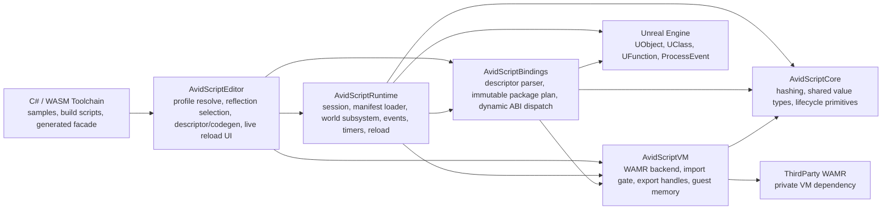

# AvidScript 模块架构

- 更新日期：2026-07-25
- 适用阶段：Phase 50 最终 Gate 候选
- 适用范围：`Plugins/AvidScript` 插件内的 UE 模块、生成工具链、WASM 运行时、Binding package 与热重载路径

> 本文描述 Phase 50 的最终候选架构。阶段是否已经通过 Gate、完成 attest 和 close，以 `Docs/Phase50/Phase50_State.json`、Gate report 与 close evidence 为准，避免架构文档复制易过期的瞬时流程状态。

## 1. 架构目标

AvidScript 是一个实验性的 Unreal Engine 脚本运行时插件。当前架构目标不是把完整 UE API 直接暴露给脚本，而是通过可审计、可生成、可重载的 binding package，把选定的 UE 类型和成员发布给 C#/WASM guest。

Phase 50 之后，核心目标可以概括为：

- C# 侧可以写出接近 UE 项目 API 的玩法脚本，包括 typed `UE.Self`、typed `TSubclassOf<T>`、typed `SpawnActor`、自定义 `UFUNCTION` 调用、typed upcast 与 checked downcast。
- Runtime 热路径只使用 descriptor 生成的 ordinal、cached UClass plan、cached ProcessEvent plan，不根据 C# 名称或 class path 做字符串反射查找。
- VM 保持语言无关和 UE 无关，只认识 WASM bytecode、导入导出、guest memory、静态/动态 host call。
- API 增长必须走 profile、descriptor、统一 dynamic ABI、binding package plan。禁止为某个项目类或函数手写 VM import、Runtime switch、WAMR wrapper 或 renderer 特判。
- 热重载是候选 Runtime 事务：候选包和 owner 校验通过后才激活，失败时保留旧 live runtime。

## 2. 模块依赖图

插件声明 5 个 UE 模块：`AvidScriptCore`、`AvidScriptBindings`、`AvidScriptVM`、`AvidScriptRuntime`、`AvidScriptEditor`。`WAMR` 是 VM 的第三方私有依赖，不应泄漏到 Runtime 或 Editor 的公共契约里。



## 3. 模块职责边界

| 模块 | 主要职责 | Phase 50 关键契约 |
| --- | --- | --- |
| `AvidScriptCore` | 放置跨模块共享的小型基础设施，例如 hash、生命周期状态和值类型。 | 不依赖 UE gameplay 层，也不承载 binding 或 VM 策略。 |
| `AvidScriptVM` | 封装 WAMR backend，加载 WASM，解析导出句柄，校验静态/动态 imports，提供 guest memory 读写视图。 | VM 不认识 `UObject`、`UClass`、C# 类型名或项目 class path。动态 imports 来自当前 immutable binding package。 |
| `AvidScriptBindings` | 解析 descriptor，构建 `FAvidScriptBindingPackage`，缓存 UClass、class reference、object type ordinal、ProcessEvent 调用计划，并执行统一 dynamic ABI dispatch。 | descriptor v6 是 typed UObject API 的权威来源；package load 之后 plan immutable；热路径不能按字符串查找类型或成员。 |
| `AvidScriptRuntime` | 管理 `FAvidScriptRuntimeSession`、`FAvidScriptWasmRuntimeInstance`、manifest 加载、owner context、事件/计时器、host effect transaction、state migration 和热重载事务。 | 初始加载和 reload 都必须验证 script manifest、binding package、WASM import identity 与 expected owner。候选失败时保留 live runtime。 |
| `AvidScriptEditor` | 解析 project binding profile，做 UE reflection selection，生成 descriptor v6、C# facade、manifest，并提供工作区创建、构建绑定、live reload 等编辑器入口。 | Editor 是生成和验证入口；Runtime 不反向生成 descriptor，也不在 gameplay 中发现 API。 |
| `ThirdParty/WAMR` | 提供 WASM Micro Runtime 静态库和头文件。 | 只作为 `AvidScriptVM` 私有依赖。上层模块通过 `IAvidScriptVmBackend` 交互。 |

## 4. Artifact 与 Schema

Phase 50 的 typed API 由几个 artifact 串起来，任何一环变化都会影响 package identity 或 reload eligibility。

### Project Binding Profile v3

Profile 是 Editor 的输入，描述项目想暴露哪些 UE 类型和成员。v3 增加了 `self_class_path`，并支持 typed class reference：

- `package_name`：binding package 的逻辑名字。
- `module_paths`：反射扫描输入。
- `classes`：需要发布的 UE class、function、property selection。
- `self_class_path`：脚本 owner 的期望 UE class，只允许 v3 使用。
- `class_references`：脚本侧可引用的 class token，例如 `TSubclassOf<T>` 所需的 `class_path`、`base_class_path` 与 load policy。

### Descriptor v6

Descriptor 是 Runtime 和 Bindings 的权威输入。Phase 50 的 v6 在旧的 function/property schema 上增加 typed UObject 类型图：

- package root 带 `self_type_id`。
- object handle type 带 `object_type_ordinal`、`class_path`、`base_type_id`。
- class reference 带 `result_type_id`。
- package hash 覆盖 self type、object type ordinal、class path、base edge、class reference 等身份信息。
- v2 到 v5 仍可兼容加载，但不能使用 v6 的 typed `Self`、typed class reference 和 object type graph 能力。

### Script Manifest

Script manifest 绑定 WASM、binding package 和 runtime 需求：

- WASM 路径、SHA-256、required exports。
- required imports 的 module/name 身份。
- binding package name/hash、package manifest SHA、descriptor SHA。
- debug map provenance 与 state migration manifest。

Manifest 不是提示信息，而是授权和 reload 判定的一部分。

## 5. Phase 50 Typed Project API

Phase 50 把“项目类型”推进到 C#/WASM/UE 的完整玩法闭环：

- `UE.Self<T>`：由 profile v3 的 `self_class_path` 驱动，Runtime 在 BeginPlay 前验证 owner 是否满足 descriptor 中的 expected self class。Guest 通过 packed owner handle 拿到 typed self。
- Typed class reference：Editor 生成 class reference ordinal，Bindings 在 package load 时解析并缓存 `UClass` 与 base class。`SpawnActor<T>` 根据 `TSubclassOf<T>` 返回 typed handle。
- Typed upcast：派生 handle 到基类 handle 只在 guest 复制 slot/generation 两个整数，不新增 host import。
- Checked downcast：基类 handle 到派生 handle 通过一个 object-type import：`avidscript.avid_object_type_is_a (iii)i`。类型不匹配、stale handle、cross-world handle 都返回 invalid typed handle 或 fail closed。
- 自定义 `UFUNCTION`：继续通过 descriptor selection、dynamic ABI 和 cached ProcessEvent plan 调用。新增项目 API 不应增加手写 VM import 或 Runtime 分支。

这意味着脚本作者能写项目级玩法代码，但引擎侧仍保留生成式、可验证、可重载的边界。

## 6. 运行时数据流

### 生成流程

```text
Project binding profile v3
    -> Editor resolve / reflection selection
    -> object type closure and deterministic ordinal graph
    -> descriptor v6 + package manifest
    -> generated C# facade and semantic model
    -> C# build to WASM
    -> script manifest
```

Editor 在这个流程里承担所有语言相关和 UE reflection selection 工作。Runtime 只消费已生成 artifact。

### 初始加载

```text
script manifest + WASM + descriptor
    -> manifest hash and import identity validation
    -> BindingPackage::LoadDescriptor builds immutable plan
    -> VM Load receives current FAvidScriptVmBindingPackage
    -> Runtime validates expected owner class
    -> required exports resolved
    -> BeginPlay candidate
    -> activate live runtime
```

关键点是 candidate 在激活前已经绑定了当前 package plan 和 owner context。owner 类型不匹配时，初始化失败，不会进入玩法生命周期。

### Dynamic Host Call

```text
WASM import ordinal
    -> AvidScriptVM import gate
    -> Runtime DispatchDynamicHostCall
    -> BindingPackage dispatch
    -> cached plan executes native operation or ProcessEvent
    -> ABI result returned to guest
```

VM 不解释 `UFunction`，Bindings 不解释 C#，Runtime 不生成 API。三者通过 ordinal、ABI cells、guest memory 和 immutable plan 协作。

### 热重载

Reload 使用隔离候选 Runtime：

- 验证 manifest schema、ABI、module id、hash、imports、binding package identity。
- 构建候选 runtime 并加载 bytecode。
- 校验 expected owner class。
- 必要时执行 state migration 和 host effect transaction。
- 候选 BeginPlay 成功后 swap live runtime。
- 任一关键步骤失败时，`RejectedReloadCount` 增加，旧 live runtime、旧 manifest、旧 binding package identity 保留。

## 7. 安全与授权边界

Phase 50 的安全规则集中在 import 身份和 package 授权：

- hash-verified WASM import section 的 module/name 必须与 script manifest 的 required imports 做精确多集合匹配。
- 文件 manifest loader 和公开 `FAvidScriptRuntimeSession` 内存加载入口必须调用同一 import policy，不能让调用方式改变授权结果。
- 静态 imports 只能来自 VM 暴露的唯一静态 import policy。
- 非静态 imports 必须是当前 immutable binding package 中 imports 的子集。
- `AvidScriptVM` 的 `ValidateAvidScriptVmImportContract` 是底层兜底；WAMR Backend 必须在取得 runtime lease、注册 native 和调用 `wasm_runtime_load` 前完成 actual import inspection 与 package 授权。
- 全局 WAMR dynamic native registry 不能被当成当前脚本授权来源。
- WAMR Backend 使用 active-call lease；guest call 内请求 unload 时只标记 deferred unload，等最外层调用返回后再释放 exec env、module instance、module 与 dynamic registry attachment。
- Runtime Session 区分 guest execution 与 Runtime mutation；执行中的 reload、嵌套 guest call 和 destructive unload 统一以 `reentrant_operation` 失败关闭。
- `UAvidScriptComponent` 在宿主回调改变组件生命周期时延迟释放 Session/owner，并在回调返回后重新检查 registered 状态，不能在已取消注册组件上继续进入 Super Tick。
- descriptor JSON、manifest JSON、整数范围、import identity 必须严格解析，异常输入 fail closed。
- owner validation 发生在 BeginPlay 前；reload candidate owner 不匹配时保留 live runtime。

这个模型的核心是：可调用能力来自当前脚本声明的 manifest 和当前 package plan，而不是来自进程里“已经注册过”的全局 native 函数。

## 8. 生命周期与资源所有权

| 资源 | Owner | 释放/替换时机 |
| --- | --- | --- |
| WASM module instance、exec env、export handles | `FAvidScriptWasmRuntimeInstance` | `Unload`、session stop、reload swap 后旧 runtime 释放。 |
| Binding package immutable plan | `TSharedPtr<const FAvidScriptBindingPackage>` | manifest/package identity 改变并通过候选校验后替换。 |
| Object registry handles | Runtime host context / world subsystem | owner、actor、component 生命周期变化时通过 slot/generation 判定 stale。 |
| Timers、events、gameplay event route | `FAvidScriptRuntimeSession` 与 runtime instance | Runtime unload 或 reload swap 时清理，候选失败不污染 live runtime。 |
| State migration slots | `FAvidScriptWasmStateMigrationManifest` | reload 阶段按 stable id、aliases、type fingerprint 迁移。 |
| Host effect transaction | Runtime reload path | candidate 成功提交；失败尝试 rollback 并保留 live runtime。 |
| Active guest call lease | WAMR Backend / Runtime Session | 最外层 guest call 返回时解除；期间的 unload 延迟、reload 与嵌套执行拒绝。 |

## 9. 当前可实现能力

Phase 50 最终候选已实现以下能力；是否通过最终验收仍以阶段 Gate 证据为准：

- C# guest 编译到 WASM，并通过 manifest 被 UE Runtime 加载。
- `BeginPlay`、`Tick`、`EndPlay`、timer callback、事件和 gameplay event 回调。
- Actor transform 读写、SceneComponent world location 读写、root component 获取、批量 transform snapshot。
- Object registry 的 slot/generation handle，stale 和 cross-world handle 失败可见。
- 反射 `UFUNCTION` 调用、反射 property read、FName runtime marshalling。
- Actor spawn/destroy、class reference cache、typed `SpawnActor<T>`。
- typed `Self`、typed upcast、checked downcast。
- C# workspace 创建、构建绑定、生成 facade、live reload 编辑器入口。
- state migration、transactional host effects、runtime diagnostics 和 debug map provenance。

## 10. 性能原则

Phase 50 的性能目标是把“类型推导”和“反射发现”提前到 Editor 或 package load 阶段：

- 自定义 UObject 类型由 descriptor v6 的稳定类型图和 package-load immutable UClass plan 驱动。
- Runtime 热路径只按 ordinal 索引缓存类型、class reference、binding plan。
- typed upcast 是 guest 内复制两个整数，预算为 0 host crossing。
- checked downcast 预算为 1 次 object-type import。
- 自定义 `UFUNCTION` 使用 cached ProcessEvent plan，避免每帧按名称找 `UFunction`。
- warm loop 中 class load 与 reflected member name lookup 预算为 0。

P50.5 benchmark 的候选数据可以作为当前本机参考：native `IsA` median/p95 约 0.000016/0.000018 ms，binding ordinal median/p95 约 0.000038/0.000039 ms，WAMR checked cast median/p95 约 0.000738/0.000860 ms，20,000 次 typed upcast 对应 0 host imports。已有 typed binding 的 Phase 49 回归仍需同机 baseline 对比，因此不把这些数字表述为跨机器性能结论。

## 11. 架构演进摘要

| 阶段 | 架构变化 |
| --- | --- |
| Phase 45 | C# auto live reload、异步 live reload、state migration、transactional host effects、runtime diagnostics 逐步成型。 |
| Phase 46 | reflected property binding 与 descriptor v4 扩展。 |
| Phase 47 | object reference property 和结构化 object handle state。 |
| Phase 48 | playable demo 核心、自然 gameplay events、FName descriptor/facade/runtime marshalling。 |
| Phase 49 | project binding profile、cached class reference、world object creation/lifecycle、dynamic projectile gameplay。 |
| Phase 50 | profile v3、descriptor v6、typed project API、typed self、typed spawn、zero-crossing upcast、one-crossing checked downcast、自定义项目 `UFUNCTION` 闭环。 |

## 12. 当前边界与下一步

当前边界：

- 目标平台是 UE 5.8 Win64 Editor 研发路径；不声明 Cook、Shipping、移动平台已覆盖。
- API 覆盖 descriptor 能表达的普通 `UFUNCTION` 和当前 ABI 类型；不是完整 UE API。
- Blueprint subclass 可作为 typed class reference 并调用 native base methods；Blueprint graph-defined functions、delegates、containers、任意 `UStruct` 仍不在 Phase 50 覆盖范围内。
- v2 到 v5 descriptor 可以兼容旧包，但不能获得 v6 typed object graph 能力。
- Phase 50 的验收和关闭状态不由本文声明；合入或发布前应以阶段 state、Gate report 与 close evidence 为最终状态源。

建议下一阶段研究重点是 Phase 51：UObject/Component factory、Outer/ownership、component query、Attach/Detach。它应该继续沿用 Phase 50 的原则：新增能力走 descriptor、immutable plan、统一 dynamic ABI 和 fail-closed reload transaction，而不是增加项目级特判。
