# P57.8 Editor 预编译制品生产与运行时闭环

## 1. 状态

P57.8 已完成 UE 5.8 Win64 Editor 下的 Wasmtime serialized artifact 自动生产、事务发布、
manifest provenance、Runtime 自动选择和生命周期接入。C# final build 现在可以在产出 canonical
WASM 后生成 `.wasmtime.cwasm`；`UAvidScriptComponent` 通过同一 RuntimeSession 路径进入
BeginPlay、Tick、事件、reload 与 unload，不需要手写 UE API wrapper，也没有复制第二套生命周期。

本批次解决的是启动路径和可信制品闭环。冻结 12-kernel 的 steady-state 数据未改动、未重跑，
所以 `P57-D06-ControlledLeadership` 继续保持 `Fixing`，不能用本批次的启动收益替代正式
Wasmtime/V8 p95 与 kernel win-rate 门禁。

## 2. 架构

```mermaid
flowchart LR
    CSharp["C# final build"] --> Wasm["canonical WASM + manifest"]
    Wasm --> Compiler["AvidScriptVM artifact compiler"]
    Compiler --> Cache["32-entry LRU cache"]
    Compiler --> Attestation["process-local attestation registry"]
    Cache --> Cwasm["Wasmtime serialized bytes"]
    Attestation --> Publisher["Editor transactional publisher"]
    Cwasm --> Publisher
    Publisher --> Published["WASM + cwasm + manifest atomic commit"]
    Published --> CanonicalLoader["existing canonical manifest loader"]
    CanonicalLoader --> RuntimeLoader["Runtime execution extension validator"]
    RuntimeLoader --> Reauthorize["RuntimeInstance reauthorization"]
    Reauthorize --> Backend["shared Wasmtime backend + lifecycle"]
```



所有权边界如下：

| 模块 | 职责 | 不负责 |
| --- | --- | --- |
| `AvidScriptVM` | Wasmtime 编译、serialize、编译器身份、LRU cache、进程内 attestation | Editor 文件事务、UE gameplay 生命周期 |
| `AvidScriptEditor` | final build 后发布 cwasm、扩展 manifest、回滚整个制品事务 | 解释 cwasm、执行脚本 |
| `AvidScriptRuntime` | 先验证 canonical WASM，再校验 execution provenance，选择 JIT/AOT 并接入 Session/Component | 运行时编译制品、生成 attestation |

## 3. VM 编译与 attestation

`FAvidScriptVmOwnedArtifact` 同时拥有 canonical WASM 和 execution bytes，避免任何
`TArrayView` 越过生产者生命周期。编译入口只接受：

```text
BackendKind=Wasmtime
ExecutionMode=Aot
ArtifactFormat=WasmtimeSerialized
```

cache key 绑定 canonical SHA-256、backend、artifact format、compiler build identity 和 target
triple。cache 与 attestation registry 均为 32 项 LRU；cache hit 复用不可变 serialized bytes，
但每次返回新的 32 字符小写 attestation id。授权时重新计算 execution/canonical 摘要并精确比较
编译器身份与 target，调用者不能通过修改字段延续旧 attestation。

Wasmtime DLL 的 SHA-256、版本、Cranelift 配置和 target identity 由一个共享 owner 产生，backend
与 compiler 不再各自构造身份字符串。

## 4. Editor 事务发布

`EAvidScriptEditorVmArtifactPolicy` 提供三种稳定策略：

| 策略 | 编译成功 | 编译失败 |
| --- | --- | --- |
| `JitOnly` | 不生产 cwasm，移除旧 execution 元数据 | 保留 canonical JIT 路径 |
| `PreferPrecompiled` | 原子发布 cwasm 与 execution manifest | 删除陈旧 cwasm/metadata，提交 canonical WASM 并显式选择 Wasmtime JIT |
| `RequirePrecompiled` | 原子提交 report、manifest、WASM、cwasm | 四项制品全部回滚，构建失败 |

final build 默认使用 `PreferPrecompiled`，bootstrap build 固定使用 `JitOnly`。publisher 位于现有
artifact transaction 的 commit 之前，cwasm 被纳入同一 backup/restore 列表。manifest 的
`execution` 扩展记录 format、相对文件名、execution/canonical SHA-256、compiler identity、
target triple、attestation id、policy 与 fallback；PowerShell 构建脚本不直接生成 cwasm。

## 5. Runtime 信任链与生命周期

Runtime loader 首先调用既有 `FAvidScriptWasmReloadManifestLoader::LoadFromFile`。只有 canonical
WASM 的路径、摘要、layout、imports、binding package 与 debug provenance 全部通过后，才解析
可选 `execution`：

1. execution 路径必须是同根相对路径，禁止父目录穿越；
2. cwasm 摘要、canonical 摘要、compiler identity 与 target 必须精确匹配；
3. loader 查询进程内 attestation，但不把可写 `Trust` 字段暴露给调用者；
4. RuntimeInstance 在加载前再次调用 `AuthorizeAvidScriptVmArtifact`；
5. 只有二次授权成功才构造 `VerifiedPackage` view，否则保持 `Untrusted`；
6. `PreferPrecompiled` 在 provenance 缺失或过期时回退 Wasmtime JIT，`RequirePrecompiled` 拒绝；
7. 没有 `execution` 的旧 manifest 继续使用原有 WAMR 默认路径，保持兼容。

Session 的 bytecode API 仍保留，内部统一包装为 owning artifact。Component 的 initial load 与 reload
都走 `RuntimeArtifactLoader -> RuntimeSession -> RuntimeInstance -> VM backend`，因此 BeginPlay、
Tick、gameplay event、timer、state migration、host effect rollback 与 unload 继续只有一套 owner。

## 6. 启动性能诊断

同一个 Editor 进程内使用同一份 canonical WASM，先做 1 次预热，再交替执行 9 组 JIT/AOT
样本，避免固定顺序偏置。每个样本都创建 backend、加载模块、实例化、解析并调用
`avid_on_begin_play`。

| 指标（P50） | Wasmtime JIT | Serialized | Serialized/JIT |
| --- | ---: | ---: | ---: |
| Runtime init | 0.015400 ms | 0.016499 ms | 1.0714 |
| Module load | 0.443600 ms | 0.031300 ms | **0.070559** |
| Instantiate | 0.097800 ms | 0.069201 ms | 0.7076 |
| Exec env | 0.001501 ms | 0.001002 ms | 0.6676 |
| 四项合计 | 0.553798 ms | 0.118300 ms | 0.2136 |

`ModuleLoadMs` 的门禁要求为 `<= 0.50`，实测 `0.070559`，serialized module load 约为 JIT 的
`14.17x`；四项合计约为 `4.68x`。cache miss compile 为 `0.961401 ms`，同进程 cache hit 为
`0.008397 ms`。20 次预热/正式 BeginPlay 调用全部成功。

该结果只表示当前小型生命周期 fixture 的启动开销，不外推大型游戏模块，也不代表 steady-state
调用性能；后续需要增加真实 C# demo 模块规模分层和 cook/staging 冷启动测量。

## 7. 验证证据

### 7.1 UE 5.8 无清理构建

标准命令：

```powershell
& "C:\UnrealEngine\Engine\Build\BatchFiles\Build.bat" AvidTPSTemplateEditor Win64 Development "<ProjectRoot>\AvidTPSTemplate.uproject" -WaitMutex -NoHotReload
```

首次集中构建发现 Runtime 匿名 helper 的 Unity 重名并失败；修复后 5-action 增量构建成功，测试
fixture 修复后的最终 4-action 增量构建同样 `Result: Succeeded`。全程未 clean Editor target。

### 7.2 Focused Automation

过滤范围覆盖 Wasmtime artifact/compiler/startup、VM architecture、Editor C# build service、Runtime
artifact loader/session 与 Component transactional reload。

| 指标 | 结果 |
| --- | ---: |
| Found | 26 |
| Started | 26 |
| Success | 26 |
| Fail | 0 |
| `GIsCriticalError` | 0 |
| TestExit | `EXIT CODE: 0` |

命令配置了 `-TestExit="Automation Test Queue Empty"`；UE 5.8 本次日志没有单独输出 Queue Empty
事件行，因此不虚构该行计数，以 26/26 completed、`GIsCriticalError=0` 和最终零退出码作为队列
完成证据。

最终日志：`C:\tmp\AvidScript_P57_8_Focused_Final.log`，SHA-256：
`f56c04617432c630b53c870272ca8ca629daf5a6324f3fc2c8be3d04f90166f0`。日志是本机证据，
不进入 Git。

### 7.3 Clean candidate 架构检查

| 字段 | 值 |
| --- | --- |
| Evidence commit | `76059e7618277a0a36ba970781f8c90d98f6bb45` |
| Evidence tree | `b85af12143d873372cc088c5a244f124a13cf0de` |
| Checker SHA-256 | `c03b9b20869c67c8f114a4f5c2c72ec4d01bf607fc041a9da918e383e11e0903` |
| Architecture inputs | `clean` |
| Result | `AvidScript architecture check passed` |

## 8. 已知边界与下一步

1. 当前 attestation 只在同一 Editor 进程内有效，不是跨进程发布者签名；packaged artifact 必须增加
   签名清单、cook/staging 验证与密钥轮换策略。
2. producer 目前只支持 UE 5.8 Win64 Editor；移动端仍需无运行时 JIT 的平台 AOT lane。
3. cache 是 32 项内存 LRU，尚未实现跨会话 content-addressed 磁盘缓存和 mmap 加载。
4. P57.8 显著降低启动编译成本，但冻结 12-kernel 的 p95 geomean `1.0430729337` 与 p95 win-rate
   `0.5833` 没有因此改变。
5. P57.9 优先进入 controlled Wasmtime compiler/toolchain 优化，把 inlining、opt level、cacheability
   与 codegen identity 纳入正式合同，并在不改变 frozen kernels 的前提下清零 steady-state 门禁。

三项受保护用户改动在本批次中保持未暂存、未覆盖、未回滚。
