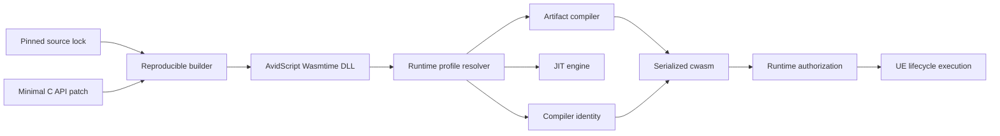

# Phase 57 受控 Wasmtime 高性能工具链设计

## 1. 背景与结论

P57.6 在冻结的 12-kernel、5 个独立进程和同轮 Puerts V8 denominator 下得到：

- p50 几何均值比值：`0.9821689140`；
- p95 几何均值比值：`1.0430729337`；
- p50/p95 kernel 胜率：`0.6667/0.5833`；
- 正确性失败：`0`，fallback：`false`。

当前官方 Wasmtime v45 C API 已能设置 Cranelift 优化级别、regalloc 和 ISA flag，
但没有暴露 Wasmtime v45 已实现的 `Config::compiler_inlining`。继续堆叠官方 C API
小开关无法形成可维护的性能领先方案；直接切换 LLVM AOT 又会把一个受控编译器优化
扩展成全新后端工程。

本设计选择中间路线：保持 Wasmtime v45 与官方序列化格式，在可复现源码构建中增加一个
最小 C API 扩展，向 AvidScript 暴露 compiler inlining；同时把工具链补丁、CPU 目标、
全部 codegen 选项和运行库摘要绑定进编译器身份。该路线先验证 Wasmtime 仍可获得的
稳态上限，并为后续 LLVM AOT lane 保留清晰边界。

## 2. 目标与非目标

### 2.1 目标

1. 建立可复现的 `Wasmtime v45.0.0 + AvidScript patchset 1` Win64 构建链。
2. 只新增 compiler inlining 所需的最小 C ABI，不 fork Wasmtime 运行时语义。
3. 让 JIT 和 `WasmtimeSerialized` 使用完全相同的受控编译器配置。
4. 编译器身份必须绑定版本、补丁、优化级别、regalloc、inlining、CPU profile、
   内存策略和 DLL SHA-256。
5. 在不修改 12 个 kernel、WASM、seed、oracle、进程数、采样数和阈值的前提下重跑正式 Gate。
6. 保持现有 WASM sandbox、Spectre mitigation、NaN 语义和 trap 语义，不用安全降级换取成绩。

### 2.2 非目标

- 本批次不实现 LLVM、WasmEdge、Wasmer 或 WAVM 后端。
- 本批次不修改 C# 前端 IR、冻结 kernel 或 Puerts denominator。
- 本批次不实现移动端 JIT；移动端继续采用未来 AOT 路线。
- 本批次不承诺 Gate 必然通过。未通过时必须保留真实证据，`P57-D06` 继续为 `Fixing`。

## 3. 方案比较

| 方案 | 收益 | 风险 | 决策 |
| --- | --- | --- | --- |
| 仅使用官方 C API flags | 维护成本最低 | P57.6 已证明优化空间不足，无法启用 inlining | 拒绝作为主方案 |
| 最小 C API 扩展 + 可复现源码构建 | 能启用现有 Cranelift inlining，仍保持 Wasmtime ABI 与序列化体系 | 增加一条受控第三方构建链 | 采用 |
| 立即新增 LLVM AOT 后端 | 长期性能上限最高 | 新依赖、新 ABI、新运行时与跨平台工作量过大 | 作为后续独立 Phase |

## 4. 架构



### 4.1 第三方工具链边界

新增 `Source/ThirdParty/Wasmtime/PerformanceToolchain`，只拥有：

- 固定上游 commit、源码归档 SHA-256、Rust 最低版本、Cargo feature 集和构建参数的 lock；
- 对 `crates/c-api/src/config.rs` 与 `crates/c-api/include/wasmtime/config.h` 的补丁；
- 下载、校验、应用补丁、构建、发布到本地 managed layout 的 PowerShell 脚本；
- 静态合同测试。

生成的源码、Cargo cache、`target/`、DLL、LIB 和本机日志仍是本地产物，不进入 Git。
插件只跟踪 lock、patch、脚本、合同和许可证说明。

### 4.2 最小扩展 ABI

补丁只增加：

```c
typedef uint8_t avidscript_wasmtime_inlining_t;

enum avidscript_wasmtime_inlining_enum {
  AVIDSCRIPT_WASMTIME_INLINING_NONE,
  AVIDSCRIPT_WASMTIME_INLINING_ALL,
};

void avidscript_wasmtime_config_compiler_inlining_set(
  wasm_config_t* config,
  avidscript_wasmtime_inlining_t mode);
```

Rust 实现仅把两个枚举映射到 `wasmtime::Inlining::No/Yes`。无效枚举不得跨 FFI 传入；
AvidScript 侧只使用编译期常量。

### 4.3 运行时配置所有权

`AvidScriptVM` 私有层新增不可变的 compiler profile 描述，统一供 JIT backend 和 artifact
compiler 使用。第一版 profile 固定为：

- strategy：`cranelift`；
- opt：`speed_and_size`；
- regalloc：`backtracking`；
- inlining：`all`；
- CPU：`x86-64-v3`；
- wasm32 memory reservation：`4 GiB`；
- memory may move：`false`；
- Spectre mitigation：保持 Wasmtime 默认开启；
- NaN canonicalization：关闭，保持标准 WebAssembly 语义；
- debug verifier、fuel、epoch interruption、profiling：关闭。

CPU profile 由 AvidScript 显式设置，不依赖“构建机自动推断”。Win64 启动时先验证
`x86-64-v3` 所需能力；不满足则返回结构化 `cpu_profile_unsupported`，禁止执行可能包含
不受支持指令的制品。未来通过多制品 manifest 增加 v2/v3 选择，不在本批次伪装兼容。

### 4.4 动态扩展发现

AvidScript 不在 import library 中静态引用新增符号。`RuntimeSupport` 在校验 DLL SHA-256 并
加载 DLL 后，通过 `FPlatformProcess::GetDllExport` 解析扩展；解析结果和 DLL handle 一起受
同一临界区管理。

- 高性能 profile 缺少扩展：fail closed，返回 `compiler_profile_unsupported`；
- 官方 DLL 仍可用于依赖诊断，但不能生成或执行声称属于高性能 profile 的制品；
- JIT 与 serialized runtime 都从同一个 resolver 取得 profile 和扩展函数指针。

### 4.5 编译器身份

身份格式升级为稳定、顺序固定的键值串，至少包含：

```text
wasmtime-v45.0.0+avidscript.1;
strategy=cranelift;opt=speed_and_size;regalloc=backtracking;
inlining=all;cpu=x86-64-v3;wasm32_memory=4g_fixed;
spectre=on;nan_canonicalization=off;dll_sha256=<64 hex>
```

该身份进入 artifact cache key、attestation、manifest `execution.compiler_build_identity`、
runtime authorization 和 benchmark provenance。任一字段不同都视为不同编译器，禁止缓存复用。

## 5. 数据流与错误处理

1. Builder 校验 source lock 和 patch SHA 后生成 managed runtime。
2. UBT 从 performance managed layout 读取头、LIB、DLL，并把实际 DLL SHA 注入 VM。
3. Runtime resolver 校验 DLL、扩展符号和 CPU profile，构造唯一 compiler identity。
4. JIT 与 artifact compiler 使用同一 profile 创建 engine。
5. Serialized artifact 在加载前继续执行 P57.8 的 digest、target、compiler identity 与 attestation 校验。
6. 所有失败在执行 guest machine code 前发生；不允许自动退回不同 profile 后仍保留旧身份。

稳定错误类别：

- `compiler_toolchain_unavailable`：performance managed layout 不存在；
- `compiler_extension_missing`：DLL 未导出扩展；
- `cpu_profile_unsupported`：宿主不满足 profile；
- `compiler_profile_invalid`：内部 profile 组合不合法；
- `artifact_compiler_mismatch`：序列化制品与当前 profile 不同。

## 6. 验证与性能门禁

阶段内只做阻塞性静态反馈，阶段末统一执行：

1. PowerShell lock/patch/build 合同；
2. Wasmtime DLL export、profile identity、JIT/serialized 同配置 Automation；
3. UE 5.8 no-clean 增量构建；
4. 冻结 12-kernel、5 进程正式 shootout；
5. 干净候选树架构检查。

正式通过条件保持不变：

- p50 和 p95 几何均值均不高于 `0.95`；
- p50 和 p95 kernel 胜率均不低于 `0.60`；
- MAD 几何均值比不高于 `1.25`；
- correctness failure 为 `0`；
- fallback 为 `false`；
- 输入和候选 provenance 全部通过。

## 7. 风险与后续

- 自编 Wasmtime 增加依赖构建时间，因此 builder 必须支持内容寻址缓存，正常项目构建不得触发 Cargo。
- `x86-64-v3` 不是所有 PC 的最低能力；在多制品选择完成前，它只作为 Win64 高性能 profile。
- inlining 可能只改善少数 kernel。若正式 Gate 仍失败，下一阶段直接建立 LLVM AOT backend
  feasibility 与相同 ABI 的对照 lane，不再重复无边界 flag 试验。
- 移动端继续要求无运行时 JIT，并复用 artifact identity、attestation 和 manifest 选择框架。
