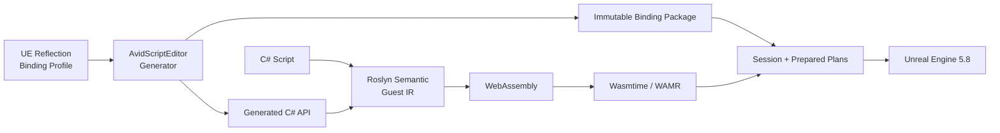

<div align="center">

# AvidScript

**面向 Unreal Engine 的现代 C# + WebAssembly 游戏脚本框架**

<p>
  
  
  
  
  
  
  
  
  <a href="LICENSE"></a>
</p>

AvidScript 将 C# 编译为 WASM，通过自动生成的 Binding 接入 UE 生命周期、项目 API、网络与异步流程。
Win64 主后端使用 Wasmtime 45，保留 WAMR 兼容后端；UE Runtime 不托管 CLR。

</div>

> [!IMPORTANT]
> 当前版本为 **0.1.0 开发者预览**，主线验证环境是 **UE5.8 源码版 + Win64
> Development/Shipping + Wasmtime 45**。两种 Win64 配置的 BuildCookRun 均已通过；Android arm64
> 交叉 AOT 发布已验证，Android UBT/真机与 iOS 仍待正式验收。

## 现在可以做什么

更新于 **2026-09-10**。已跑通 **C# → WASM → UE 事件与 API → Win64 打包运行**，
可开始尝试小型玩法 Demo，不需要 `.avid`。**P64 正式 Gate 与 P65.C Shipping 发布 Gate 已完成；
当前仍不是完整 UE/.NET 替代层。**

| 能力 | 已实现内容 |
| --- | --- |
| C# 游戏逻辑 | `BeginPlay/Tick/EndPlay`、Timer、Overlap、Gameplay Event；事件型脚本可省略 Tick，Startup Scenario 自动挂载与回滚；cooperative Wasmtime AOT 已在实际 Shipping Game 闭环 |
| UE API 与类型 | 从 Reflection/Profile 生成项目 `UFUNCTION/UPROPERTY`、Interface 和 Blueprint 接口；支持 `UObject/AActor`、`FVector/FTransform`、固定 `USTRUCT`、`FText` 与受支持的递归容器、Set/Map |
| C# 定义 UE 类型 | Actor、Component、World/GameInstance Subsystem，含继承、override、属性、函数与默认参数 |
| UI 与存档 | C# 驱动 UMG 按钮/文本、SaveGame 跨进程读回、存取失败保护；切图后恢复存档。Development/Shipping 包内 AOT 存取已通过，Development 样例已有人工界面/点击反馈 |
| 异步与委托 | 受控 `async/await`、Delay/NextTick、异步加载、Latent、AsyncAction；单播/多播、受支持签名的 `return/ref/out`、独立 UObject 订阅与回调来源查询 |
| Blueprint 与联机 | callable/event 双向交互；Server/Client/NetMulticast RPC、属性复制与 RepNotify，dedicated/listen 多进程验证 |
| 热重载与生命周期 | 方法体替换、持久字段迁移、失败候选回滚；存取可穿插重载，退出时取消异步并解绑事件；ObjectHandle 与 Session 隔离 |
| 构建与发布 | Wasmtime 45 Win64 JIT/AOT、WAMR 兼容后端；内容寻址模块、Generated Type 配置隔离、Development/Shipping BuildCookRun；Win64 cooperative 安全点编译、证明与 CookedPackage 信任闭环；可重复 source package、原子安装/修复、兼容诊断与分层 Release Gate；Android arm64 交叉 AOT |
| IDE 与诊断 | 增量缓存、persistent Worker、`.slnx`/WASI 工作区；源码映射、跨层栈、受控断点/步进与只读变量；typed Host 错误保留具体分类、原因和 import 身份；UE Trace 和 Profiler 导出 |

直接看 C# 样例：[收集玩法](Samples/CSharp/PickupRush/README.md) ·
[UI/存档](Samples/CSharp/UiSaveDemo/README.md)（[源码](Samples/CSharp/UiSaveDemo/UiSaveDemoScript.cs)）·
[项目 API](Samples/CSharp/TypedProjectApi/README.md) · [联机](Samples/CSharp/NetworkTopology/README.md)。

**近期交付：** [Win64 Shipping cooperative C# 闭环](Docs/Phase65/P65.D31_Wasmtime_Codegen_Attribution.md)、
[Development/Shipping 包内 UI/存档](Docs/Phase64/P64.D_Packaged_UI.md)、
[包内 World 生命周期门槛](Docs/Phase64/P64.D_Packaged_World_Soak.md)、两次 Editor 一小时切图、
[分配栈诊断](Docs/Phase64/P64.D_Native_Allocation_Tracing.md)、[调用生命周期修复](Docs/Phase64/P64.D_Invocation_Lifetime.md)
与[类型化 Host 结构化诊断](Docs/Phase64/P64.D_Typed_Host_Diagnostics.md)。
首次安装的[干净生成模块构建](Docs/Phase64/P64.D_Clean_Checkout_Build.md)也已完成定点修复与双路径 UBT。
[完整 Automation 隔离恢复](Docs/Phase64/P64.D_Full_Automation_Recovery.md)修正了无 package Subsystem、
GameplayEvent 对象授权和故障 Session 所有权合同；正式候选完整 Automation **461/461**、.NET **300/300**、
PowerShell contracts **16/16** 与三条 clean/generated UBT 路径全部通过。
已知字符串参数帧逐轮保留已归零；整个 Editor 进程的剩余增长仍在归因，不宣称无泄漏。
完整记录见 [P64 交付](Docs/Phase64/P64_Closeout.md)，类型范围见 [P58 验收](Docs/Phase58/P58.4_Centralized_Gate_Report.md)。
实现与验收分别记录，限制见[当前边界](#当前边界)。

Windows 最新 clean candidate 回归 **467/467** 通过，.NET 六组 runner **302/302** 通过；修正了普通编辑器 AOT
fuel 配置、隔离工程样本路径和 correctness 探针的 gameplay 分帧。详情见
[D31.C8/C9](Docs/Phase65/P65.D31_Wasmtime_Codegen_Attribution.md#d31c8-普通编辑器-aot-预算一致性)。
原先两个混合平台用例已拆开，Windows 断言独立保留；恢复主工程 Development 生成类型包身份后，
两个 Windows 用例与八项 GeneratedTypes 定向测试 **10/10** 通过；随后 `7707d5c6` 完整 Windows
选择清单逐项通过，包含拆分后保留的 Windows 断言。Android 两项另列为未执行，不计入通过数。
正式性能采样的 Windows PID 复用误拒绝已改用进程生命周期内固定的实例身份；`7707d5c6`
完整矩阵有效，**18 项门槛通过 16 项**，剩余两项为纯执行总体比率与胜率。PhysicalCost 入口同类
修复已补齐 schema 与行为合同；`5bafc180` clean candidate 原生构建、五进程 **1050/1050**
样本与三项受影响门槛均通过。Android/Mac 实机验收暂缓，
[公开二进制路径脱敏](Docs/Phase65/P65.D32_Win64_Public_Binary_Privacy.md)已完成中性 Wasmtime 重建与完整隐私扫描（117 文件、0 命中）；传递依赖许可证、新 DLL 的 UE 集成和公开离线包 Gate 尚未完成，主工程运行库保持原身份。

## 架构



| 模块 | 职责 |
| --- | --- |
| `AvidScriptCore` | 后端无关 ABI、错误与基础合同 |
| `AvidScriptBindings` | descriptor、codec、prepared executor 与 value heap |
| `AvidScriptVM` | Wasmtime/WAMR、WASM 校验、Guest Memory 与 Host crossing |
| `AvidScriptRuntime` | Session、生命周期、对象 registry、事件、异步与热重载 |
| `AvidScriptEditor` | Reflection/profile、代码生成、C# 构建和 Editor 集成 |
| `Tools/` | Roslyn 前端、Guest IR 与 WASM backend |

对象始终通过 generational `ObjectHandle` 访问；不向 Guest 暴露原始 `UObject*`。不支持的类型或
失配的反射身份会在生成或加载阶段失败关闭。

## 性能摘要

**指定 UE 交互路径已领先冻结版本的 Puerts；纯执行层尚未全面领先。**
以下图表为 **P57 归档基准**，当前 P65 数据见图表后的最新摘要：UE5.8 Win64 Development、Intel Core Ultra 7 265K，
Wasmtime 45 Cranelift JIT 对冻结版本的 Puerts V8，同机 5 个进程、每进程 5 次预热、每单元 30 次采样。
比率为 AvidScript / Puerts，越低越好。


| UE 交互场景 | AvidScript 耗时（P50） | Puerts Reflection 耗时（P50） | 比率 |
| --- | ---: | ---: | ---: |
| Scalar UFUNCTION | `54.57 ns` | `106.15 ns` | **`0.514x`** |
| Property get/set | `68.14 ns` | `103.01 ns` | **`0.661x`** |
| FVector value | `66.49 ns` | `1193.10 ns` | **`0.056x`** |
| UObject roundtrip | `69.60 ns` | `130.90 ns` | **`0.532x`** |

这是指定 prepared/fused 路径的每逻辑操作耗时，不代表任意 `UFUNCTION` 或整款游戏帧率。
见 [P57 原始证据](Docs/Phase57/P57.11B1_Recursive_Fixed_Struct_Codec_Evidence.json)。

- **游戏逻辑：** P56 Small/Dense gameplay 与 Lifecycle callback 的 P50 比率为 **`0.469x / 0.513x / 0.391x`**，各自对照路径与范围见[报告](Docs/Phase56/P56.5_Fused_Call_Frame_Implementation_Report.md)。
- **纯执行：** P65.D31.C11 正式 12-kernel 相同 WASM 对照的 P50/P95 几何均值为 **`1.102x / 1.239x`**，P50/P95 胜率为 **`50.0% / 8.33%`**，仍未达到 `<= 0.95x` 与 `>= 60%` 目标；高 P95 样本全部保留，未宣称总体领先。
- **最新 UE crossing：** P65.D10 将通用 `int32 -> int32` generated S1 降至 **`18.17 ns`**，相对 Puerts static 为 **`0.829x`**；十项 micro P50 几何均值已从 `1.440x` 改善到 `1.004x`，但仍未形成全面领先。见[D10 报告](Docs/Phase65/P65.D10_Generated_Unary_I32_Performance.md)。
- **最新 generated typed 路径：** FVector ref/out 已达到 `103.64 ns`（Puerts static 的 `0.144x`）；P65.D13 又将 UObject roundtrip 从 `147.73 ns` 降至 **`51.88 ns`**，已领先 Puerts reflection，但仍是 Puerts static 的 `1.139x`。十项 UE micro 的 P50/P95 几何均值为 **`0.779x / 0.786x`**。见[D11](Docs/Phase65/P65.D11_Generated_Vector_RefOut_Performance.md)与[D13](Docs/Phase65/P65.D13_Packed_Object_Roundtrip_Performance.md)。
- **最新 packaged 性能：** P65.D28 让 verified AOT package 使用 fuel-free Cranelift profile，同时保留 epoch watchdog 与签名边界。generated S1 十项 P50/P95 几何均值为 **`0.590x / 0.592x`**，胜项 **`8/10 / 8/10`**；对象 roundtrip 为 **`0.773x / 0.750x`**。`pure_integer` 与 `callback_empty` 仍未领先，semantic lane 仍待优化。见[D28 报告](Docs/Phase65/P65.D28_Verified_Package_Fuel_Free_Artifacts.md)。
- **最新完整矩阵：** P65.D31.C11 的 semantic / Puerts reflection 为 **`0.619x`**，Small/Dense gameplay 为最佳 Puerts 的 **`0.226x / 0.303x`**；generated scalar/property 为 **`22.16 / 39.63 ns`**，empty callback 为 **`50.03 ns`**。统一 Gate 通过 **`16/18`**，见[D31.C11](Docs/Phase65/P65.D31_Wasmtime_Codegen_Attribution.md#d31c11-当前-windows-全量与完整性能矩阵)。
- **比较边界：** 尚无同口径 UnLua/AngelScript 排行榜；不宣称全场景领先。其他数据见[容器](Docs/Phase57/P57.11D_Compiler_Managed_Array_Region.md)、[UE 原生对照](Docs/Phase60/P60.D_Performance_And_Gate.md)与[增量构建](Docs/Phase61/P61.E_Integration_Gate.md)。

## 快速开始

要求：UE5.8 源码版、Windows 10/11 x64、Visual Studio 2022、.NET SDK `8.0.416`、
PowerShell 7 与 Git。

1. 将仓库放入项目的 `Plugins/AvidScript`。
2. 在插件目录安装锁定的 Wasmtime 依赖：

```powershell
pwsh -NoProfile -File Build/InstallWasmtimeDependency.ps1 -Mode Install
```

3. 使用源码版 UE5.8 增量构建 Editor Target：

```powershell
$env:UE_ROOT = "C:\UnrealEngine"

& "$env:UE_ROOT\Engine\Build\BatchFiles\Build.bat" `
  YourProjectEditor Win64 Development `
  "-Project=C:\Path\To\YourProject.uproject" `
  -WaitMutex -NoHotReloadFromIDE
```

4. 构建仓库内第一个 C# 生命周期 Guest：

```powershell
pwsh -NoProfile -File Build/BuildCSharpActorLifecycle.ps1
```

项目自定义 API 需要先通过 Editor Reflection 与 Binding Profile 生成 binding package 和 C# facade。

更多样例：[生命周期与异步](Samples/CSharp/ActorLifecycle/ActorLifecycleScript.cs)、
[事件与热重载](Samples/CSharp/PlayablePickup/README.md)、[RPC](Samples/CSharp/NetworkRpc/README.md)、
[属性复制](Samples/CSharp/ReplicatedProperty/README.md)、[多进程网络](Samples/CSharp/NetworkTopology/README.md)。

## 当前边界

- **UE 类型**：由 Profile 与 ABI/codec 决定生成范围，并非所有 UE API 自动可用。复合容器内强 UObject 引用仍拒绝，平面 `TArray<UObject*>` 可用；Set/Map key 受确定性编码限制，soft/weak 的脚本侧解析易用接口待补齐。
- **C# 子集**：无完整 .NET Runtime、任意 awaiter 或异常系统；暂不支持 `event +=`、lambda/closure，使用显式 bind/subscribe 与 `ExecuteX/BroadcastX`。
- **重载与隔离**：方法体可热重载；UI 样例通过 `NextTickAsync` 在候选提交后初始化。准备期无可回滚适配的反射写入仍被拒绝，不承诺回滚任意外部副作用。反射结构变更需增量 UBT 并重启 Editor；WASM 隔离不是原生 DLL 进程沙箱。
- **玩法与平台**：UI 包使用独立验证插件和隔离启动配置，Development/Shipping 均通过跨进程自动存取；Development 人工界面、按钮和同一 UserRoot 新进程读档均反馈无问题。Shipping 人工视觉按用户要求不阻塞当前推进，明确转入发布候选验收，不能视为通过。任意损坏存档不在现有保证内；Development 包内一小时切图与当前候选 2/2 多进程网络拓扑通过，UI 重载另有 20 轮有界证据，但不宣称一小时网络/重载长稳；Android UBT/APK/真机及 iOS 仍未验收。
- **诊断与性能**：typed Host 拒绝已在 Wasmtime 保留具体 category/details/import，WAMR semantic/dynamic 路径同样保留分类；尚无完整 C# 异常系统。纯执行 P50/P95 领先门禁未关闭，也未完成同口径 UnLua/AngelScript 矩阵。

P65.A-C 已完成发布工程主链：可重复发布包、原子安装/升级、兼容诊断与分层平台 Gate；P65.D 正在推进性能领导力。
Shipping 人工视觉与移动设备证据仍作为独立发布候选 Gate，不以自动报告或阶段编号替代。

P65.A 已完成：thin source 发布器与原子安装器当前通过 **24/24** 轻量合同及真实 commit-based 发布/安装
smoke。发布输入固定到 Git commit 与 allowlist，package/receipt 由 Schema、inventory 和 SHA-256 约束，
支持 `Plan / Install / Upgrade / Repair / NoOp / Verify`、项目锁和失败回滚；相同输入重复发布得到相同
release identity。公开离线二进制包仍受中性构建与路径脱敏 Gate 阻断，不包含在当前 source profile。

P65.B1 已提供只读 Compatibility Doctor：统一检查 UE5.8、.NET/PowerShell/VS、插件 receipt、Wasmtime、
Binding、Generated Type、项目 Target 与 Android toolchain，并输出稳定 JSON code/status/remediation。
当前工程的 Win64 开发链全部通过、**0 blocked**；warning 为源码 checkout 无安装 receipt 与 Android `3/19`
及其未满足子项，不影响 PC 开发，但不会被写成已完成的分发或移动端证据。

P65.B2 已完成脱敏 support bundle：一次命令执行 Doctor 并原子发布带 Schema/inventory/SHA-256 的支持包，
路径替换为中性占位符，默认不收集日志。显式日志仅接受 `.log/.txt`，每份限制为 64 KiB/200 行；源码、
WASM、PDB、Guest IR、环境与原始日志不进入包。当前真实 bundle 隐私扫描和 readback 通过。

P65.C1 已把 Generated Type 与模块包生产器身份纳入同一个 `release.json`：生产器 SHA-256 与两端 Wasmtime
lock、Git tree、payload inventory 一同参与 `release_id`。项目实际 `package_id`、模块 catalog 与平台 receipt
将在分层 Release Gate 中绑定，避免把项目私有产物写死到通用插件发布包。

P65.C 已提供统一平台 Release Gate：固定报告 release、项目产物、Win64 Shipping、Android toolchain/arm64/
APK/device 与人工体验 8 层独立状态。最终真实 `Execute` 为 **3 passed / 0 failed / 1 blocked / 4 not_run**，
Win64 Shipping BuildCookRun 与 fresh receipt 通过；Android 仍为 3/19。Release/UBT/Cooker 可按本次运行隔离可选
插件，Generated Type 使用配置专属 overlay，不改写 `.uproject` 或源码 `current.json`。详见
[P65.C3 发布 Gate](Docs/Phase65/P65.C3_Win64_Shipping_Release_Gate.md)。

P65.D 已完成 clean candidate 的正式 5 进程基线：18 项统一性能 Gate 中 **14 项通过、4 项失败**。
UE 交互 workload 相对 Puerts 为 Semantic **0.60x**、small **0.38x**、dense **0.52x**；纯执行
Wasmtime/V8 P50/P95 为 **1.128x/1.189x**，完整 callback 为 **831.86 ns（Puerts 的 5.67x）**。
因此 UE 交互领先已形成证据，但完整性能领导力仍未关闭；下一批集中优化 guest-entry containment 与
callback 成功路径。详见 [P65.D3 正式性能基线](Docs/Phase65/P65.D3_Formal_Performance_Baseline.md)。

P65.D4-D6 已加入专用 Wasmtime event thunk、低竞争 epoch watchdog 和 callback 成功路径惰性观测。
最新 clean candidate 单进程诊断中，三个 AvidScript lane 的 callback P50/P95 均低于对应 Puerts lane；
generated S1 的 callback P50 比率为 **`0.886x / 0.913x`**，gameplay small/dense 相对 Puerts static
为 **`0.196x / 0.182x`**。该结果仍是诊断证据，正式 5 进程 Gate 完成前不改写 P65.D3 结论。
详见 [P65.D7 性能诊断](Docs/Phase65/P65.D7_Clean_Candidate_Performance_Diagnostic.md)。

同一优化候选的正式 5 进程复测已完成：callback 降至 **`494.31 ns`**，较 P65.D3 下降约
**`40.6%`**；UE gameplay 继续领先，但 identical-WASM P50/P95 仍为 **`1.126x / 1.168x`**，
统一 Gate 为 **12/18**。因此诊断方向成立，完整领导力仍未关闭；下一步是由 verified cooked package
驱动的高性能 containment 层，而不是 benchmark 专用关闭安全机制。详见
[P65.D8 正式复测](Docs/Phase65/P65.D8_Formal_Performance_Retest.md)。

P65.D9 已按真实执行预算拆分 Wasmtime compiler profile：配置 fuel 或加载 serialized package 时继续使用
严格 containment；原始 WASM 且未请求 fuel 时免除 fuel 插桩，并保留 epoch、Host-call 和内存边界。
正式 identical-WASM P50/P95 相对 D8 改善 **`1.72% / 3.28%`**，但当前仍为
**`1.1065x / 1.1293x`**，未通过领先门禁。下一步聚焦浮点、SIMD 与 mixed gameplay 的 Cranelift
生成质量，以及 verified package callback 的安全快层。详见
[P65.D9 按需 Fuel 配置](Docs/Phase65/P65.D9_Demand_Driven_Fuel_Profile.md)。

P65.D10 已贯通通用实例 `int32 -> int32` generated S1：Descriptor、C# facade、生成 C++、Runtime
prepared target 与 Wasmtime typed host 使用同一签名合同。真实 packaged host 的 5 进程正式结果中，
`scalar_noop` 为 **`18.17 ns`**，比冻结 Puerts static 快约 **`17.1%`**，且 generated/semantic/
prepared-dynamic 计数证明调用没有回退。十项 micro 综合仍为 `1.004x`、胜项 `5/10`，下一批继续处理
`vector_ref_out` 与 `object_roundtrip`。详见
[P65.D10 Generated Unary I32](Docs/Phase65/P65.D10_Generated_Unary_I32_Performance.md)。

P65.D11-D13 已把通用 `FVector ref/out` 与 `UObject* -> UObject*` 接入 generated typed-host。
正式 packaged-host 结果分别为 **`103.64 ns`** 与 **`51.88 ns`**；后者较 D11 提速 `2.85x`，
领先 Puerts reflection，但相对 Puerts static 仍为 `1.139x`。十项 UE micro 的 generated S1
P50/P95 几何均值为 **`0.779x / 0.786x`**、胜项 `6/10`。callback、pure integer、object static
与 AngelScript 同语义矩阵仍未全部关闭，P65-D03 保持未验证。详见
[P65.D11](Docs/Phase65/P65.D11_Generated_Vector_RefOut_Performance.md)与
[P65.D13](Docs/Phase65/P65.D13_Packed_Object_Roundtrip_Performance.md)。

P65.D28 已把 verified packaged artifact 的 compiler profile 与真实 Session 安全预算对齐：未启用 fuel
预算时不再保留 fuel 计数机器码，旧 strict artifact 与非零 fuel 预算仍 fail-closed 兼容。正式 5 进程
`9000/9000` 样本中，generated S1 十项 P50/P95 几何均值为 **`0.590x / 0.592x`**、胜项
**`8/10 / 8/10`**；相对 D22 分别改善 `11.31% / 9.55%`。`pure_integer` 为
`1.395x / 1.625x`，`callback_empty` 为 `1.033x / 1.047x`，adaptive semantic 综合仍为
`1.472x / 1.483x`，因此 P65-D03 保持开放。详见
[P65.D28](Docs/Phase65/P65.D28_Verified_Package_Fuel_Free_Artifacts.md)。

P65.D29 已把 adaptive semantic 的通用 `int32 F(int32)` 接入固定 typed-host ABI；正式 Editor Gate 中
semantic / Puerts reflection 为 **`0.738x`**，Small/Dense gameplay 为 **`0.225x / 0.310x`**。
该轮 `18` 项性能门禁通过 `14` 项；后续 D31.C11 已将 scalar/property 两项转为通过，当前为
`16/18`，执行层总体比率和胜率仍未达标。D29 历史结果详见
[P65.D29](Docs/Phase65/P65.D29_Adaptive_Unary_Typed_Host.md)。

P65.D31.C4 修复编译身份和 Game/Editor 标签后，clean candidate `c6f7b177` 的 Win64 包正式
微基准 `9000/9000` 样本正确；generated scalar/property 为 `17.19/29.89 ns`，empty callback 为
`103.61 ns`，其相对 Puerts 优势仍未达标。C5 随后去除 Session 入口的临时字符串构造，改善结果见下文。
目前优先收尾 Windows，Android/Mac 实机验收暂缓；完整 Gate 已由 D31.C11 更新为 `16/18`。见
[D31 验证记录](Docs/Phase65/P65.D31_Wasmtime_Codegen_Attribution.md)。

Windows 发布工具已补齐超长路径的备用数据流检查，并支持 UE5.8 的两种合法 Game 归档布局。
`9ef177ed` 的正式微基准与玩法样本分别为 `9000/9000`、`1800/1800` 正确，优化后的 empty callback
为 `47.26 ns`（Puerts static `103.06 ns`）；完整 18 项 Gate 仍待汇总。源码预览包已通过重复确定性
发布、全新工程安装、完整核验和 NoOp；发布合同 `26/26` 通过。

## 验证

完整回归与后续专项分别记录，**不累加成当前全量通过数**：

| 范围 | 已归档证据 |
| --- | --- |
| [Phase 64 正式 Gate](Docs/Phase64/P64_Gate_Summary.json)，候选 `cca81ec` | Automation **461/461**、.NET **300/300**、PowerShell contracts **16/16**；12 项 Gate 检查及 clean/generated/published 三条 UE5.8 UBT 路径通过 |
| [PickupRush](Samples/CSharp/PickupRush/README.md) | Editor / Win64 Development / Shipping 均为 **5/5** 事件与胜利状态；包回执 **21/21 / 19/19** |
| [存取与正文重载](Docs/Phase64/P64.D_Save_Reload_Ownership.md) | **165/165** 动作、runner **118/118**、生命周期 **18/18**；GC 后资源有界，纯 UI 重载 **84/84** 回归通过 |
| [存档与异常流程](Docs/Phase64/P64.D_UI_Save_Edges.md) | 五个独立进程 **31/31** 动作；覆盖保存、重启读取、缺档、GC、读取失败、写锁与组件退出 |
| [Development/Shipping 包内 UI](Docs/Phase64/P64.D_Packaged_UI.md) | Wasmtime 45 AOT，各两个实际 Game 进程 **5/5 + 2/2** 动作，回执 **28/28、25/25**；包内 runner **29/29**，Component 专项 **10/10** |
| [包内 World 生命周期](Docs/Phase64/P64.D_Packaged_World_Soak.md) | Development AOT **1173 轮/5866 动作/3602.566 秒**及 Shipping **3 轮/16 动作**通过；UObject、Session、backend 与 VM cache 有界，D07 已验证；动态 Delegate `UFunction` 的 GC Fatal 已修复 |
| [World 连续运行](Docs/Phase64/P64.D_World_Soak.md) | 修复前后两次各 **约 3601 秒、877 次切图、4386/4386 动作**；旧对象逐轮回收，Session/backend live/UObject 有界；Editor 增长已由包内一小时分层 |
| [内存归因与分配栈](Docs/Phase64/P64.D_Native_Allocation_Tracing.md) | VM/Trace/FName/LLM 快照、GC 书签与 Insights 四组查询；`SetUtf8Value` 两窗口 **0 项/0 字节**，结合包内稳态验证 D07，但不宣称整个进程零增长 |
| [调用生命周期修复](Docs/Phase64/P64.D_Invocation_Lifetime.md) | 原生 UFunction 非平凡帧统一析构；Wasmtime 重载历史改为调用者按需持有；Binding **1/1**、Wasmtime **14/14**，修复后一小时 **877/877** 轮通过 |
| [类型化 Host 结构化诊断](Docs/Phase64/P64.D_Typed_Host_Diagnostics.md) | Wasmtime typed 与 WAMR dynamic 实际 WASM、Runtime epoch/重入和 Reflection 拒绝共 **4/4** 通过；no-clean Editor UBT 成功 |
| [干净安装生成模块](Docs/Phase64/P64.D_Clean_Checkout_Build.md) | 无项目生成头/源的 clean candidate **39/39 actions**，已有真实生成类型 **8/8 actions**；最终 Gate 又完成 clean/generated **35/35 + 35/35** 与发布后 **5/5** |
| [完整 Automation 隔离恢复](Docs/Phase64/P64.D_Full_Automation_Recovery.md) | UeTypeGenerator **5/5**、聚焦 Automation **10/10**；修复进入正式候选后完整 Automation **461/461**、零失败 |

编译器专项见 [async 短路求值](Docs/Phase64/P64.D_Async_Short_Circuit.md)与[C# 捕获赋值](Docs/Phase64/P64.D_Captured_Assignment.md)。
上述机器验证不替代真实输入、视觉、设备和完整长稳验收；[Android 边界](Docs/Phase64/P64.D_Android_Readiness.md)单独保留。

阶段状态与实现证据见 [Docs](Docs/)，开发规则见 [AGENTS.md](AGENTS.md)。

## 许可证

AvidScript 原创代码使用 [MIT License](LICENSE)。Wasmtime 使用 Apache-2.0 WITH
LLVM-exception；`Source/ThirdParty/WAMR/upstream` 保留上游许可。Unreal Engine 不包含在本仓库中。
