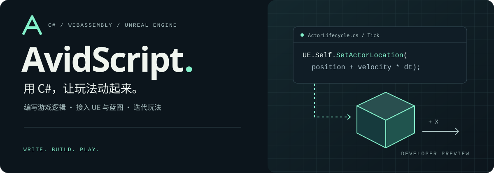

# AvidScript

<p align="center">
  
</p>

   [](LICENSE)

AvidScript 是 Unreal Engine 的 C# 脚本插件。C# 编译为 WebAssembly，通过生成的绑定调用 UE API，运行时不依赖 CLR。

> [!NOTE]
> 开发预览，支持 C# 子集。当前测试平台：UE 5.8 / Win64 Editor、Development。[支持范围](#limitations)

[安装](#installation) · [示例](#examples) · [支持范围](#limitations) · [开发](#development) · [License](#license)

<a id="usage"></a>

```csharp
// Tick：让当前 Actor 沿 X 轴移动，速度为 120 UE 单位/秒。
[UnmanagedCallersOnly(EntryPoint = "avid_on_tick")]
public static void Tick(float deltaSeconds)
{
    FVector currentLocation = UE.Self.GetActorLocation();
    UE.Self.SetActorLocation(currentLocation + new FVector(120.0f * deltaSeconds, 0.0f, 0.0f));
}
```

`UE.Self` 指向绑定脚本的 Actor。完整示例：[ActorLifecycleScript.cs](Samples/CSharp/ActorLifecycle/ActorLifecycleScript.cs)。

<a id="快速开始"></a>
<a id="安装"></a>
<a id="quick-start"></a>

## Installation

依赖：UE **5.8 源码版**、Visual Studio 2022（UE C++ 工具）、PowerShell 7、.NET SDK [**8.0.416**](global.json)。

将仓库放到工程的 `Plugins/AvidScript`，安装 Wasmtime 并编译 Editor。

<details>
<summary>源码构建命令（Win64）</summary>

在插件目录执行。以下使用 `AvidTPSTemplate` 工程；使用其他工程时，替换 `.uproject` 路径和 Editor target。

```powershell
# 安装 Wasmtime
pwsh -NoProfile -File Build/InstallWasmtimeDependency.ps1 -Mode Install

# 构建 Editor
$ueRoot = 'C:\UnrealEngine' # 改为本机 UE 源码目录
$project = (Resolve-Path ../../AvidTPSTemplate.uproject).Path
& (Join-Path $ueRoot 'Engine\Build\BatchFiles\Build.bat') `
  AvidTPSTemplateEditor Win64 Development "-Project=$project" `
  -WaitMutex -NoHotReloadFromIDE
```

</details>

1. 打开工程，放置并选中一个 **Movable** Cube。
2. 执行 **Tools → AvidScript → Build And Bind C# ActorLifecycle Script**。
3. 点击 **Play**。默认示例会移动、旋转和缩放 Cube。

编辑 `Samples/CSharp/ActorLifecycle/ActorLifecycleScript.cs` 后，再次执行同一菜单命令。

<a id="示例"></a>

## Examples

| 示例 | 内容 |
| --- | --- |
| [ActorLifecycle](Samples/CSharp/ActorLifecycle/ActorLifecycleScript.cs) | `BeginPlay`、`Tick`、输入和碰撞回调 |
| [LatentGameplay](Samples/CSharp/LatentGameplay/README.md) | `DelayAsync`、取消等待 |
| [NetworkRpc](Samples/CSharp/NetworkRpc/README.md) | 客户端与服务器 RPC |
| [ReplicatedProperty](Samples/CSharp/ReplicatedProperty/README.md) | 属性复制与 `RepNotify` 回调 |
| [UiSaveDemo](Samples/CSharp/UiSaveDemo/README.md) | UI 与存档 |
| [TypedProjectApi](Samples/CSharp/TypedProjectApi/README.md) | 调用项目中的 C++ API |
| [ScriptDefinedTypes](Samples/CSharp/ScriptDefinedTypes/README.md) | C# 声明 Actor、Component、Subsystem |

<details>
<summary>async / await：延迟执行与取消</summary>

[LatentGameplayScript.cs](Samples/CSharp/LatentGameplay/LatentGameplayScript.cs) 节选：

```csharp
private static AvidCancellationSource LifetimeCancellation;

[UnmanagedCallersOnly(EntryPoint = "avid_on_begin_play")]
public static async void BeginPlay()
{
    LifetimeCancellation = AvidCancellationSource.Create();

    // 等待 0.25 秒后缩放 Actor。
    await UKismetSystemLibrary.DelayAsync(0.25f)
        .WithCancellation(LifetimeCancellation.Token);
    UE.Self.SetActorScale3D(new FVector(1.25f, 1.25f, 1.25f));
}

[UnmanagedCallersOnly(EntryPoint = "avid_on_end_play")]
public static void EndPlay()
{
    LifetimeCancellation.Cancel();
    LifetimeCancellation.Release();
}
```

</details>

<a id="当前边界"></a>
<a id="已知限制"></a>
<a id="支持范围"></a>

## Limitations

| 项目 | 限制 |
| --- | --- |
| C# / .NET | C# 子集，不能直接运行任意 .NET 程序或 NuGet 包 |
| `Task<int>` | 仅支持同一脚本实例内等待 |
| 异步取消 | `catch` / `throw;` 为[内部预览](Docs/Phase66/P66.C7_Async_Cancellation_Language_Contract.md)；未捕获取消仍可能中止脚本 |
| `try` / `await` | 需要[预览开关](Docs/Phase66/P66.C6_Direct_Continuation_Await_Contract.md)；`catch`、`finally` 内不支持 `await` |
| C# 声明 UE 类型 | 修改 `UClass`、`UProperty`、`UFunction` 后需重新构建并重启 Editor |
| 平台 / 发布 | Android、iOS、Shipping、真实多人游戏尚未验收 |

<a id="构建与测试"></a>
<a id="开发"></a>
<a id="build-and-test"></a>

## Development

从插件目录执行：

```powershell
# 编译 ActorLifecycle 示例，生成 WASM
pwsh -NoProfile -File Build/BuildCSharpActorLifecycle.ps1

# 编译器测试
dotnet run --project Tools/AvidScript.CSharpGuest.Tests/AvidScript.CSharpGuest.Tests.csproj -c Release
```

<a id="项目结构"></a>
<a id="internals"></a>

<details>
<summary>源码结构与编译流程</summary>


```text
Source/    UE 插件模块
Tools/     C# 编译器、中间表示、WASM 生成工具
Build/     构建与验证脚本
Samples/   示例脚本
Docs/      使用说明、设计与测试记录
```

[语言实现与测试](Docs/Phase66/P66.C_Language_Execution_Plan.md)

</details>

<a id="许可"></a>

## License

[MIT](LICENSE)。第三方依赖：[Wasmtime](Source/ThirdParty/Wasmtime/README.md) / [WAMR](Source/ThirdParty/WAMR/README.md)。Unreal Engine 不包含在本仓库中。
