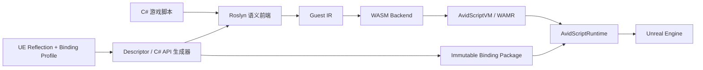

# AvidScript

AvidScript 是面向 Unreal Engine 的实验性现代脚本框架。目前主线使用 C# 作为脚本语言，经 Roslyn 语义分析、AvidScript Guest IR 和 WASM 后端生成 WebAssembly，并由嵌入 UE 的 WAMR 运行。

项目目标不是为每个 UE API 手写一层 wrapper，而是从 UE Reflection 和项目 Binding Profile 生成类型、函数与属性投影，在加载阶段建立不可变 dispatch plan，让脚本在 `BeginPlay`、`Tick`、Timer、Overlap 等 UE 事件中编写真实游戏逻辑。

> 当前版本为 `0.1.0 开发者预览`。Phase 50 主要验证 UE5.8 源码版、Windows 64 位 Development Editor；Cook、Shipping、Android 和 iOS 尚未完成正式支持。

## 当前能力

- C# 生命周期：`BeginPlay`、`Tick`、`EndPlay`、Timer 与 Gameplay Event 路由；
- 生成式 UE Binding：覆盖 profile 授权且 ABI 已支持的普通 `UFUNCTION` 和属性；
- 常用值类型：`FVector`、`FRotator`、`FTransform`、`FName` 等；
- typed `UE.Self`、项目 Actor handle、生成式继承关系与失败关闭的 checked cast；
- `TSubclassOf<T>` 风格 class reference，以及 `SpawnActor`、`DestroyActor`、`IsA`；
- generational object handle、World 隔离和失效句柄检测；
- binding package、prepared semantic、WASM import identity 与 Runtime Session 的多层 provenance 校验；
- C# 热重载、显式状态迁移、失败候选回滚和调试映射；
- package-load 缓存类型与反射调用计划，warm path 不按名称或 class path 查找 UE 对象。

一个 typed C# 脚本可以直接表达：

```csharp
using System.Runtime.InteropServices;

namespace AvidScript;

public static class GameScript
{
    private static AActor SpawnedActor;

    [UnmanagedCallersOnly(EntryPoint = "avid_on_begin_play")]
    public static void BeginPlay()
    {
        AAvidScriptTypedTestActor self = UE.Self;
        self.ApplyGameplayValue(4.0f);

        SpawnedActor = UE.SpawnActor(
            ProjectClasses.Projectile,
            FTransform.Identity);
    }

    [UnmanagedCallersOnly(EntryPoint = "avid_on_tick")]
    public static void Tick(float deltaSeconds)
    {
        if (SpawnedActor.IsValid)
        {
            SpawnedActor.SetActorScale3D(new FVector(1.0f, 1.0f, 1.0f));
        }
    }
}
```

生成 API 取决于项目 profile 与 UE Reflection 结果。完整可运行源码见 [TypedProjectApi](Samples/CSharp/TypedProjectApi/TypedProjectApiScript.cs)。

## 架构



| 模块 | 职责 |
| --- | --- |
| `AvidScriptCore` | 通用 ABI、诊断与基础合同 |
| `AvidScriptBindings` | UE typed binding、descriptor、缓存调用计划 |
| `AvidScriptVM` | WAMR、WASM 检查、Guest Memory 与 Host crossing |
| `AvidScriptRuntime` | Session、生命周期、对象 registry、热重载 |
| `AvidScriptEditor` | Reflection/profile、代码生成、C# 构建与 Editor 集成 |
| `Tools/` | Roslyn 前端、Guest 编译器、Guest IR 与 WASM 后端 |

## 环境要求

- Unreal Engine 5.8 源码版；
- Windows 10/11 x64；
- Visual Studio 2022 与 UE 要求的 C++ 工具链；
- .NET SDK `8.0.416`；
- PowerShell 7；
- Git。

WAMR 源码位于 `Source/ThirdParty/WAMR/upstream`，仓库不提交本地 `Binaries/`、`Intermediate/`、`Saved/` 或工具 `bin/obj` 产物。

## 接入项目

1. 将仓库放到 UE 项目的 `Plugins/AvidScript`。
2. 构建 Win64 WAMR：

```powershell
cmd /c Build\BuildWAMRWin64.cmd
```

3. 使用源码版 UE 构建项目 Editor Target：

```powershell
& "$env:UE_ROOT\Engine\Build\BatchFiles\Build.bat" `
  YourProjectEditor Win64 Development `
  "-Project=C:\Path\To\YourProject.uproject" `
  -WaitMutex -NoHotReloadFromIDE
```

4. 启动 Editor，并确认 `AvidScript` 插件已启用。
5. 从 `Samples/CSharp` 中选择最接近目标的 profile 与脚本，生成项目 binding package 后再构建 C# Guest。

当前构建与生成流程仍处于开发者预览阶段。建议先在同仓库测试项目中运行样例，再迁移到独立游戏项目。

## 样例

| 样例 | 展示内容 |
| --- | --- |
| [TypedProjectApi](Samples/CSharp/TypedProjectApi/README.md) | typed Self、自定义 UFUNCTION、Spawn、cast 与销毁 |
| [DynamicProjectile](Samples/CSharp/DynamicProjectile/README.md) | Blueprint class reference、Timer、Spawn/Destroy 与热重载回滚 |
| [PlayablePickup](Samples/CSharp/PlayablePickup/README.md) | Overlap 游戏事件、持久状态与热重载 |
| [ActorLifecycle](Samples/CSharp/ActorLifecycle/ActorLifecycleScript.cs) | 基础 BeginPlay/Tick/EndPlay |
| [D Guest](Samples/D/ActorSetLocation/README.md) | D 到 WASM 的早期验证链路 |
| [.avid Guest](Samples/AvidScript/ActorSetLocation/README.md) | 自研语言前端的早期原型 |

## 验证

项目使用三层集中验收：

- 固定 .NET 8.0.416 的前端、语义、Guest IR 与 WASM backend 合同测试；
- PowerShell parser、构建合同与架构门禁；
- UE5.8 no-clean 模块构建和 `Automation RunTests AvidScript`。

Phase 50 的能力、性能数据和边界见 [Phase 50 收尾报告](Docs/Phase50/P50_Phase50_Closeout.md)。

## 当前边界

- 不是完整 UE API 类型系统，只覆盖 descriptor 可表达且 ABI 已实现的类型；
- arbitrary `UStruct`、容器、delegate、Blueprint 图中新声明函数尚未完整支持；
- C# 支持面由 Roslyn semantic/CFG lowering 能力决定，并非完整 .NET Runtime；
- 移动端 AOT、Cook/Shipping、崩溃隔离和跨平台性能仍在后续阶段；
- 尚未建立与 Puerts、UnLua、AngelScript 的同机同项目公开 benchmark，因此当前不宣称外部性能排名。

## 开发约定

- 面向使用者的文档使用中文；
- 运行时能力必须由 descriptor/profile 生成，禁止为项目 API 添加专用 VM wrapper；
- Runtime 热路径使用加载期缓存 plan，禁止按字符串做反射查找；
- 不清理完整 Editor Target 来解决普通增量构建问题；
- 阶段状态、测试预算、错误记录与源码版 UE5.8 路径约定见 [AGENTS.md](AGENTS.md)。

## 许可证

AvidScript 的原创代码使用 [MIT License](LICENSE)。

`Source/ThirdParty/WAMR/upstream` 保留其上游 Apache License 2.0 及目录内其他第三方许可；Unreal Engine 本身不包含在本仓库中，并受 Epic Games 的许可条款约束。
