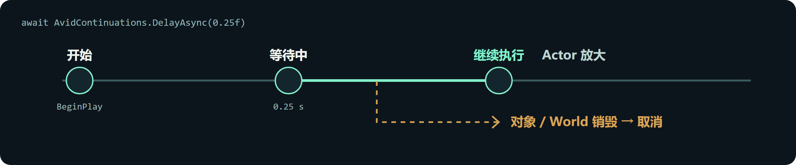
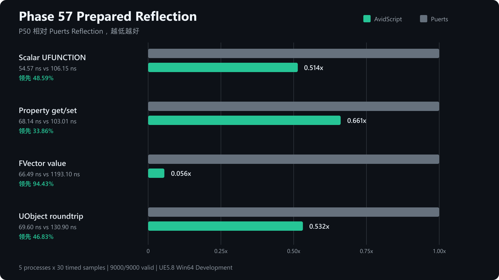

# AvidScript

     [](LICENSE)

AvidScript 是 Unreal Engine 的 C# 脚本插件。构建工具将 C# 编译为 WebAssembly（WASM），插件在游戏中加载脚本并调用 UE API；游戏运行时不加载 .NET/CLR。

当前版本为 **0.1.0 Preview**，主要验证环境是 **UE 5.8 源码版、Windows x64**。它支持下列样例中的开发流程，但尚不能运行任意 .NET 程序或 NuGet 包。

## 代码示例

以下是 [ActorLifecycleScript.cs](Samples/CSharp/ActorLifecycle/ActorLifecycleScript.cs) 中每帧移动 Actor 的核心写法：

```csharp
[UnmanagedCallersOnly(EntryPoint = "avid_on_tick")]
public static void Tick(float deltaSeconds)
{
    FVector position = UE.Self.GetActorLocation();
    UE.Self.SetActorLocation(
        position + new FVector(120.0f * deltaSeconds, 0.0f, 0.0f));
}
```

`UE.Self` 是挂载脚本的 Actor。这里按 `deltaSeconds` 计算位移，每秒沿 X 轴移动 120 个 UE 单位。完整样例还处理 `BeginPlay`、旋转、缩放、计时器、资源加载和 `EndPlay`。

## 快速开始

需要 Windows 10/11 x64、UE 5.8 源码版、Visual Studio 2022 的 UE C++ 构建环境、PowerShell 7、Git 和 .NET SDK **8.0.416**。以下命令均在项目的 `Plugins/AvidScript` 目录执行。

1. 将本仓库放入 C++ UE 项目的 `Plugins/AvidScript`，安装 Wasmtime 依赖：

   ```powershell
   pwsh -NoProfile -File Build/InstallWasmtimeDependency.ps1 -Mode Install
   ```

2. 构建项目的 Editor。将路径和 target 名换成自己的项目：

   ```powershell
   $env:UE_ROOT = "C:\UnrealEngine"

   & "$env:UE_ROOT\Engine\Build\BatchFiles\Build.bat" `
     YourProjectEditor Win64 Development `
     "-Project=C:\Path\To\YourProject.uproject" `
     -WaitMutex -NoHotReloadFromIDE
   ```

3. 打开 Editor，确认插件已启用。在关卡中放一个 Cube，将 **Mobility** 设为 **Movable** 并选中它。
4. 执行 **Tools > AvidScript > Build And Bind C# ActorLifecycle Script**，然后点击 **Play**。脚本会设置方块的初始位置，并持续移动、旋转和放大它。

如果没有看到变化，检查 Cube 上的 **AvidScript Component** 和 **Output Log** 中的 `AvidScript` 构建、加载错误。

<details>
<summary>命令行编译与手动绑定</summary>

在插件目录运行：

```powershell
pwsh -NoProfile -File Build/BuildCSharpActorLifecycle.ps1
```

成功时会输出 `result=direct_abi_built`。加载清单位于**项目目录**下的 `Saved/AvidScriptCSharpGuest/ActorLifecycle/actor_lifecycle.avidscript.json`。在 Actor 上添加 **AvidScript Component**，将 **Script Manifest File** 指向该文件；**Script Module** 留空。命令行编译不会修改关卡。

</details>

## 常见用法

### 等待后继续执行

```csharp
[UnmanagedCallersOnly(EntryPoint = "avid_on_begin_play")]
public static async void BeginPlay()
{
    await AvidContinuations.DelayAsync(0.25f);
    UE.Self.SetActorScale3D(new FVector(1.25f, 1.25f, 1.25f));
}
```

游戏不会因为 `await` 停帧。等待期间如果脚本所属对象或 World 被销毁，后续代码会取消。还支持下一帧、资源加载及受支持的 UE Latent API；主动取消的完整写法见 [LatentGameplay](Samples/CSharp/LatentGameplay/README.md)。



### 用 C# 定义 UE 类型

以下摘自 [ScriptDefinedTypes.cs](Samples/CSharp/ScriptDefinedTypes/ScriptDefinedTypes.cs)，展示可被蓝图调用的 Actor 方法：

```csharp
using AvidScript;

[UClass(Blueprintable = true, BlueprintType = true)]
public partial class Projectile : AvidActor
{
    [UProperty(BlueprintReadWrite = true, Category = "Projectile")]
    public float LaunchSpeed { get; set; } = 1200.0f;

    [UFunction(BlueprintCallable = true, Category = "Projectile")]
    public async void SetLaunchSpeedNextTick(float speed)
    {
        await AvidContinuations.NextTickAsync();
        LaunchSpeed = speed;
    }
}
```

调用后本帧保持原值，下一帧才写入 `speed`。新增或修改 `UClass/UProperty/UFunction` 等反射结构时，需要重新构建 Editor 并重启；仅修改受支持的方法体可以走热重载。[生成类型的构建与网络行为](Samples/CSharp/ScriptDefinedTypes/README.md)。

### 完整样例

| 需求 | 样例 |
| --- | --- |
| Actor 生命周期、Tick、资源加载 | [ActorLifecycle](Samples/CSharp/ActorLifecycle/ActorLifecycleScript.cs) |
| 道具拾取、延迟恢复 | [PlayablePickup](Samples/CSharp/PlayablePickup/README.md) |
| 限时收集小游戏 | [PickupRush](Samples/CSharp/PickupRush/README.md) |
| UI 与存档 | [UiSaveDemo](Samples/CSharp/UiSaveDemo/README.md) |
| RPC、属性复制与 RepNotify | [NetworkRpc](Samples/CSharp/NetworkRpc/README.md)、[ReplicatedProperty](Samples/CSharp/ReplicatedProperty/README.md) |
| UE 事件订阅与跨 `await` 回调 | [ScriptDefinedTypes](Samples/CSharp/ScriptDefinedTypes/README.md)、[事件合同](Docs/Phase66/P66.B_Event_Language_Contract.md) |
| 项目 C++ API 的生成绑定 | [TypedProjectApi](Samples/CSharp/TypedProjectApi/README.md) |

## 工作原理

```text
C# 源码 ──Roslyn/Guest IR──> WASM 模块
UE API 选择配置 ──绑定生成器──> C# 调用接口 + UE 描述符
WASM 模块 ──AvidScript Runtime──> UE 对象、属性、函数与事件
```

项目先选择要暴露的 UE API，构建工具再生成对应的 C# 调用接口。脚本持有受验证的对象句柄，不直接保存 `UObject*`。Wasmtime 是主要执行后端，另有 WAMR 兼容后端。

## 当前支持范围

| 范围 | 已有能力 | 主要限制 |
| --- | --- | --- |
| C# 语言 | 常用控制流、一维数组 `foreach`、受支持的类/结构体、lambda、局部函数 | 泛型执行、普通枚举器、异常等尚未覆盖完整 C#；不能直接使用任意 NuGet 包 |
| 异步 | 计时器、下一帧、资源加载、受支持的 UE Latent API | 不能等待任意 `Task` 或自定义 awaiter |
| UE API 与类型 | 生成的属性/函数绑定、常用数学类型、文本、受支持的数组/Set/Map | API 需先选择并生成绑定；部分嵌套容器和软/弱引用用法仍有限制 |
| UE 类型与网络 | C# 定义 Actor/Component/Subsystem；RPC、复制属性、RepNotify 的聚焦测试 | 反射结构变更需重建 Editor；真实游戏流程仍需单独验收 |
| 调试与重载 | 错误定位、调用栈、受支持的断点/变量查看；方法体热重载 | 不是完整 C# 调试器；不能回滚任意外部副作用 |
| 平台与打包 | Windows Development/Shipping 样例与打包验证 | Android 真机与 iOS 尚未验收；当前优先完善 Windows |

样例说明具体可运行路径；它们不表示任意 C# 写法或任意 UE 类型都已支持。已实现与待完成项见 [P66 实施计划](Docs/Phase66/P66.1_Implementation_Plan.md)。自动化测试也不能代替实际 Play、网络、长时间运行验收。

## 性能

部分冻结的 UE 调用基准优于 Puerts Reflection，但纯计算等项目尚未达到目标；目前没有证据证明整体领先 Puerts 或 Unreal AngelScript。测试条件和适用范围见 [性能报告](Docs/Phase65/P65.D34_Production_Epoch_Runtime.md)与[框架成熟度评估](Docs/Phase66/P66_Developer_Leadership_Assessment.md)。

<details>
<summary>查看 P57 历史调用基准图</summary>



这是 P57 历史基准，不是当前版本的完整性能排名。[原始证据](Docs/Phase57/P57.11B1_Recursive_Fixed_Struct_Codec_Evidence.json)包含测试配置与采样数据。

</details>

## 文档

- [编辑器命令与 IDE 工作区](Docs/Phase61/P61.D4c2_Editor_IDE_Commands.md)
- [调试面板](Docs/Phase61/P61.C4b_Editor_Debugger_Panel.md)
- [Windows 打包样例](Docs/Phase64/P64.D_Packaged_UI.md)
- [插件打包与安装](Docs/Phase65/P65.A_Deterministic_Release_And_Atomic_Install.md)
- [研发计划与设计记录](Docs/)
- [仓库工作规则](AGENTS.md)

## 许可证

AvidScript 原创代码采用 [MIT License](LICENSE)。Wasmtime 使用 Apache-2.0 WITH LLVM-exception；WAMR 保留上游许可。Unreal Engine 不包含在本仓库中。
