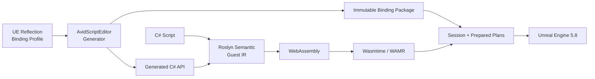
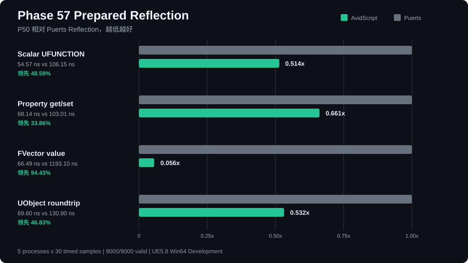

<div align="center">

# AvidScript

**面向 Unreal Engine 的现代 C# + WebAssembly 游戏脚本框架**

<p>
  
  
  
  
  
  
  
  <a href="LICENSE"></a>
</p>

AvidScript 将 C# 编译为轻量 WASM Guest，通过 Reflection 生成的 Binding 接入 UE 生命周期、
项目 API、网络与异步流程。Win64 主后端使用 Wasmtime 45，WAMR 保留为兼容与移动端候选。

</div>

> [!IMPORTANT]
> 当前版本为 **0.1.0 开发者预览**，主线验证环境是 **UE5.8 源码版 + Win64
> Development Editor + Wasmtime 45**。完整 BuildCookRun、Shipping、Android 与 iOS 尚未完成正式验收。

## 已实现

| 领域 | 已验证能力 |
| --- | --- |
| 游戏生命周期 | `BeginPlay`、`Tick`、`EndPlay`、Timer、Overlap、Gameplay Event |
| UE API | 由 Reflection/Profile 生成普通 `UFUNCTION`、`UPROPERTY`、UE Interface 与项目自定义 API |
| UE 类型 | UObject capability、`FVector`、`FRotator`、`FTransform`、固定 `USTRUCT`、`FName`、`FString`、一维 `TArray<T>` |
| C# 定义 UE 类型 | Actor、Component、World/GameInstance Subsystem、继承、override、`UPROPERTY`、`UFUNCTION` 与默认参数 |
| 异步 | `Delay`、`NextTick`、异步对象加载、latent `FooAsync`、Blueprint AsyncAction outcome 与受控 `async/await` |
| 委托 | 动态单播租约、多播订阅、强类型 `return/ref/out` 回调，以及生成式 `ExecuteX/BroadcastX` 主动调用 |
| Blueprint | 自声明 callable/event 双向调用、`before/after/replace` 事件接管，以及 AsyncAction 强类型 awaitable 生成 |
| 网络 | Server/Client/NetMulticast RPC、replicated property、RPC/RepNotify handler、dedicated/listen 多进程闭环 |
| 热重载 | 方法体事务式替换、候选回滚、状态帧与 handle 生命周期隔离 |
| 发布 | 内容寻址 Generated Type bundle、NonUFS staging 与 Cook-layout Runtime load |
| 后端 | Wasmtime 45 Win64 主后端；WAMR 兼容后端 |
| 增量构建 | 双层产物缓存与 persistent Worker；无修改热构建零编译调用，5 轮中位数 `884 ms` |
| 结构化诊断 | Debug Map v2、同步/async 序列点、稳定 probe ID、双后端 probe 执行、跨层调用栈、Editor 源码导航 |
| 同步调试 | 顶层 `void` 导出的非阻塞 pause、continue、step-into、4 KiB 状态帧、双后端恢复与源码断点目录 |
| 调试变量 | Session 按 probe 与词法作用域生成有界只读 snapshot，支持标量、enum、ObjectHandle/能力 token 与值类型摘要 |
| Editor 调试 | PIE 目标选择、源码断点、attach/pause/continue/step、暂停变量、源码跳转与 reload/teardown 安全 |

Phase 60 的功能批次已完成：UE Interface 与默认参数、Delegate 双向调用、Blueprint
callable/event，以及带 typed payload 的 AsyncAction `await` 已接入真实 C# Session Runtime。
异步对象支持 reload 重绑、reinstance 失效取消、teardown 回收与迟到广播抑制。

完整 AvidScript Automation `411/411`、UE5.8 no-clean UBT 与 clean detached architecture Gate
均已通过，Phase 60 已完成正式 attestation 与 close。

详细进度见 [Phase 60 中文收尾记录](Docs/Phase60/P60_Closeout.md)。

Phase 61 已完成 `P61.A-P61.C`：增量编译、Debug Map v2、可导航调用栈，
以及同步顶层 `void` 导出的 CPS 暂停/恢复闭环已落地。Editor 的 AvidScript Debugger 面板可选择 PIE
Component Session、维护源码断点、控制执行、查看暂停变量并跳转源码，reload/teardown 时自动安全重绑定或失效。
真实 Debug C# WASM 的 PIE World 集成用例已覆盖 pause、变量、step、continue、reload 与 EndPlay。
`EndPlay`、non-void、async 和 Guest helper 暂不生成可暂停点。
5 轮增量矩阵的无修改、方法体、Binding、工具链中位耗时为
`884 / 1833 / 1826 / 3223 ms`；Profiler、IDE workspace 与人工 Editor 交互验收仍在后续批次。

## C# 游戏脚本

下面的 typed API 来自项目 Reflection，不是为单个 API 手写的 VM wrapper：

```csharp
using System.Runtime.InteropServices;

namespace AvidScript;

public static class GameScript
{
    private static AActor Projectile;

    [UnmanagedCallersOnly(EntryPoint = "avid_on_begin_play")]
    public static async void BeginPlay()
    {
        AAvidScriptTypedTestActor self = UE.Self;
        self.ApplyGameplayValue(4.0f);

        Projectile = UE.SpawnActor(
            ProjectClasses.Projectile,
            FTransform.Identity);

        await AvidContinuations.NextTickAsync();
        Projectile.SetActorScale3D(new FVector(1.05f, 1.0f, 1.0f));
    }

    [UnmanagedCallersOnly(EntryPoint = "avid_on_tick")]
    public static void Tick(float deltaSeconds)
    {
        if (Projectile.HasHandle)
        {
            Projectile.AddActorWorldOffset(
                new FVector(100.0f * deltaSeconds, 0.0f, 0.0f));
        }
    }

    [UnmanagedCallersOnly(EntryPoint = "avid_on_end_play")]
    public static void EndPlay()
    {
        if (Projectile.HasHandle)
        {
            UE.DestroyActor(Projectile);
            Projectile = default;
        }
    }
}
```

完整样例见 [TypedProjectApi](Samples/CSharp/TypedProjectApi/README.md) 与
[ActorLifecycle](Samples/CSharp/ActorLifecycle/ActorLifecycleScript.cs)。

## 架构



| 模块 | 职责 |
| --- | --- |
| `AvidScriptCore` | 后端无关 ABI、错误与基础合同 |
| `AvidScriptBindings` | descriptor、codec、prepared executor 与 value heap |
| `AvidScriptVM` | Wasmtime/WAMR、WASM 校验、Guest Memory 与 Host crossing |
| `AvidScriptRuntime` | Session、生命周期、对象 registry、事件、异步与热重载 |
| `AvidScriptEditor` | Reflection/profile、代码生成、C# 构建和 Editor 集成 |
| `Tools/` | Roslyn 前端、Guest IR 与 WASM backend |

对象始终通过 generational `ObjectHandle` 访问；不向 Guest 暴露原始 `UObject*`。不支持的类型或
失配的反射身份会在生成或加载阶段失败关闭。

## 性能摘要

以下数据来自 UE5.8 Win64 Development、同机冻结 workload。比率小于 `1.0x` 表示
AvidScript 更快；这些结论只适用于对应 workload，不外推到所有脚本代码。



| UE 交互场景 | AvidScript P50 | Puerts Reflection P50 | 比率 |
| --- | ---: | ---: | ---: |
| Scalar UFUNCTION | `54.57 ns` | `106.15 ns` | **`0.514x`** |
| Property get/set | `68.14 ns` | `103.01 ns` | **`0.661x`** |
| FVector value | `66.49 ns` | `1193.10 ns` | **`0.056x`** |
| UObject roundtrip | `69.60 ns` | `130.90 ns` | **`0.532x`** |

Phase 56 完整游戏 workload 中，Small gameplay、Dense gameplay 与 Lifecycle callback 的
P50 比率分别为 **`0.469x`、`0.513x`、`0.391x`**。编译器托管数组区域在 `N>=64`
的冻结 workload 中领先 Puerts TArray **17.47x-20.04x**。

P60 的新增 UE 交互路径均在 warm path 禁止名称反射查找，并使用固定 20 组样本：

| P60 路径 | UE/原生 P50 | AvidScript P50 | 比率或预算 |
| --- | ---: | ---: | ---: |
| Interface | `0.151 us` | `0.387 us` | `2.56x` |
| Delegate 主动调用 | `0.553 us` | `0.726 us` | `1.31x` |
| Blueprint callable | `0.641 us` | `0.779 us` | `1.22x` |
| AsyncAction Session 生命周期 | 不适用 | `4.308 us` | `< 250 us` |

这些数字用于同一 UE 构建内的回归门禁，不等同于完整 WASM crossing 或竞品对比。

纯执行层仍未宣布绝对领先：12-kernel Wasmtime/V8 suite 的 P50/P95 几何均值为
`0.9800x / 1.0006x`，P95 领导力门禁仍未关闭。

完整口径与机器可读证据：

- [Prepared Reflection 证据](Docs/Phase57/P57.11B1_Recursive_Fixed_Struct_Codec_Evidence.json)
- [编译器托管数组区域报告](Docs/Phase57/P57.11D_Compiler_Managed_Array_Region.md)
- [Phase 56 游戏 workload 报告](Docs/Phase56/P56.5_Fused_Call_Frame_Implementation_Report.md)
- [Wasmtime Cranelift Speed 报告](Docs/Phase57/P57.13_Cranelift_Speed_Profile.md)
- [Phase 60 性能矩阵与 Gate](Docs/Phase60/P60.D_Performance_And_Gate.md)

## 快速开始

要求：UE5.8 源码版、Windows 10/11 x64、Visual Studio 2022、.NET SDK `8.0.416`、
PowerShell 7 与 Git。

1. 将仓库放入项目的 `Plugins/AvidScript`。
2. 在插件目录安装锁定的 Wasmtime 依赖：

```powershell
pwsh -NoProfile -File Build/InstallWasmtimeDependency.ps1 -Mode Install
```

3. 使用源码版 UE5.8 增量构建 Editor Target：

```powershell
$env:UE_ROOT = "C:\UnrealEngine"

& "$env:UE_ROOT\Engine\Build\BatchFiles\Build.bat" `
  YourProjectEditor Win64 Development `
  "-Project=C:\Path\To\YourProject.uproject" `
  -WaitMutex -NoHotReloadFromIDE
```

4. 构建仓库内第一个 C# 生命周期 Guest：

```powershell
pwsh -NoProfile -File Build/BuildCSharpActorLifecycle.ps1
```

项目自定义 API 需要先通过 Editor Reflection 与 Binding Profile 生成 binding package 和 C# facade。

## 样例

| 样例 | 展示内容 |
| --- | --- |
| [TypedProjectApi](Samples/CSharp/TypedProjectApi/README.md) | typed Self、自定义 UFUNCTION、Spawn、cast 与销毁 |
| [ActorLifecycle](Samples/CSharp/ActorLifecycle/ActorLifecycleScript.cs) | 生命周期、Timer、异步加载与受控 async/await |
| [PlayablePickup](Samples/CSharp/PlayablePickup/README.md) | Overlap、Gameplay Event、持久状态与热重载 |
| [NetworkRpc](Samples/CSharp/NetworkRpc/README.md) | C# 调用项目 Server、Client 与 NetMulticast RPC |
| [ReplicatedProperty](Samples/CSharp/ReplicatedProperty/README.md) | replicated property、authority setter 与 Push Model |
| [NetworkTopology](Samples/CSharp/NetworkTopology/README.md) | dedicated/listen 多进程网络闭环 |

## 当前边界

- 生成范围由 Binding Profile 与现有 ABI/codec 决定，还不是完整 UE 类型系统；
- C# `event +=` 与 lambda/closure 语法糖尚未实现；当前使用生成的显式 bind/subscribe 与 `ExecuteX/BroadcastX`；
- 容器当前聚焦一维 `TArray<T>`；nested array、`TSet`、`TMap` 与 `FText` 尚未完整支持；
- C# 前端提供受控游戏脚本子集，不包含完整 .NET Runtime、任意 awaiter 或异常系统；
- 反射结构变化仍需 no-clean UBT 并重启 Editor，方法体变化可自动热重载；
- Generated Type Cook bundle 已完成，完整 BuildCookRun、Shipping、崩溃隔离与移动端 AOT 尚未验收；
- 正式竞品性能矩阵目前覆盖 Puerts V8，尚未同口径覆盖 UnLua 与 AngelScript。

## 路线图

1. **P61**：增量编译、源码定位、调用栈、断点、变量查看与 Profiler；
2. **P62-P64**：Cook/Shipping、移动端 AOT 与真实小型游戏 Demo；
3. **P65**：跨框架成熟度、稳定性与性能领导力收口。

路线图只表示工程顺序，不代表对应能力已经可用。

## 验证

最近一次完整基线为 **AvidScript Automation 411/411 通过**。Phase 60 已完成 Interface、默认参数、
Delegate 双向调用、Blueprint callable/event 与 AsyncAction typed payload/await 闭环；UE5.8 no-clean
UBT、完整 Automation、性能预算和 clean detached architecture Gate 均已通过。

阶段状态与实现证据见 [Docs](Docs/)，开发规则见 [AGENTS.md](AGENTS.md)。

## 许可证

AvidScript 原创代码使用 [MIT License](LICENSE)。Wasmtime 使用 Apache-2.0 WITH
LLVM-exception；`Source/ThirdParty/WAMR/upstream` 保留上游许可。Unreal Engine 不包含在本仓库中。
