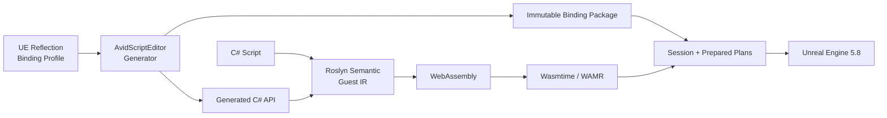

<div align="center">

# AvidScript

**面向 Unreal Engine 的现代 C# + WebAssembly 游戏脚本框架**

<p>
  
  
  
  
  
  
  
  
  <a href="LICENSE"></a>
</p>

AvidScript 将 C# 编译为 WASM，通过自动生成的 Binding 接入 UE 生命周期、项目 API、网络与异步流程。
Win64 主后端使用 Wasmtime 45，保留 WAMR 兼容后端；UE Runtime 不托管 CLR。

</div>

> [!IMPORTANT]
> 当前版本为 **0.1.0 开发者预览**，主线验证环境是 **UE5.8 源码版 + Win64
> Development/Shipping + Wasmtime 45**。两种 Win64 配置的 BuildCookRun 均已通过；Android arm64
> 交叉 AOT 发布已验证，Android UBT/真机与 iOS 仍待正式验收。

## 现在可以做什么

更新于 **2026-09-04**，最近交付代码为 [`d34f6c2`](https://github.com/Avidel-zzz/AvidScript/commit/d34f6c2dec0f7b0073d344065836f9dab8c2d6a1)，**P64 仍在实施中**。
已跑通 **C# → WASM → UE 事件与 API → Win64 打包运行**，可开始尝试小型玩法 Demo，不需要 `.avid`；
下面区分已交付能力与待验收内容，不把开发者预览视为完整 UE/.NET 替代层。

| 开始开发 | 已跑通的能力 | 样例与用法 |
| --- | --- | --- |
| C# 玩法 | BeginPlay/Tick/EndPlay、计时、收集、复活与胜负；Editor 和 Win64 Development/Shipping 包 | [用法](Samples/CSharp/PickupRush/README.md) · [C# 源码](Samples/CSharp/PickupRush/PickupRushScript.cs) |
| UI 与存档 | UMG 按钮/文本、SaveGame 跨进程读回、失败处理；存取穿插正文热重载与退出解绑 | [用法](Samples/CSharp/UiSaveDemo/README.md) · [C# 源码](Samples/CSharp/UiSaveDemo/UiSaveDemoScript.cs) |
| 项目 UE API | 从 Profile 生成自定义 `UFUNCTION/UPROPERTY` 接口；typed Self、Spawn、cast 与销毁 | [TypedProjectApi](Samples/CSharp/TypedProjectApi/README.md) |
| 联机玩法 | RPC、属性复制与 RepNotify；dedicated/listen 多进程验证 | [NetworkTopology](Samples/CSharp/NetworkTopology/README.md) |

**最近补齐**

- **存取与热重载可交错使用**：存档对象复用，Load 后旧对象可由 GC 回收；非法候选回滚后旧逻辑继续运行，退出时解绑按钮并释放 Session。见[实现与验证](Docs/Phase64/P64.D_Save_Reload_Ownership.md)。
- **失败存取保留有效状态**：读档失败不替换原对象与分数；Reset 不改磁盘存档，写锁导致保存失败时文件保持不变。见[异常流程](Docs/Phase64/P64.D_UI_Save_Edges.md)。
- **C# 异步语义修正**：[初始化隐式上转](Docs/Phase64/P64.D_Async_Initializer_Conversion.md)和 [`&&/||` 短路求值](Docs/Phase64/P64.D_Async_Short_Circuit.md)，支持样例的延迟 UI 初始化。

**尚未验收：** World 销毁重建、长稳与内存趋势、UI 真实输入/视觉和包内运行；Android UBT/真机及 iOS。
当前 20 轮热重载验证不代表长期运行无泄漏。具体计数集中列在[验证](#验证)，性能口径见[性能摘要](#性能摘要)。

## 框架能力

| 领域 | 已实现内容 |
| --- | --- |
| 游戏流程 | `BeginPlay/Tick/EndPlay`、Timer、Overlap、Gameplay Event；[事件型脚本](Docs/Phase64/P64.D_EventOnly_Runtime.md)可省略 Tick，Startup Scenario 自动挂载与回滚 |
| 生成式 UE API | Reflection/Profile、Interface、项目与 Blueprint 类型；普通 UObject 的 [owned/borrowed 授权](Docs/Phase64/P64.D_Reflection_Receiver.md)与 Self 缓存隔离 |
| 类型与容器 | `UObject/AActor`、`FVector/FTransform`、固定 `USTRUCT`、名称/字符串、`FText`；数组、递归容器、`TSet/TMap`，soft/weak object 身份往返；覆盖限制见下方 |
| C# 定义 UE 类型 | Actor、Component、World/GameInstance Subsystem，含继承、override、属性、函数与默认参数 |
| 异步与委托 | 受控 `async/await`、Delay/NextTick、异步加载、Latent、AsyncAction；单播/多播、受支持签名的 `return/ref/out` 与主动调用；独立 UObject 订阅与[回调来源查询](Docs/Phase64/P64.D_Delegate_Source_Context.md) |
| Blueprint 与网络 | callable/event 双向交互；Server/Client/NetMulticast RPC、属性复制与 RepNotify，dedicated/listen 多进程验证 |
| 热重载与安全 | 方法体替换、持久字段迁移与失败回滚，候选激活仅允许可回滚的 Host 副作用；ObjectHandle、Session 隔离、执行预算与退出取消 |
| Cook 与发布 | 内容寻址模块、多平台 catalog、无头 Release、Generated Type 预编译；Win64 Development/Shipping BuildCookRun 与回执校验 |
| VM 后端 | Wasmtime 45 Win64 JIT/AOT；Android arm64 脚本及 Generated Type 交叉 AOT；WAMR 兼容后端 |
| 构建与 IDE | 增量缓存、persistent Worker、`.slnx`/WASI 工作区、离线源码索引与 Visual Studio/Rider/VS Code 启动 |
| 调试与 Profiler | 源码映射、跨层调用栈、PIE 目标、受控同步断点/步进、只读变量；UE Trace、热点与 JSON 导出 |

类型覆盖见 [P58 验收](Docs/Phase58/P58.4_Centralized_Gate_Report.md)，最新交付见
[P64 记录](Docs/Phase64/P64_Closeout.md)。**功能已实现不等于全部场景验收完成**，具体限制见[当前边界](#当前边界)。

## 架构



| 模块 | 职责 |
| --- | --- |
| `AvidScriptCore` | 后端无关 ABI、错误与基础合同 |
| `AvidScriptBindings` | descriptor、codec、prepared executor 与 value heap |
| `AvidScriptVM` | Wasmtime/WAMR、WASM 校验、Guest Memory 与 Host crossing |
| `AvidScriptRuntime` | Session、生命周期、对象 registry、事件、异步与热重载 |
| `AvidScriptEditor` | Reflection/profile、代码生成、C# 构建和 Editor 集成 |
| `Tools/` | Roslyn 前端、Guest IR 与 WASM backend |

对象始终通过 generational `ObjectHandle` 访问；不向 Guest 暴露原始 `UObject*`。不支持的类型或
失配的反射身份会在生成或加载阶段失败关闭。

## 性能摘要

**指定 UE 交互路径已领先冻结版本的 Puerts；纯执行层尚未全面领先。**
以下为已归档基准，**没有对当前 P64 改动重新测量**。主表来自 P57：UE5.8 Win64 Development、
Intel Core Ultra 7 265K、Wasmtime 45 Cranelift JIT，与冻结版本的 Puerts V8 同机对照；
5 个计时进程，每进程 5 次预热、每单元 30 次采样。比率为 AvidScript / Puerts，越低越好。


| UE 交互场景 | AvidScript 耗时（P50） | Puerts Reflection 耗时（P50） | 比率 |
| --- | ---: | ---: | ---: |
| Scalar UFUNCTION | `54.57 ns` | `106.15 ns` | **`0.514x`** |
| Property get/set | `68.14 ns` | `103.01 ns` | **`0.661x`** |
| FVector value | `66.49 ns` | `1193.10 ns` | **`0.056x`** |
| UObject roundtrip | `69.60 ns` | `130.90 ns` | **`0.532x`** |

以上是指定 prepared/fused 路径的每逻辑操作耗时，不代表任意 `UFUNCTION` 都有相同收益。
环境、路由计数与正确性结果见 [P57 原始证据](Docs/Phase57/P57.11B1_Recursive_Fixed_Struct_Codec_Evidence.json)。

Phase 56 的游戏逻辑基准中，Small gameplay、Dense gameplay 与 Lifecycle callback 相对各自冻结 Puerts 对照路径的
P50 比率分别为 **`0.469x`、`0.513x`、`0.391x`**；这是受控 workload，不是整款游戏帧率。详见
[游戏 workload 报告](Docs/Phase56/P56.5_Fused_Call_Frame_Implementation_Report.md)。

**尚未全面领先：** 12-kernel 相同 WASM 的 Wasmtime/V8 对照中，P50/P95 几何均值为
`0.9800x / 1.0006x`，均未达到冻结的 `<= 0.95x` 目标；这不是 C# 与 JavaScript 的完整游戏比较。
纯执行领导力门禁仍未关闭，也没有同口径 UnLua/AngelScript 排行榜。见
[执行层报告](Docs/Phase57/P57.13_Cranelift_Speed_Profile.md)。

其他归档结果：[容器基准](Docs/Phase57/P57.11D_Compiler_Managed_Array_Region.md)、
[UE 原生对照](Docs/Phase60/P60.D_Performance_And_Gate.md)、[增量构建](Docs/Phase61/P61.E_Integration_Gate.md)。

## 快速开始

要求：UE5.8 源码版、Windows 10/11 x64、Visual Studio 2022、.NET SDK `8.0.416`、
PowerShell 7 与 Git。

1. 将仓库放入项目的 `Plugins/AvidScript`。
2. 在插件目录安装锁定的 Wasmtime 依赖：

```powershell
pwsh -NoProfile -File Build/InstallWasmtimeDependency.ps1 -Mode Install
```

3. 使用源码版 UE5.8 增量构建 Editor Target：

```powershell
$env:UE_ROOT = "C:\UnrealEngine"

& "$env:UE_ROOT\Engine\Build\BatchFiles\Build.bat" `
  YourProjectEditor Win64 Development `
  "-Project=C:\Path\To\YourProject.uproject" `
  -WaitMutex -NoHotReloadFromIDE
```

4. 构建仓库内第一个 C# 生命周期 Guest：

```powershell
pwsh -NoProfile -File Build/BuildCSharpActorLifecycle.ps1
```

项目自定义 API 需要先通过 Editor Reflection 与 Binding Profile 生成 binding package 和 C# facade。

更多样例：[生命周期与异步](Samples/CSharp/ActorLifecycle/ActorLifecycleScript.cs)、
[事件与热重载](Samples/CSharp/PlayablePickup/README.md)、[RPC](Samples/CSharp/NetworkRpc/README.md)、
[属性复制](Samples/CSharp/ReplicatedProperty/README.md)、[多进程网络](Samples/CSharp/NetworkTopology/README.md)。

## 当前边界

- **UE 类型**：由 Profile 与 ABI/codec 决定生成范围，并非所有 UE API 自动可用。复合容器内强 UObject 引用仍拒绝，平面 `TArray<UObject*>` 可用；Set/Map key 受确定性编码限制，soft/weak 的脚本侧解析易用接口待补齐。
- **C# 子集**：无完整 .NET Runtime、任意 awaiter 或异常系统；暂不支持 `event +=`、lambda/closure，使用显式 bind/subscribe 与 `ExecuteX/BroadcastX`。
- **重载与隔离**：方法体可热重载；UI 样例通过 `NextTickAsync` 在候选提交后初始化。准备期无可回滚适配的反射写入仍被拒绝，不承诺回滚任意外部副作用。反射结构变更需增量 UBT 并重启 Editor；WASM 隔离不是原生 DLL 进程沙箱。
- **玩法与平台**：UI/存档通过 Editor 合成事件验证，不等于真实输入/视觉、任意损坏存档、World 销毁、包内 UI 或热重载长稳验收；Android UBT/APK/真机及 iOS 尚未验收。
- **诊断与性能**：typed Host 的具体拒绝原因尚未统一透传到 VM 错误；纯执行 P50/P95 领先门禁未关闭，也未完成同口径 UnLua/AngelScript 矩阵。

下一步补齐 World 销毁重建、长稳、UI 真实输入/包内运行及移动构建/设备证据；
随后推进安装、升级、兼容和诊断等发布工程，不以阶段编号代替实际验收。

## 验证

完整回归与后续专项分别记录，**不累加成当前全量通过数**：

| 范围 | 已归档证据 |
| --- | --- |
| [完整技术基线](Docs/Phase64/P64_Closeout.md)，候选 `9e08cdc` | Automation **439/439**、.NET **284/284**；10 组 PowerShell 合同、干净候选架构检查和 no-clean Editor UBT 通过 |
| [PickupRush](Samples/CSharp/PickupRush/README.md) | Editor / Win64 Development / Shipping 均为 **5/5** 事件与胜利状态；包回执 **21/21 / 19/19** |
| [存取与正文重载专项](Docs/Phase64/P64.D_Save_Reload_Ownership.md) | 组合流程 **165/165** 动作、runner **118/118**、生命周期 **18/18**；103 个快照 owned 为 0，GC 后 borrowed 稳定为 8；纯 UI 重载 **84/84** 回归通过 |
| [存档与异常流程](Docs/Phase64/P64.D_UI_Save_Edges.md) | 五个独立进程 **31/31** 动作；覆盖保存、重启读取、缺档、GC、读取失败、写锁与组件退出 |
| [C# 编译器专项](Docs/Phase64/P64.D_Async_Short_Circuit.md) | Guest **140/140**、Semantic **98/98**；新增 **13** 个 IR 执行场景及 WASM 编译，不宣称真实 WASM 执行 |

其他修复证据见 [C# 捕获赋值](Docs/Phase64/P64.D_Captured_Assignment.md)及上方近期交付。
机器验证不替代真实输入、视觉、设备和长稳验收；[Android 边界](Docs/Phase64/P64.D_Android_Readiness.md)单独保留。

阶段状态与实现证据见 [Docs](Docs/)，开发规则见 [AGENTS.md](AGENTS.md)。

## 许可证

AvidScript 原创代码使用 [MIT License](LICENSE)。Wasmtime 使用 Apache-2.0 WITH
LLVM-exception；`Source/ThirdParty/WAMR/upstream` 保留上游许可。Unreal Engine 不包含在本仓库中。
