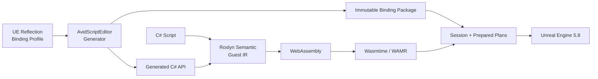

<div align="center">

# AvidScript

**面向 Unreal Engine 的现代 C# + WebAssembly 游戏脚本框架**

<p>
  
  
  
  
  
  
  
  
  <a href="LICENSE"></a>
</p>

AvidScript 将 C# 编译为 WASM，通过自动生成的 Binding 接入 UE 生命周期、项目 API、网络与异步流程。
Win64 主后端使用 Wasmtime 45，保留 WAMR 兼容后端；UE Runtime 不托管 CLR。

</div>

> [!IMPORTANT]
> 当前版本为 **0.1.0 开发者预览**，主线验证环境是 **UE5.8 源码版 + Win64
> Development/Shipping + Wasmtime 45**。两种 Win64 配置的 BuildCookRun 均已通过；Android arm64
> 交叉 AOT 发布已验证，Android UBT/真机与 iOS 仍待正式验收。

## 现在可以做什么

更新于 **2026-09-05**。已跑通 **C# → WASM → UE 事件与 API → Win64 打包运行**，
可开始尝试小型玩法 Demo，不需要 `.avid`。**P64 仍在实施中，不是完整 UE/.NET 替代层。**

| 能力 | 已实现内容 |
| --- | --- |
| C# 游戏逻辑 | `BeginPlay/Tick/EndPlay`、Timer、Overlap、Gameplay Event；事件型脚本可省略 Tick，Startup Scenario 自动挂载与回滚 |
| UE API 与类型 | 从 Reflection/Profile 生成项目 `UFUNCTION/UPROPERTY`、Interface 和 Blueprint 接口；支持 `UObject/AActor`、`FVector/FTransform`、固定 `USTRUCT`、`FText` 与受支持的递归容器、Set/Map |
| C# 定义 UE 类型 | Actor、Component、World/GameInstance Subsystem，含继承、override、属性、函数与默认参数 |
| UI 与存档 | C# 驱动 UMG 按钮/文本、SaveGame 跨进程读回、存取失败保护；切图后恢复存档。Development/Shipping 包内 AOT 存取已通过，Development 样例已有人工界面/点击反馈 |
| 异步与委托 | 受控 `async/await`、Delay/NextTick、异步加载、Latent、AsyncAction；单播/多播、受支持签名的 `return/ref/out`、独立 UObject 订阅与回调来源查询 |
| Blueprint 与联机 | callable/event 双向交互；Server/Client/NetMulticast RPC、属性复制与 RepNotify，dedicated/listen 多进程验证 |
| 热重载与生命周期 | 方法体替换、持久字段迁移、失败候选回滚；存取可穿插重载，退出时取消异步并解绑事件；ObjectHandle 与 Session 隔离 |
| 构建与发布 | Wasmtime 45 Win64 JIT/AOT、WAMR 兼容后端；内容寻址模块、Generated Type 预编译、Development/Shipping BuildCookRun；Android arm64 交叉 AOT |
| IDE 与诊断 | 增量缓存、persistent Worker、`.slnx`/WASI 工作区；VS/Rider/VS Code 启动、源码映射、跨层栈、受控断点/步进与只读变量；UE Trace 和 Profiler 导出 |

直接看 C# 样例：[收集玩法](Samples/CSharp/PickupRush/README.md) ·
[UI/存档](Samples/CSharp/UiSaveDemo/README.md)（[源码](Samples/CSharp/UiSaveDemo/UiSaveDemoScript.cs)）·
[项目 API](Samples/CSharp/TypedProjectApi/README.md) · [联机](Samples/CSharp/NetworkTopology/README.md)。

**近期交付：** [Development/Shipping 包内 UI/存档](Docs/Phase64/P64.D_Packaged_UI.md)、
[包内 World 生命周期门槛](Docs/Phase64/P64.D_Packaged_World_Soak.md)、两次 Editor 一小时切图、
[分配栈诊断](Docs/Phase64/P64.D_Native_Allocation_Tracing.md)与[调用生命周期修复](Docs/Phase64/P64.D_Invocation_Lifetime.md)。
已知字符串参数帧逐轮保留已归零；整个 Editor 进程的剩余增长仍在归因，不宣称无泄漏。
完整记录见 [P64 交付](Docs/Phase64/P64_Closeout.md)，类型范围见 [P58 验收](Docs/Phase58/P58.4_Centralized_Gate_Report.md)。
实现与验收分别记录，限制见[当前边界](#当前边界)。

## 架构



| 模块 | 职责 |
| --- | --- |
| `AvidScriptCore` | 后端无关 ABI、错误与基础合同 |
| `AvidScriptBindings` | descriptor、codec、prepared executor 与 value heap |
| `AvidScriptVM` | Wasmtime/WAMR、WASM 校验、Guest Memory 与 Host crossing |
| `AvidScriptRuntime` | Session、生命周期、对象 registry、事件、异步与热重载 |
| `AvidScriptEditor` | Reflection/profile、代码生成、C# 构建和 Editor 集成 |
| `Tools/` | Roslyn 前端、Guest IR 与 WASM backend |

对象始终通过 generational `ObjectHandle` 访问；不向 Guest 暴露原始 `UObject*`。不支持的类型或
失配的反射身份会在生成或加载阶段失败关闭。

## 性能摘要

**指定 UE 交互路径已领先冻结版本的 Puerts；纯执行层尚未全面领先。**
以下为 **P57 归档基准，未对当前 P64 重测**：UE5.8 Win64 Development、Intel Core Ultra 7 265K，
Wasmtime 45 Cranelift JIT 对冻结版本的 Puerts V8，同机 5 个进程、每进程 5 次预热、每单元 30 次采样。
比率为 AvidScript / Puerts，越低越好。


| UE 交互场景 | AvidScript 耗时（P50） | Puerts Reflection 耗时（P50） | 比率 |
| --- | ---: | ---: | ---: |
| Scalar UFUNCTION | `54.57 ns` | `106.15 ns` | **`0.514x`** |
| Property get/set | `68.14 ns` | `103.01 ns` | **`0.661x`** |
| FVector value | `66.49 ns` | `1193.10 ns` | **`0.056x`** |
| UObject roundtrip | `69.60 ns` | `130.90 ns` | **`0.532x`** |

这是指定 prepared/fused 路径的每逻辑操作耗时，不代表任意 `UFUNCTION` 或整款游戏帧率。
见 [P57 原始证据](Docs/Phase57/P57.11B1_Recursive_Fixed_Struct_Codec_Evidence.json)。

- **游戏逻辑：** P56 Small/Dense gameplay 与 Lifecycle callback 的 P50 比率为 **`0.469x / 0.513x / 0.391x`**，各自对照路径与范围见[报告](Docs/Phase56/P56.5_Fused_Call_Frame_Implementation_Report.md)。
- **纯执行：** 12-kernel 相同 WASM 对照的 P50/P95 几何均值为 **`0.9800x / 1.0006x`**，未达到 `<= 0.95x` 目标；不是 C# 对 JavaScript 的完整游戏比较。见[执行层报告](Docs/Phase57/P57.13_Cranelift_Speed_Profile.md)。
- **比较边界：** 尚无同口径 UnLua/AngelScript 排行榜；不宣称全场景领先。其他数据见[容器](Docs/Phase57/P57.11D_Compiler_Managed_Array_Region.md)、[UE 原生对照](Docs/Phase60/P60.D_Performance_And_Gate.md)与[增量构建](Docs/Phase61/P61.E_Integration_Gate.md)。

## 快速开始

要求：UE5.8 源码版、Windows 10/11 x64、Visual Studio 2022、.NET SDK `8.0.416`、
PowerShell 7 与 Git。

1. 将仓库放入项目的 `Plugins/AvidScript`。
2. 在插件目录安装锁定的 Wasmtime 依赖：

```powershell
pwsh -NoProfile -File Build/InstallWasmtimeDependency.ps1 -Mode Install
```

3. 使用源码版 UE5.8 增量构建 Editor Target：

```powershell
$env:UE_ROOT = "C:\UnrealEngine"

& "$env:UE_ROOT\Engine\Build\BatchFiles\Build.bat" `
  YourProjectEditor Win64 Development `
  "-Project=C:\Path\To\YourProject.uproject" `
  -WaitMutex -NoHotReloadFromIDE
```

4. 构建仓库内第一个 C# 生命周期 Guest：

```powershell
pwsh -NoProfile -File Build/BuildCSharpActorLifecycle.ps1
```

项目自定义 API 需要先通过 Editor Reflection 与 Binding Profile 生成 binding package 和 C# facade。

更多样例：[生命周期与异步](Samples/CSharp/ActorLifecycle/ActorLifecycleScript.cs)、
[事件与热重载](Samples/CSharp/PlayablePickup/README.md)、[RPC](Samples/CSharp/NetworkRpc/README.md)、
[属性复制](Samples/CSharp/ReplicatedProperty/README.md)、[多进程网络](Samples/CSharp/NetworkTopology/README.md)。

## 当前边界

- **UE 类型**：由 Profile 与 ABI/codec 决定生成范围，并非所有 UE API 自动可用。复合容器内强 UObject 引用仍拒绝，平面 `TArray<UObject*>` 可用；Set/Map key 受确定性编码限制，soft/weak 的脚本侧解析易用接口待补齐。
- **C# 子集**：无完整 .NET Runtime、任意 awaiter 或异常系统；暂不支持 `event +=`、lambda/closure，使用显式 bind/subscribe 与 `ExecuteX/BroadcastX`。
- **重载与隔离**：方法体可热重载；UI 样例通过 `NextTickAsync` 在候选提交后初始化。准备期无可回滚适配的反射写入仍被拒绝，不承诺回滚任意外部副作用。反射结构变更需增量 UBT 并重启 Editor；WASM 隔离不是原生 DLL 进程沙箱。
- **玩法与平台**：UI 包使用独立验证插件和隔离启动配置，Development/Shipping 均通过跨进程自动存取；Development 首轮人工界面/按钮反馈无问题，人工重启读档、Shipping 视觉及网络/重载长稳仍待验收。任意损坏存档不在现有保证内；两次一小时切图均通过，但剩余 Editor/探针/分配器内存增长、Android UBT/APK/真机及 iOS 仍未验收。
- **诊断与性能**：[typed Host 结构化诊断合同](Docs/Phase64/P64.D_Typed_Host_Diagnostics.md)已冻结，产品透传与双后端/重入验证尚未完成；纯执行 P50/P95 领先门禁未关闭，也未完成同口径 UnLua/AngelScript 矩阵。

下一步补齐人工重启读档与 Shipping 视觉、内存归因、网络/重载长稳及移动构建/设备证据；
随后推进安装、升级、兼容和诊断等发布工程，不以阶段编号代替实际验收。

## 验证

完整回归与后续专项分别记录，**不累加成当前全量通过数**：

| 范围 | 已归档证据 |
| --- | --- |
| [完整技术基线](Docs/Phase64/P64_Closeout.md)，候选 `9e08cdc` | Automation **439/439**、.NET **284/284**；10 组 PowerShell 合同、干净候选架构检查和 no-clean Editor UBT 通过 |
| [PickupRush](Samples/CSharp/PickupRush/README.md) | Editor / Win64 Development / Shipping 均为 **5/5** 事件与胜利状态；包回执 **21/21 / 19/19** |
| [存取与正文重载](Docs/Phase64/P64.D_Save_Reload_Ownership.md) | **165/165** 动作、runner **118/118**、生命周期 **18/18**；GC 后资源有界，纯 UI 重载 **84/84** 回归通过 |
| [存档与异常流程](Docs/Phase64/P64.D_UI_Save_Edges.md) | 五个独立进程 **31/31** 动作；覆盖保存、重启读取、缺档、GC、读取失败、写锁与组件退出 |
| [Development/Shipping 包内 UI](Docs/Phase64/P64.D_Packaged_UI.md) | Wasmtime 45 AOT，各两个实际 Game 进程 **5/5 + 2/2** 动作，回执 **28/28、25/25**；包内 runner **29/29**，Component 专项 **10/10** |
| [包内 World 生命周期](Docs/Phase64/P64.D_Packaged_World_Soak.md) | Development AOT **1173 轮/5866 动作/3602.566 秒**及 Shipping **3 轮/16 动作**通过；UObject、Session、backend 与 VM cache 有界，D07 已验证；动态 Delegate `UFunction` 的 GC Fatal 已修复 |
| [World 连续运行](Docs/Phase64/P64.D_World_Soak.md) | 修复前后两次各 **约 3601 秒、877 次切图、4386/4386 动作**；旧对象逐轮回收，Session/backend live/UObject 有界；Editor 增长已由包内一小时分层 |
| [内存归因与分配栈](Docs/Phase64/P64.D_Native_Allocation_Tracing.md) | VM/Trace/FName/LLM 快照、GC 书签与 Insights 四组查询；`SetUtf8Value` 两窗口 **0 项/0 字节**，结合包内稳态验证 D07，但不宣称整个进程零增长 |
| [调用生命周期修复](Docs/Phase64/P64.D_Invocation_Lifetime.md) | 原生 UFunction 非平凡帧统一析构；Wasmtime 重载历史改为调用者按需持有；Binding **1/1**、Wasmtime **14/14**，修复后一小时 **877/877** 轮通过 |

编译器专项见 [async 短路求值](Docs/Phase64/P64.D_Async_Short_Circuit.md)与[C# 捕获赋值](Docs/Phase64/P64.D_Captured_Assignment.md)。
上述机器验证不替代真实输入、视觉、设备和完整长稳验收；[Android 边界](Docs/Phase64/P64.D_Android_Readiness.md)单独保留。

阶段状态与实现证据见 [Docs](Docs/)，开发规则见 [AGENTS.md](AGENTS.md)。

## 许可证

AvidScript 原创代码使用 [MIT License](LICENSE)。Wasmtime 使用 Apache-2.0 WITH
LLVM-exception；`Source/ThirdParty/WAMR/upstream` 保留上游许可。Unreal Engine 不包含在本仓库中。
