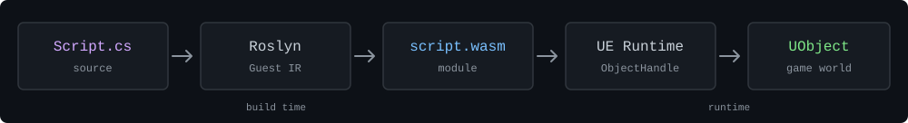

# AvidScript

   [](LICENSE)

在 Unreal Engine 中运行 C# 游戏脚本：编译器生成 WASM，UE 插件负责加载、调用和访问引擎对象。运行游戏时不需要 CLR。



目前面向 **UE 5.8 源码版 / Win64** 开发。语言和 API 仍在扩充，先从仓库内的样例开始。

## Quick start

需要 Windows 10/11 x64、UE 5.8 源码版、Visual Studio 2022 的 UE C++ 工作负载、PowerShell 7、Git，以及 [global.json](global.json) 指定的 .NET SDK。以下命令在 `AvidTPSTemplate/Plugins/AvidScript` 目录执行。

1. 安装 Win64 Wasmtime 依赖：

   ```powershell
   pwsh -NoProfile -File Build/InstallWasmtimeDependency.ps1 -Mode Install
   ```

2. 构建 Editor：

   ```powershell
   $env:UE_ROOT = "C:\Path\To\UnrealEngine" # 改为 UE 5.8 源码目录
   $uproject = (Resolve-Path ../../AvidTPSTemplate.uproject).Path
   & (Join-Path $env:UE_ROOT "Engine\Build\BatchFiles\Build.bat") `
     AvidTPSTemplateEditor Win64 Development "-Project=$uproject" `
     -WaitMutex -NoHotReloadFromIDE
   ```

3. 打开项目，在关卡里放置并选中一个 **Movable** Cube。运行 **Tools > AvidScript > Build And Bind C# ActorLifecycle Script**，再点击 **Play**。Cube 应移动、旋转并放大。

只想生成脚本 WASM 时，运行 `pwsh -NoProfile -File Build/BuildCSharpActorLifecycle.ps1`。如果 Play 后 Actor 没变化，检查 Actor 上的 **AvidScript Component**，并在 **Output Log** 中搜索 `AvidScript`。

## C# 代码

[ActorLifecycleScript.cs](Samples/CSharp/ActorLifecycle/ActorLifecycleScript.cs) 的 `Tick` 每秒沿 X 轴移动 120 个 UE 单位：

```csharp
[UnmanagedCallersOnly(EntryPoint = "avid_on_tick")]
public static void Tick(float deltaSeconds)
{
    FVector position = UE.Self.GetActorLocation();
    UE.Self.SetActorLocation(position + new FVector(120.0f * deltaSeconds, 0.0f, 0.0f));
}
```

`UE.Self` 指向当前绑定的 Actor。完整文件还包含 BeginPlay、计时器、异步加载、碰撞和 EndPlay。

也可以从 C# 声明 Blueprint 可访问的 UE 类型。[ScriptDefinedTypes.cs](Samples/CSharp/ScriptDefinedTypes/ScriptDefinedTypes.cs) 中的 Actor 包含：

```csharp
[UClass(Blueprintable = true, BlueprintType = true)]
public partial class Projectile : AvidActor
{
    [UProperty(BlueprintReadWrite = true, Category = "Projectile")]
    public float LaunchSpeed { get; set; } = 1200.0f;

    [UFunction(BlueprintCallable = true, Category = "Projectile")]
    public async void SetLaunchSpeedNextTick(float speed)
    {
        await AvidContinuations.NextTickAsync();
        LaunchSpeed = speed;
    }
}
```

调用 `SetLaunchSpeedNextTick(900)` 后，`LaunchSpeed` 在下一帧变为 `900`。增加或修改反射成员需要重新构建并重启 Editor；构建方法见[类型定义样例](Samples/CSharp/ScriptDefinedTypes/README.md)。

## 样例与状态

| 场景 | 代码 | 当前验证 |
| --- | --- | --- |
| Actor 生命周期与 UE API | [ActorLifecycle](Samples/CSharp/ActorLifecycle/) | Win64 Editor 样例 |
| 下一帧、计时器、异步加载 | [LatentGameplay](Samples/CSharp/LatentGameplay/README.md) | 样例与自动化测试 |
| RPC、属性复制、RepNotify | [NetworkRpc](Samples/CSharp/NetworkRpc/README.md)、[ReplicatedProperty](Samples/CSharp/ReplicatedProperty/README.md) | 独立进程自动化；实际项目网络验收待做 |
| UI 与存档 | [UiSaveDemo](Samples/CSharp/UiSaveDemo/README.md) | 样例 |
| 项目 C++ API 绑定 | [TypedProjectApi](Samples/CSharp/TypedProjectApi/README.md) | 生成绑定与样例 |
| C# 定义 UE 类型 | [ScriptDefinedTypes](Samples/CSharp/ScriptDefinedTypes/README.md) | 样例与自动化测试 |

当前限制：

- 编译器只支持已实现的 C# 子集，不能直接运行任意 .NET 项目或 NuGet 包。
- `throw` / `catch` / `finally` 的专用测试入口支持零参 `System.Exception`、多个抛出点共用线性 `finally` 和有限的重抛；标准脚本构建入口仍拒绝异常源码。[实现范围](Docs/Phase66/P66.C_Language_Execution_Plan.md)
- Windows Editor 与打包样例已有验证；Android 真机和 iOS 尚未验收。

## 仓库结构

| 路径 | 内容 |
| --- | --- |
| [`Source/`](Source/) | UE Runtime、Editor、VM 后端和绑定模块 |
| [`Tools/`](Tools/) | C# 前端、Guest IR 和 WASM 构建工具 |
| [`Build/`](Build/) | 依赖安装、构建和验证脚本 |
| [`Samples/`](Samples/) | C# 游戏脚本样例 |
| [`Docs/`](Docs/) | 设计和验证记录 |

开发约定见 [AGENTS.md](AGENTS.md)。

## License

AvidScript 原创代码使用 [MIT License](LICENSE)。Wasmtime 使用 Apache-2.0 WITH LLVM-exception；WAMR 保留上游许可。Unreal Engine 不包含在本仓库中。
