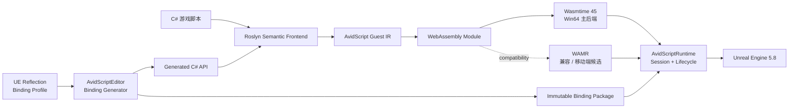
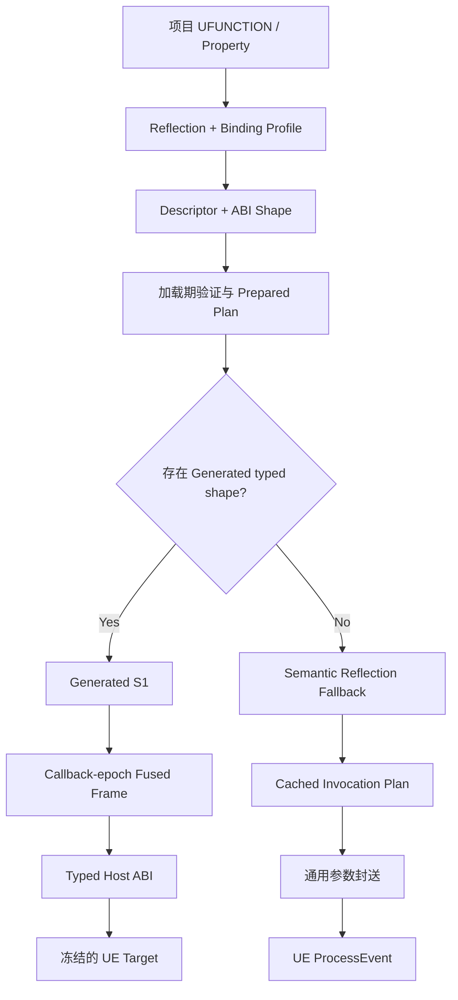

<div align="center">

# AvidScript

**面向 Unreal Engine 的现代 C# + WebAssembly 游戏脚本框架**

<p>
  
  
  
  
  
  
  <a href="LICENSE"></a>
</p>

将 C# 编译为轻量 WASM Guest，通过生成式 Binding 接入 `BeginPlay`、`Tick`、
Timer、Overlap 和普通 `UFUNCTION`，在 UE 中编写真实游戏逻辑。

</div>

> [!IMPORTANT]
> 当前版本为 **0.1.0 开发者预览**。主线验证环境是 **UE5.8 源码版 +
> Windows 64 位 Development Editor + Wasmtime 45**。Cook、Shipping、Android
> 与 iOS 尚未完成正式支持。

## 为什么是 AvidScript

- **生成，而不是手写 API 清单**：从 UE Reflection 与 Binding Profile 生成 C#
  类型、函数、属性和不可变 dispatch plan，不为每个项目 API 增加 VM switch。
- **C# 游戏逻辑，WASM 运行边界**：Roslyn 语义前端生成 AvidScript Guest IR，
  再输出 WebAssembly；PC 主后端使用 Wasmtime Cranelift。
- **接入 UE 生命周期**：脚本可以响应 `BeginPlay`、`Tick`、`EndPlay`、Timer、
  Gameplay Event 与 Overlap，并使用 Actor、Component 和常用 UE 值类型。
- **性能结论可复核**：同机、同 workload 对比 Puerts V8；候选 commit、profile、
  进程样本、P50/P95 和未达门禁均进入机器可读 evidence。

项目当前优先服务 **C# + WASM** 游戏开发。.avid 与 D 前端保留为实验性验证，
不会阻碍 C# 工具链和 UE Binding 的成熟。

## 一段脚本就是一个游戏对象

下面是 Generated Binding 暴露的 typed C# API。类型与方法来自项目 Reflection
结果，不是为样例手写的 VM 指令。

```csharp
using System.Runtime.InteropServices;

namespace AvidScript;

public static class GameScript
{
    private static AActor Projectile;

    [UnmanagedCallersOnly(EntryPoint = "avid_on_begin_play")]
    public static void BeginPlay()
    {
        AAvidScriptTypedTestActor self = UE.Self;
        self.ApplyGameplayValue(4.0f);

        AAvidScriptTypedTestProjectile typedProjectile = UE.SpawnActor(
            ProjectClasses.Projectile,
            FTransform.Identity);
        AAvidScriptTypedTestActor typedActor = typedProjectile;
        Projectile = typedActor;
    }

    [UnmanagedCallersOnly(EntryPoint = "avid_on_tick")]
    public static void Tick(float deltaSeconds)
    {
        if (!Projectile.HasHandle)
        {
            return;
        }

        Projectile.SetActorScale3D(new FVector(1.0f, 1.0f, 1.0f));
    }

    [UnmanagedCallersOnly(EntryPoint = "avid_on_end_play")]
    public static void EndPlay()
    {
        if (Projectile.HasHandle)
        {
            UE.DestroyActor(Projectile);
            Projectile = default;
        }
    }
}
```

完整可运行版本见
[TypedProjectApi](Samples/CSharp/TypedProjectApi/TypedProjectApiScript.cs)。

## 当前能力

| 领域 | 已实现 |
| --- | --- |
| C# 生命周期 | `BeginPlay`、`Tick`、`EndPlay`、Timer、Gameplay Event、Overlap 路由 |
| 生成式 Binding | Profile 授权的普通 `UFUNCTION`、属性、Generated S1 typed fast path、semantic fallback |
| UE 值类型 | `FVector`、`FRotator`、`FTransform`、`FName` 等已定义 ABI 类型 |
| UObject / Actor | typed `UE.Self`、generational handle、`SpawnActor`、`DestroyActor`、`IsA`、checked cast |
| Component | descriptor 驱动工厂、typed `FindComponent`、Attach/Detach、显式 `Release` |
| 对象安全 | Session 所有权、World 隔离、失效句柄检测、UObject GC 强引用、Component 回收 |
| 热重载 | C# 候选加载、显式状态迁移、失败回滚、调试映射 |
| 调用完整性 | Binding package、WASM import、prepared semantic 与 Runtime Session 多层 provenance |
| 性能热路径 | callback-epoch fused host cell、prepared export、`TickHot` / Event hot result |
| VM 后端 | Win64 Wasmtime 45 主后端；WAMR 兼容后端与移动端候选 |

生成 API 的覆盖范围由项目 profile、UE Reflection 结果和当前 ABI 类型能力共同决定。
普通反射路径不会因为 fast path 缺失而静默调用错误入口。

## 性能

Phase 56 使用 UE5.8 Win64 Development，在同一候选、同一机器上比较 AvidScript
Wasmtime 与 Puerts V8。正式协议为 **5 个独立进程**，每进程 **5 次 warmup +
30 次 timed sample**，以下数值均为跨进程统计，**越低越好**。


| 场景 | AvidScript P50 | Puerts 最快对应路径 P50 | AvidScript / Puerts | 结论 |
| --- | ---: | ---: | ---: | --- |
| Small gameplay | `65.72 ns/op` | `139.996 ns/op` | **`0.469x`** | 约低 53.1% |
| Dense gameplay | `121.88 ns/op` | `237.638 ns/op` | **`0.513x`** | 约低 48.7% |
| Lifecycle callback | `67.88 ns` | `173.66 ns` | **`0.391x`** | 约低 60.9% |

### 跨界与执行层

| 指标 | 正式结果 | 说明 |
| --- | ---: | --- |
| Typed empty host crossing | `4.08 ns` | 纯 typed 跨界净成本 |
| Generated S1 scalar | `27.08 ns` | 相对 Puerts static 为 `0.845x`，绝对目标 `25 ns` 未达 |
| Generated S1 property | `54.31 ns` | 绝对目标 `50 ns` 未达 |
| Wasmtime / V8 P50 几何均值 | `0.977x` | Wasmtime 平均约低 2.3% |
| Wasmtime / V8 P95 几何均值 | `0.996x` | 尾延迟基本持平，未达 `0.95x` 目标 |
| Semantic / Puerts reflection | `5.819x` | 当前最重要的 UE 通用交互瓶颈 |

性能门禁通过率为 **12/18**，即 18 项中 12 项通过、6 项未通过。目前可以确认的是
Generated S1、Data-Oriented 与 lifecycle 热路径在选定游戏 workload 上领先；这不等于
Wasmtime 全面领先 V8，也不等于所有 UE reflection 调用已经领先 Puerts。

被测运行时候选：
[`d82ed7a`](https://github.com/Avidel-zzz/AvidScript/commit/d82ed7aa997758fa7f6983c6a6996999a467d283)。
完整统计口径与未达项：

- [Phase 56 中文实现与性能报告](Docs/Phase56/P56.5_Fused_Call_Frame_Implementation_Report.md)
- [Phase 56 机器可读证据](Docs/Phase56/P56.5_Fused_Call_Frame_Benchmark_Evidence.json)
- [Phase 56 Gate 摘要](Docs/Phase56/P56_Gate_Summary.json)

## 架构



| 模块 | 职责 |
| --- | --- |
| `AvidScriptCore` | 后端无关 ABI、错误、诊断与基础合同 |
| `AvidScriptBindings` | UE typed binding、descriptor、授权和缓存调用计划 |
| `AvidScriptVM` | Wasmtime/WAMR 后端、WASM 校验、Guest Memory 与 Host crossing |
| `AvidScriptRuntime` | Session、生命周期、对象 registry、事件、事务与热重载 |
| `AvidScriptEditor` | Reflection/profile、代码生成、C# 构建和 Editor 集成 |
| `Tools/` | Roslyn 前端、Guest IR、WASM backend 与构建工具 |

### 一般 UFUNCTION 如何进入脚本



Fast path 是由 descriptor 和 ABI shape 生成的通用机制，不要求为每个
`UFUNCTION` 手写 C++ wrapper。尚未支持的类型会在生成或加载阶段失败关闭，
而不是进入未经验证的动态调用。

## 环境要求

- Unreal Engine 5.8 源码版；
- Windows 10/11 x64；
- Visual Studio 2022 与 UE 对应的 MSVC/Windows SDK；
- .NET SDK `8.0.416`；
- PowerShell 7；
- Git。

## 快速开始

### 1. 放置插件

将仓库放到项目的 `Plugins/AvidScript`：

```text
YourProject/
  Plugins/
    AvidScript/
  YourProject.uproject
```

### 2. 安装锁定的 Wasmtime 依赖

在插件目录执行：

```powershell
pwsh -NoProfile -File Build/InstallWasmtimeDependency.ps1 -Mode Install
```

脚本按 lock file 下载并校验 Wasmtime 45 Win64 C API，不依赖未固定版本的系统包。

### 3. 构建 UE Editor Target

```powershell
$env:UE_ROOT = "C:\UnrealEngine"

& "$env:UE_ROOT\Engine\Build\BatchFiles\Build.bat" `
  YourProjectEditor Win64 Development `
  "-Project=C:\Path\To\YourProject.uproject" `
  -WaitMutex -NoHotReloadFromIDE
```

不要为普通增量问题清理完整 Editor Target。

### 4. 构建第一个 C# Guest

先使用仓库内的生命周期样例验证工具链：

```powershell
pwsh -NoProfile -File Build/BuildCSharpActorLifecycle.ps1
```

项目自定义 API 需要先由 Editor Reflection 与 Binding Profile 生成 binding
package 和 C# facade，再构建对应 Guest。当前流程仍是开发者预览，建议先在同仓库
测试项目中验证，再迁移到独立游戏项目。

### WAMR 兼容后端

WAMR 保留用于兼容性和后续移动端 AOT 工作，不是当前 Win64 默认性能后端：

```powershell
cmd /c Build\BuildWAMRWin64.cmd
```

## 样例

| 样例 | 展示内容 |
| --- | --- |
| [TypedProjectApi](Samples/CSharp/TypedProjectApi/README.md) | typed Self、自定义 `UFUNCTION`、Spawn、cast 与销毁 |
| [DynamicProjectile](Samples/CSharp/DynamicProjectile/README.md) | Blueprint class reference、Timer、Spawn/Destroy 与热重载回滚 |
| [PlayablePickup](Samples/CSharp/PlayablePickup/README.md) | Overlap、Gameplay Event、持久状态与热重载 |
| [ComponentGameplay](Samples/CSharp/ComponentGameplay/ComponentGameplay.cs) | 创建/查询组件、Attach、Tick 调用与 EndPlay 释放 |
| [BidirectionalProperties](Samples/CSharp/BidirectionalProperties/README.md) | C# 与 UE 属性双向读写 |
| [ActorLifecycle](Samples/CSharp/ActorLifecycle/ActorLifecycleScript.cs) | 最小 `BeginPlay` / `Tick` / `EndPlay` |
| [D Guest](Samples/D/ActorSetLocation/README.md) | D 到 WASM 的早期验证链路 |
| [.avid Guest](Samples/AvidScript/ActorSetLocation/README.md) | 自研语言前端的早期原型 |

## 当前边界

- 还不是完整 UE API 类型系统，只覆盖 descriptor 可表达且 ABI 已实现的类型；
- arbitrary `UStruct`、容器、delegate 和 Blueprint 图中新声明函数尚未完整支持；
- C# 由 Roslyn semantic/CFG lowering 编译，不提供完整 .NET Runtime；
- semantic reflection 保证通用 fallback，但高频 `Tick` 内应优先使用 Generated S1；
- Cook、Shipping、崩溃隔离、Android 与 iOS 尚未完成正式验收；
- 正式竞品矩阵目前覆盖 Puerts V8，尚未同口径覆盖 UnLua 与 AngelScript。

## 路线图

1. 为 semantic reflection 建立通用缓存化 invocation plan，降低普通
   `UFUNCTION` 的参数布局、对象解析和 `ProcessEvent` 封送成本；
2. 继续压缩 Generated S1 scalar/property 固定成本与 Wasmtime P95 尾延迟；
3. 完成 Cook、Shipping、包体和故障隔离验证；
4. 推进 Android/iOS AOT 与 WAMR/其他移动后端适配。

路线图只表示后续工程顺序，不代表对应平台已经可用。

## 验证与开发约定

项目采用集中阶段验收：

- 固定 .NET 8.0.416 的前端、语义、Guest IR 与 WASM backend 合同测试；
- PowerShell schema、构建合同、候选身份和架构门禁；
- UE5.8 no-clean Editor build 与 `Automation RunTests AvidScript`；
- 同机、候选绑定的 Puerts/Wasmtime 正式性能矩阵。

Phase 56 的完整 AvidScript Automation 为 **317/317 通过**。

工程规则：

- 面向使用者的文档使用中文；
- Runtime、Bindings、VM、Editor 保持模块边界；
- 新 UE API 通过 descriptor/profile 生成，不添加项目专用 VM wrapper；
- 热路径不按名称或 class path 反复查找对象；
- 非阻塞问题在阶段末集中构建与验收，避免碎片化等待；
- 阶段状态、源码版 UE5.8 路径和错误复盘见 [AGENTS.md](AGENTS.md)。

## 许可证

AvidScript 原创代码使用 [MIT License](LICENSE)。

Wasmtime 使用 Apache-2.0 WITH LLVM-exception；`Source/ThirdParty/WAMR/upstream`
保留上游 Apache License 2.0 及目录内其他第三方许可。Unreal Engine 不包含在
本仓库中，并受 Epic Games 的许可条款约束。
