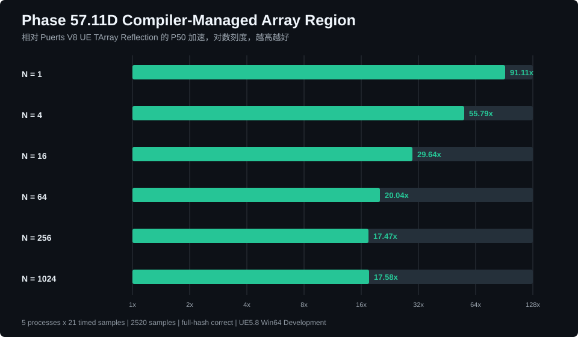
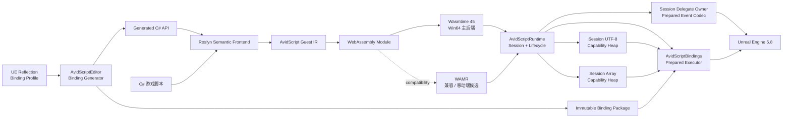
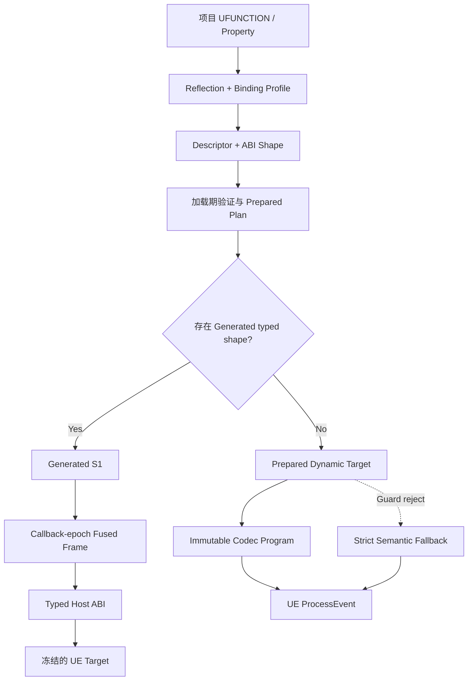

<div align="center">

# AvidScript

**面向 Unreal Engine 的现代 C# + WebAssembly 游戏脚本框架**

<p>
  
  
  
  
  
  
  
  <a href="LICENSE"></a>
</p>

将 C# 编译为轻量 WASM Guest，通过生成式 Binding 接入 `BeginPlay`、`Tick`、
Timer、受控 `async/await`、UE latent UFUNCTION、异步对象加载、Overlap、动态多播事件、
普通 `UFUNCTION`、生成式 RPC、普通与 replicated `UPROPERTY`。C# 也可声明可供 Blueprint
继承的 Actor、Component 与 Subsystem，并在不改变反射结构时自动热重载 WASM 方法体。

</div>

> [!IMPORTANT]
> 当前版本为 **0.1.0 开发者预览**。主线验证环境是 **UE5.8 源码版 +
> Windows 64 位 Development Editor + Wasmtime 45**。Cook、Shipping、Android
> 与 iOS 尚未完成正式支持。

## 为什么是 AvidScript

- **生成，而不是手写 API 清单**：从 UE Reflection 与 Binding Profile 生成 C#
  类型、函数、属性和不可变 dispatch plan，不为每个项目 API 增加 VM switch。
- **C# 游戏逻辑，WASM 运行边界**：Roslyn 语义前端生成 AvidScript Guest IR，
  再输出 WebAssembly；PC 主后端使用 Wasmtime Cranelift。
- **接入 UE 生命周期与事件**：脚本可以响应 `BeginPlay`、`Tick`、`EndPlay`、Timer、受控 `async/await`、异步对象加载、
  Gameplay Event、Overlap，并订阅 Session 授权的任意兼容 UObject 动态多播事件；同时使用 Actor、Component、递归固定宽度 `USTRUCT`、
  `FName`、`FString`、一维 `TArray<T>` 和常用 UE 值类型，并调用项目自定义的 Server、Client 与 NetMulticast RPC，
  以及读取或在 authority 上写入 replicated property。
- **性能结论可复核**：同机、同 workload 对比 Puerts V8；候选 commit、profile、
  进程样本、P50/P95 和未达门禁均进入机器可读 evidence。

项目当前优先服务 **C# + WASM** 游戏开发。.avid 与 D 前端保留为实验性验证，
不会阻碍 C# 工具链和 UE Binding 的成熟。

## 一段脚本就是一个游戏对象

下面是 Generated Binding 暴露的 typed C# API。类型与方法来自项目 Reflection
结果，不是为样例手写的 VM 指令。

```csharp
using System.Runtime.InteropServices;

namespace AvidScript;

public static class GameScript
{
    private static AActor Projectile;

    [UnmanagedCallersOnly(EntryPoint = "avid_on_begin_play")]
    public static void BeginPlay()
    {
        AAvidScriptTypedTestActor self = UE.Self;
        self.ApplyGameplayValue(4.0f);

        AAvidScriptTypedTestProjectile typedProjectile = UE.SpawnActor(
            ProjectClasses.Projectile,
            FTransform.Identity);
        AAvidScriptTypedTestActor typedActor = typedProjectile;
        Projectile = typedActor;
    }

    [UnmanagedCallersOnly(EntryPoint = "avid_on_tick")]
    public static void Tick(float deltaSeconds)
    {
        if (!Projectile.HasHandle)
        {
            return;
        }

        Projectile.SetActorScale3D(new FVector(1.0f, 1.0f, 1.0f));
    }

    [UnmanagedCallersOnly(EntryPoint = "avid_on_end_play")]
    public static void EndPlay()
    {
        if (Projectile.HasHandle)
        {
            UE.DestroyActor(Projectile);
            Projectile = default;
        }
    }
}
```

完整可运行版本见
[TypedProjectApi](Samples/CSharp/TypedProjectApi/TypedProjectApiScript.cs)。

### FName、FString 与自定义 UFUNCTION

`FName` 和 `FString` 在生成的 C# facade 中统一呈现为 `string`。value、const-ref、
ref、out、return 与属性读写共用同一个通用 codec，不需要为项目函数手写 wrapper：

```csharp
[UnmanagedCallersOnly(EntryPoint = "avid_on_tick")]
public static void Tick(float deltaSeconds)
{
    AMyGameplayActor self = UE.Self;

    string displayName = self.DisplayName;
    self.NormalizeName(ref displayName);
    self.BuildStatusText(out string status);

    self.DisplayName = displayName;
    self.StatusText = status;
    self.LastSocketName = self.GetAttachParentSocketName();
}
```

这里的 `AMyGameplayActor` 代表项目 Reflection 生成的 facade。仓库内双后端真实闭环见
[NameStringRoundtrip fixture](Source/AvidScriptRuntime/Private/Tests/Fixtures/P57_11B2_NameStringRoundtrip.cs)。

### TArray、普通索引循环与显式值释放

满足元素安全合同的一维 `TArray<T>` 会生成 C# `T[]`。函数 value/ref/out/return、属性读写、
`Length` 和索引访问使用同一套 schema v10 类型图：

```csharp
int[] input = new int[] { 1, 2 };
int[] inOut = new int[] { 10 };
int[] result = self.IntArrayRoundTrip(input, ref inOut, out int[] output);

int sum = 0;
for (int index = 0; index < result.Length; ++index)
{
    sum += result[index];
}
result[0] += 1;

if (sum == 13)
{
    self.ReadableIntArray = result;
}
AvidScriptValue.Release(inOut);
AvidScriptValue.Release(output);
AvidScriptValue.Release(result);
```

这条路径已用同一个 C# Guest 在 WAMR 与 Wasmtime 执行，UE property 最终得到
`[11, 1, 2]`，显式释放后 live array capability 为 0。编译器会自动把 capability 上的普通
索引循环 materialize 为有界 Guest region，并在 dirty barrier 写回；`Snapshot`/`Flush` 保留
为兼容与显式控制 API。完整 fixture 见
[ArrayRoundtrip](Source/AvidScriptRuntime/Private/Tests/Fixtures/P57_11B3_ArrayRoundtrip.cs)。

### UE 动态多播事件

Profile 通过 `include_events` 显式授权动态多播委托。生成的 facade 提供稳定的 `AvidEvents`
常量、强类型 `AvidSubscriptions` 入口和不透明订阅 token：

```csharp
public static class PickupScript
{
    [AvidTransient]
    private static AvidSubscription _subscription;

    public static void BeginPlay()
    {
        _subscription = AvidSubscriptions.OnPickedUp(UE.Self);
    }

    [AvidEvent(AvidEvents.OnPickedUp)]
    public static void OnPickedUp(AActor instigator, int itemId, float value)
    {
        UE.Self.ApplyPickup(itemId, value);
    }

    public static void StopListening()
    {
        _subscription.Cancel();
        _subscription = default;
    }
}
```

Roslyn 前端会校验事件身份、返回类型与参数签名，并生成确定性的
`avid_on_delegate_<stable-id>` WASM export。订阅源可以是当前 Runtime Session 已持有或借用的任意
兼容 UObject handle；Runtime 统一校验 registry、capability、world 与 owner class。脚本可显式取消，
加载失败、热重载替换、宿主切换与 `EndPlay` 仍由 Session 事务式管理并最终自动解绑。

### UE 延迟 Continuation

`AvidContinuations.Delay` 与 `NextTick` 使用真实 UE `FTimerManager` 作为 producer。Session 在安全
Tick 边界按注册顺序恢复最多一个回调；脚本不需要手写 WASM export：

```csharp
private const int ResumeSpawn = 1;

[AvidTransient]
private static AvidContinuation PendingSpawn;

public static void BeginPlay()
{
    PendingSpawn = AvidContinuations.Delay(0.25f, ResumeSpawn);
}

[AvidContinuation(ResumeSpawn)]
public static void ResumeSpawnHandler()
{
    UE.Self.SetActorScale3D(new FVector(1.05f, 1.0f, 1.0f));
}
```

token 支持显式 `Cancel()`，并随 active/prepared Session transaction、热重载回滚、HostContext
切换与 `EndPlay` 自动失效和清理。`Delay` / `NextTick` handler 保持零参数 `public static void`。

### 受控 C# async/await

C3 将 `Delay`、`NextTick` 与真实 `FStreamableManager::RequestAsyncLoad` 投影为受控 C# awaitable。
编译器把 async 导出切成零 Guest 堆分配的 CPS segment，在 Session 安全 Tick 边界恢复后继续执行
UE 游戏逻辑：

```csharp
[UnmanagedCallersOnly(EntryPoint = "avid_on_begin_play")]
public static async void BeginPlay()
{
    AvidLoadedObject mesh = await AvidAssets.LoadObjectAsync(
        "/Engine/EngineMeshes/Cube.Cube");
    if (!mesh.IsValid)
    {
        return;
    }

    FVector step = new FVector(10.0f, 0.0f, 0.0f);
    for (int pass = 0; pass < 2; ++pass)
    {
        await AvidContinuations.NextTickAsync();
        UE.Self.AddActorWorldOffset(step);
    }

    int continuationMode;
    if (UE.Self.IsActorTickEnabled())
    {
        continuationMode = 1;
    }
    else
    {
        continuationMode = 0;
    }
    switch (continuationMode)
    {
        case 1:
            await AvidContinuations.DelayAsync(0.01f);
            break;
        default:
            break;
    }
}
```

P57.12C5 进一步从 UE Reflection 识别满足 completion-only 合同的 latent `UFUNCTION`，生成
`FooAsync` facade。下面的 `DelayAsync` 来自 `UKismetSystemLibrary.Delay`，不需要手写 VM wrapper：

```csharp
[UnmanagedCallersOnly(EntryPoint = "avid_on_begin_play")]
public static async void BeginPlay()
{
    UE.Self.SetActorScale3D(new FVector(1.0f, 1.0f, 1.0f));
    await UKismetSystemLibrary.DelayAsync(0.25f);
    UE.Self.SetActorScale3D(new FVector(1.25f, 1.25f, 1.25f));
}
```

P57.12C6A 已把这一生成链扩展到 public/storage ABI 不同的 `bool` 参数。项目自己的
`UFUNCTION(meta=(Latent, ...)) WaitForFlag(bool)` 会生成 `WaitForFlagAsync(bool)`，Guest 在调用
WASM import 前显式执行 `bool -> i32` 适配；Reflection、descriptor、C#、Semantic、Guest 与 Runtime
全程没有按 API 名称分支。

P57.12C6B 同样支持 enum value 参数与 enum 默认值。C# 保留强类型 enum，Semantic 根据 enum
TypeShape 授权 underlying storage，Guest 发出零额外 WASM 指令的同存储转换；缺少或不匹配的 TypeShape
会在生成物进入 Runtime 前失败。

P57.12C6C 进一步支持 UObject capability、FVector/FRotator/FTransform 和已授权固定 USTRUCT value
参数。共享 storage planner 根据 type graph 选择递归字段展开或 `in` address，validator 与 lowerer
使用同一份计划；深度、cell 数与叶子类型均有上限，string/array 仍保持 fail closed。

P57.12C7 至 C10 已实现独立 Session cancellation source、显式取消、provider result slot 与
`AvidOutcome<T>`；取消恢复策略由 descriptor 明确声明，不从 latent `ref/out` 或函数名称猜测结果。
P57.12C11 的结构化 early-return guard 会在业务副作用前检查 outcome。

P57.12C12 进一步为每个 await 生成精确活跃状态帧。固定布局 scalar、enum、`FVector`、固定
`USTRUCT` 与对象 capability local 可以跨多个暂停边界；Session 以 continuation token 隔离状态，
每个边界只进行一次 bulk store/read，并在 cancel、reload 与 teardown 时统一回收。

P57.12C13 已把 await 之间的局部声明与重赋值、`if/else`、`while`、`do/while`、`for`、
`break`、`continue` 和 `return` lowering 为确定性 WASM 基本块。逆向活跃性会处理分支合流、
循环不动点和控制转移，只有真正跨 await 活跃的 local 才进入状态帧；循环回边不产生 Host 往返。

P57.12C14 进一步加入显式 continuation CFG。受支持的 `if/else` 与循环体现在可以直接包含 await；
resume callback 就是恢复程序计数器，Guest 为每个入口物化同步可达基本块，循环中的同一 await
可以在每轮重新调度。CFG 固定点活跃性只保存恢复路径真正需要的 local，没有新增 Host import、
Runtime AST 解释器或按 API 名称分支。

P57.12C15 在同一 CFG 上加入 integral/enum `switch`。常量 case 按源码顺序编译为普通
`equals + branch_if`，多个 label 可以共享 section，default 是最终 fallback；section 内 await、
`break`、外层循环 `continue` 和 `return` 均保留 C# 控制流语义。governing value 首批要求是
local/parameter 读取，避免用隐藏 Host 状态掩盖副作用或所有权问题。

P57.12C16 进一步支持一维数组的 `foreach` 循环体直接 await。Semantic schema `16 / 1.18`
显式发布编译器数组引用与索引，集合表达式只求值一次；Guest 状态帧只保存 4 字节引用值，循环
继续使用 `array_length`、`array_region_load` 和普通 branch，不复制整个数组，也不新增 Host import。
正数线性内存引用受 activation 栅栏保护，负数 UE 数组 capability 继续服从 Session/reload 所有权。

### 生成式 UE RPC

P57.12D1 把项目 Reflection 中被 profile 授权的 `Server`、`Client` 与 `NetMulticast`
`UFUNCTION` 直接投影到现有 C# facade。网络方向与可靠性进入 descriptor identity；Runtime 在调用前
重新核对活动 UFunction flags、Actor/ActorComponent owner、authority 与 UE callspace，再由
`ProcessEvent` 执行 UE 原生网络路由。项目 RPC 不需要手写 Host import 或按函数名称分支：

```csharp
public static void BeginPlay()
{
    AAvidScriptBindingRuntimeNetworkTestActor self = UE.Self;
    AActor actor = self;
    if (actor.HasAuthority())
    {
        self.ClientApplyValue(20);
        self.MulticastAnnounceValue(30);
    }
    else
    {
        self.ServerSubmitValue(10);
    }
}
```

候选热重载会在 `ProcessEvent` 前拒绝 RPC，避免不可回滚的网络副作用。D1 开放脚本主动调用
RPC；D3 已进一步支持被 Profile 显式授权的 native RPC 入站 C# handler。
完整样例见 [NetworkRpc](Samples/CSharp/NetworkRpc/README.md)。

### Replicated Property

P57.12D2 把 profile 授权的 `UPROPERTY(Replicated)` 与 `UPROPERTY(ReplicatedUsing=...)`
投影为普通 C# 属性。getter 可在两端读取，setter 只允许 authority；写入成功后按活动
`FProperty::RepIndex` 调用 UE5.8 Push Model dirty API。复制条件、连接差异发送与 native/Blueprint
RepNotify 仍由 UE 网络栈负责：

```csharp
public static void BeginPlay()
{
    AAvidScriptBindingRuntimeNetworkTestActor self = UE.Self;
    AActor actor = self;
    if (!actor.HasAuthority())
    {
        return;
    }

    self.ReplicatedScore = self.ReplicatedScore + 10;
    self.ReplicatedRoutedValue = 20;
}
```

replicated setter 禁止 Generated S1 与 candidate reload，direct、struct、fast-path 和 BlueprintSetter
都在同一 authority/dirty 边界内。D2 不轮询属性变化；D3 只在 UE 真正调用 RepNotify UFunction 时
进入 C# handler。
完整样例见 [ReplicatedProperty](Samples/CSharp/ReplicatedProperty/README.md)。

### 链式 RPC 与 RepNotify Handler

P57.12D3 通过 Profile schema 9 的 `include_handlers` 显式选择项目 native RPC 与 RepNotify
`UFUNCTION`，descriptor schema 17 冻结网络/属性身份，再按 `(UFunction, UObject)` 路由到当前
Session 的生成式 C# export。P57.12D4 将 Profile 升级为 schema 10、descriptor 升级为 schema 18，
新增 `before_handlers` / `after_handlers`，并允许 Profile 精确授权拥有 bytecode 的 Blueprint override：

```csharp
[AvidEvent(AvidEvents.ServerSubmitValue)]
public static void HandleServerSubmitValue(int value)
{
    AAvidScriptBindingRuntimeNetworkTestActor self = UE.Self;
    self.ReplicatedScore = value;
}

[AvidEvent(AvidEvents.OnRep_ReplicatedScore)]
public static void HandleReplicatedScoreChanged()
{
}
```

`include_handlers` 使用 `replace`；`before` 在 C# 成功后执行原实现；`after` 先执行原实现再进入 C#。
Blueprint 原实现继续由 `UObject::ProcessInternal` 执行。guest 执行期间到达的重入事件会将参数深拷贝到
Session-owned `FStructOnScope`，在下一次 Session tick 按上限 64 的 FIFO 分发，不递归进入 VM。
export 缺失、候选未提交、对象不匹配或 Session 卸载时保持/恢复原 thunk。NetDriver、RPC callspace、
复制条件与 RepNotify 触发时机仍由 UE 负责，不增加按项目 API 手写的 Host import。完整样例见
[InboundNetworkHandlers](Samples/CSharp/InboundNetworkHandlers/README.md)。

### 真实独立进程网络闭环

P57.12D5 使用 UE5.8 Development Editor 独立进程跑通 dedicated server + 2 clients 与 listen server +
1 remote client。客户端 C# 从 `BeginPlay` 经下一 Tick continuation 调用 generated Server RPC；服务器 C#
`before` handler 写入 replicated property，原生 RPC 随后执行；UE 复制触发客户端原生 RepNotify 与 C#
`after` handler，最后 confirmation RPC 回到服务器。编排器验证每个 role、PID、计数和值，并只回收自己
创建的精确进程句柄。完整样例见
[NetworkTopology](Samples/CSharp/NetworkTopology/README.md)。

当前支持零参数、非泛型、block-bodied 的 `public static async void` 导出，以及在受支持控制流中的直接
`DelayAsync(float)`、`NextTickAsync()`、`LoadObjectAsync(const string)` 和受支持的生成式 latent
`FooAsync(...)`。旧 callback API、旧 Semantic 产物与
`avid_on_continuation_v2` 继续兼容。

取消、候选回滚、`EndPlay` 与 Session teardown 会抑制尚未分发的恢复并取消异步 handle。Continuation
还会在调度、生产者完成、候选提交和 Guest 分发前检查 owner generation 与 World teardown；失效 activation
会整 lane 关闭，并抑制已经迟到的回调。成功对象结果沿用 Session 强引用与 generational capability；callback
trap 会回滚本次借出的对象 capability。

## 当前能力

| 领域 | 已实现 |
| --- | --- |
| C# 定义 UE 类型 | C# 声明真实 Actor、Component、World/GameInstance Subsystem、`UCLASS/UFUNCTION/UPROPERTY`、继承与 override、Blueprint 子类、RepNotify 和类型生命周期；确定性生成 native shell 与 WASM body |
| C# 生命周期 | `BeginPlay`、`Tick`、`EndPlay`、Timer、Gameplay Event、Overlap 路由、受控 `async void` 导出 |
| 确定性 Continuation | `Delay` / `NextTick`、`FStreamableManager` 异步对象加载、生成式 UE latent producer、typed outcome、显式 cancellation source、状态与对象结果、CPS dispatcher、不透明 token、Session active/prepared 事务、owner generation/World liveness 围栏与 teardown |
| 受控 async/await | 多个顺序 await、分支/循环/switch/一维数组 foreach 内部 await、固定值与数组引用 local 跨 await、局部重赋值、`if/else`、integral/enum `switch`、`for`/`foreach`/`while`/`do`、`break`/`continue`/`return`、continuation CFG、per-await liveness frame、Reflection 生成 `FooAsync`、零 Guest 堆 CPS segment、稳定 resume debug map、store/read/schedule fail closed；不依赖 CLR `Task` Runtime |
| UE 事件订阅 | Profile 显式授权的动态多播委托；任意 Session capability UObject 源、生成式 `[AvidEvent]` / `AvidSubscriptions`、显式 token/cancel、事务式热重载与自动解绑 |
| UE 网络交互 | 生成式 Server、Client、NetMulticast RPC；replicated property 双端读取、authority 写入与 Push Model dirty；Profile 授权的 native/Blueprint-bytecode RPC 与 RepNotify 入站 C# handler；`replace/before/after` 链式语义、Session 对象路由、64 项重入 FIFO、authority/callspace 前置校验与候选热重载副作用隔离；dedicated + 2 clients 与 listen + 1 remote client 独立进程闭环 |
| 生成式 Binding | Profile 授权的普通 `UFUNCTION`/`UPROPERTY`、Generated S1、prepared dynamic executor、严格 fallback |
| UE 值类型 | `FVector`、`FRotator`、`FTransform`、enum、`FName`、`FString` |
| 自定义 USTRUCT | 递归固定宽度字段图；value/const-ref/ref/out/return 与 property get/set；对象叶 capability |
| 变长字符串 | Session-owned UTF-8 capability heap；跨调用 intern；reload/跨 Runtime 失效；多输出原子发布 |
| 通用数组 | schema v10 一维 `TArray<T>` -> C# `T[]`；函数全方向、属性读写、编译器托管 region、Snapshot/Flush、显式 Release，以及 schema v16 数组引用跨 await 与 foreach CFG |
| UObject / Actor | typed `UE.Self`、generational handle、异步加载结果 `TryCast`、`SpawnActor`、`DestroyActor`、`IsA`、checked cast |
| Component | descriptor 驱动工厂、typed `FindComponent`、Attach/Detach、显式 `Release` |
| 对象安全 | Session 所有权、World 隔离、失效句柄检测、UObject GC 强引用、Component 回收 |
| 热重载 | C# 候选加载、显式状态迁移、失败回滚、调试映射；Generated Type package 自动监听、body-only 多实例事务更新、package 链去重；反射结构变化明确要求 native rebuild |
| 调用完整性 | Binding package、WASM import、immutable codec program、prepared target 与 Runtime Session 多层 provenance |
| 性能热路径 | callback-epoch fused host cell、prepared export、`TickHot` / Event hot result |
| VM 后端 | Win64 Wasmtime 45 主后端；WAMR 兼容后端；同一 C# Guest 双后端验证 |

当前 UE5.8 EngineGameplay profile 生成 `371` 个 reflection binding，加上 object/owner 与
六个 value capability，manifest 授权 `379` 个 import；这代表默认 gameplay surface，不等于完整 UE API 总量。项目 profile
可以加入自己的 UCLASS/UFUNCTION，只要类型可由现有 descriptor/codec 表达，就会自动生成。

生成 API 的覆盖范围由项目 profile、UE Reflection 结果和当前 ABI 类型能力共同决定。
普通反射路径不会因为 fast path 缺失而静默调用错误入口。

## 性能

性能数据按测试层次分开报告。**UE 交互、完整游戏 workload 与纯 Wasm 执行不是同一
benchmark，不能互相替代。** 所有正式对比均使用 UE5.8 Win64 Development、冻结 workload
和同机 Puerts V8；比率小于 `1.0x` 表示 AvidScript 更快。

### Phase 57：通用 UE 交互

Phase 57 将原本昂贵的 Semantic reflection 路径重构为加载期冻结的 prepared reflection
invocation cell 与不可变 codec program。正式协议为 **5 个独立进程**、每进程 **5 次
warmup + 30 次 timed sample**，共 `9000/9000` 个有效 timed sample。


| UE 交互场景 | AvidScript P50 | Puerts Reflection P50 | 比率 | AvidScript 领先 |
| --- | ---: | ---: | ---: | ---: |
| Scalar UFUNCTION | `54.57 ns` | `106.15 ns` | **`0.514x`** | **48.59%** |
| Property get/set | `68.14 ns` | `103.01 ns` | **`0.661x`** | **33.86%** |
| FVector value | `66.49 ns` | `1193.10 ns` | **`0.056x`** | **94.43%** |
| UObject roundtrip | `69.60 ns` | `130.90 ns` | **`0.532x`** | **46.83%** |

四个已冻结 prepared shape 均领先 Puerts Reflection，目标样本产生 `96,000,000` 次 native
hit，fallback 与 guard reject 都为 0。该表仍只代表对应 prepared shape，不外推到字符串或
container；数组使用下面独立的 P57.11C 协议。

### Phase 57.11D：编译器托管数组区域

P57.11D 使用 5 个独立进程、每进程 8 次 warmup + 21 次 timed sample，共 `2520` 个
样本。Puerts lane 使用真实 `UE.NewArray(UE.BuiltinInt)` 和 UE `TArray<int32>` Reflection
往返；AvidScript headline lane 来自真实 C# -> Semantic -> Guest IR -> Wasm 流水线，并把
同一次 export 内的普通数组循环自动聚合为一次 read、Guest 变换与一次 dirty write。



| 元素数 | AvidScript compiler region P50 | Puerts TArray P50 | 比率 | AvidScript 加速 |
| ---: | ---: | ---: | ---: | ---: |
| 1 | `10.034 ns` | `914.172 ns` | **`0.01098x`** | **91.11x** |
| 4 | `20.068 ns` | `1119.629 ns` | **`0.01792x`** | **55.79x** |
| 16 | `61.864 ns` | `1833.887 ns` | **`0.03373x`** | **29.64x** |
| 64 | `245.120 ns` | `4913.280 ns` | **`0.04989x`** | **20.04x** |
| 256 | `946.078 ns` | `16532.023 ns` | **`0.05723x`** | **17.47x** |
| 1024 | `3718.771 ns` | `65368.717 ns` | **`0.05689x`** | **17.58x** |

完整输出 hash 与 `N>=64` 的 compiler-region/element `<=0.80x` 门禁均通过。这里比较的是
一次 export 内的编译器托管数据驻留路径，不是所有 UFUNCTION 的通用加速倍数：AvidScript
capability 在计时前建立，Puerts 每个逻辑调用包含 TArray 参数/返回值分配和 wrapper 访问。
完整口径见 [P57.11D 中文报告](Docs/Phase57/P57.11D_Compiler_Managed_Array_Region.md)。

### Phase 56：完整游戏 workload

Phase 56 的 Generated S1、Data-Oriented 与生命周期热路径仍是可复核的历史正式基线：


| 场景 | AvidScript P50 | Puerts 最快对应路径 P50 | 比率 | AvidScript 领先 |
| --- | ---: | ---: | ---: | ---: |
| Small gameplay | `65.72 ns/op` | `139.996 ns/op` | **`0.469x`** | **53.1%** |
| Dense gameplay | `121.88 ns/op` | `237.638 ns/op` | **`0.513x`** | **48.7%** |
| Lifecycle callback | `67.88 ns` | `173.66 ns` | **`0.391x`** | **60.9%** |

### Wasmtime 与 V8 纯执行层

冻结的 12-kernel controlled suite 最新使用 Wasmtime v45 Cranelift `speed` profile：
P50 几何均值 `0.9800x`、P95 几何均值 `1.0006x`，P50/P95 kernel win rate 为
`66.7% / 41.7%`。相对 P57.9 的 `speed_and_size` profile，P95 改善约 2.55%，P50 基本
持平；P95 仍未达到 `0.95x` 领先门槛，因此 `P57-D06-ControlledLeadership` 仍未解决，
并已转移到 P59 的 LLVM AOT/等价 codegen 后端工作。AvidScript 当前领先主要来自更低
成本的生成式 UE 边界，而不是宣称 Wasmtime 对 V8 的所有纯计算都绝对领先。

正式证据与详细口径：

- [P57.11B3 通用数组与完整验收证据](Docs/Phase57/P57.11B3_Generic_Array_Capability_Evidence.json)
- [P57.11C 数组批量传输与正式性能证据](Docs/Phase57/P57.11C_Array_Bulk_Transfer_Evidence.json)
- [P57.11D 编译器托管数组区域与正式性能证据](Docs/Phase57/P57.11D_Compiler_Managed_Array_Region_Evidence.json)
- [P57.11B2 FName/FString 与完整验收证据](Docs/Phase57/P57.11B2_Variable_Utf8_Value_Heap_Evidence.json)
- [P57.11B1 Prepared Reflection 正式性能证据](Docs/Phase57/P57.11B1_Recursive_Fixed_Struct_Codec_Evidence.json)
- [P57.13 Cranelift Speed 正式性能结果](Docs/Phase57/P57.13_Cranelift_Speed_Profile.md)
- [P57.9 Wasmtime/V8 controlled toolchain](Docs/Phase57/P57.9_Controlled_Wasmtime_Toolchain.md)
- [Phase 56 游戏 workload 报告](Docs/Phase56/P56.5_Fused_Call_Frame_Implementation_Report.md)

正式性能候选：
[`4c10239`](https://github.com/Avidel-zzz/AvidScript/commit/4c1023989596bba112de345b5533546655559df7)；
当前功能候选：
[`d67f2d6`](https://github.com/Avidel-zzz/AvidScript/commit/d67f2d61faca272b20cd5a063e82ba881012073d)。

## 架构



| 模块 | 职责 |
| --- | --- |
| `AvidScriptCore` | 后端无关 ABI、错误、诊断与基础合同 |
| `AvidScriptBindings` | UE typed binding、descriptor、不可变 codec、prepared executor 与 value heap |
| `AvidScriptVM` | Wasmtime/WAMR 后端、WASM 校验、Guest Memory 与 Host crossing |
| `AvidScriptRuntime` | Session、生命周期、对象 registry、事件、Continuation、事务与热重载 |
| `AvidScriptEditor` | Reflection/profile、代码生成、C# 构建和 Editor 集成 |
| `Tools/` | Roslyn 前端、Guest IR、WASM backend 与构建工具 |

### 一般 UFUNCTION 如何进入脚本



Generated 与 prepared path 都由 descriptor、真实反射 identity 和 ABI shape 生成，
不要求为每个 `UFUNCTION` 手写 C++ wrapper。输出范围、对象 capability 与变长值容量会在
`ProcessEvent` 前预检；尚未支持的类型在生成或加载阶段失败关闭，而不是进入未经验证的调用。

## 环境要求

- Unreal Engine 5.8 源码版；
- Windows 10/11 x64；
- Visual Studio 2022 与 UE 对应的 MSVC/Windows SDK；
- .NET SDK `8.0.416`；
- PowerShell 7；
- Git。

## 快速开始

### 1. 放置插件

将仓库放到项目的 `Plugins/AvidScript`：

```text
YourProject/
  Plugins/
    AvidScript/
  YourProject.uproject
```

### 2. 安装锁定的 Wasmtime 依赖

在插件目录执行：

```powershell
pwsh -NoProfile -File Build/InstallWasmtimeDependency.ps1 -Mode Install
```

脚本按 lock file 下载并校验 Wasmtime 45 Win64 C API，不依赖未固定版本的系统包。

### 3. 构建 UE Editor Target

```powershell
$env:UE_ROOT = "C:\UnrealEngine"

& "$env:UE_ROOT\Engine\Build\BatchFiles\Build.bat" `
  YourProjectEditor Win64 Development `
  "-Project=C:\Path\To\YourProject.uproject" `
  -WaitMutex -NoHotReloadFromIDE
```

不要为普通增量问题清理完整 Editor Target。

### 4. 构建第一个 C# Guest

先使用仓库内的生命周期样例验证工具链：

```powershell
pwsh -NoProfile -File Build/BuildCSharpActorLifecycle.ps1
```

项目自定义 API 需要先由 Editor Reflection 与 Binding Profile 生成 binding
package 和 C# facade，再构建对应 Guest。当前流程仍是开发者预览，建议先在同仓库
测试项目中验证，再迁移到独立游戏项目。

### WAMR 兼容后端

WAMR 保留用于兼容性和后续移动端 AOT 工作，不是当前 Win64 默认性能后端：

```powershell
cmd /c Build\BuildWAMRWin64.cmd
```

## 样例

| 样例 | 展示内容 |
| --- | --- |
| [TypedProjectApi](Samples/CSharp/TypedProjectApi/README.md) | typed Self、自定义 `UFUNCTION`、Spawn、cast 与销毁 |
| [DynamicProjectile](Samples/CSharp/DynamicProjectile/README.md) | Blueprint class reference、Timer、Spawn/Destroy 与热重载回滚 |
| [PlayablePickup](Samples/CSharp/PlayablePickup/README.md) | Overlap、Gameplay Event、持久状态与热重载 |
| [ComponentGameplay](Samples/CSharp/ComponentGameplay/ComponentGameplay.cs) | 创建/查询组件、Attach、Tick 调用与 EndPlay 释放 |
| [BidirectionalProperties](Samples/CSharp/BidirectionalProperties/README.md) | C# 与 UE 属性双向读写 |
| [ActorLifecycle](Samples/CSharp/ActorLifecycle/ActorLifecycleScript.cs) | async `BeginPlay`、循环/switch section 内部 await、跨三个 await 的 FVector/对象 local、`Tick` / `EndPlay`、Timer Continuation 与异步对象加载 |
| [LatentGameplay](Samples/CSharp/LatentGameplay/README.md) | Reflection 生成 `UKismetSystemLibrary.DelayAsync`，在 `BeginPlay` 中等待后恢复 UE 游戏逻辑 |
| [AsyncArrayForeach](Samples/CSharp/AsyncArrayForeach/README.md) | 一维数组 foreach 中逐 Tick await，并在恢复后继续调用 UE Actor API |
| [NetworkRpc](Samples/CSharp/NetworkRpc/README.md) | C# 调用项目自定义 Server、Client、NetMulticast RPC，并按 authority 选择方向 |
| [ReplicatedProperty](Samples/CSharp/ReplicatedProperty/README.md) | C# 普通属性语法读写 replicated property，authority setter 与 Push Model dirty |
| [InboundNetworkHandlers](Samples/CSharp/InboundNetworkHandlers/README.md) | UE 入站 RPC 与 RepNotify 按 before/after 链式策略进入生成式 C# handler，并继续调用 replicated property API |
| [NetworkTopology](Samples/CSharp/NetworkTopology/README.md) | 独立进程 dedicated/listen 拓扑中的 BeginPlay -> RPC -> replicated property -> RepNotify -> ack 完整闭环 |
| [D Guest](Samples/D/ActorSetLocation/README.md) | D 到 WASM 的早期验证链路 |
| [.avid Guest](Samples/AvidScript/ActorSetLocation/README.md) | 自研语言前端的早期原型 |

## 当前边界

- 还不是完整 UE API 类型系统，只覆盖 descriptor 可表达且 ABI 已实现的类型；
- 固定宽度递归 `USTRUCT` 已支持，但其字段中暂不接受 `FName`、`FString` 与容器；
- 一维 `TArray<T>` 已支持首批固定元素类型；nested array、字符串元素、`TSet`、`TMap` 尚未支持；
- 动态多播事件支持当前 Session 授权的任意兼容 UObject 源，但仍要求 Profile 显式授权；单播委托、C# `event +=`、lambda/closure 尚未支持；
- 受控 `async/await` 已支持顺序等待、分支/循环/integral 或 enum switch section、一维数组 value foreach 内的直接 await、typed outcome、固定布局 local 与数组引用状态帧、控制转移和宿主 activation 失效抑制；await 仍须是直接语句或单一 local initializer，switch governing value 首批须为 local/parameter 读取，foreach 首批须为同步一维数组与精确元素类型；条件表达式与 header 中的 await、pattern/string switch、`goto case/default`、非数组 enumerator、元素转换、解构、ref/await foreach、string element、`Task` / `ValueTask`、异常传播、`try/finally`、任意 awaiter、async helper 调用链、批量加载和进度/优先级尚未支持；
- soft object path 尚不会自动加入 Cook 依赖，打包项目必须显式纳入脚本所引用的资产；异步结果当前在 Session teardown 统一释放，尚无细粒度 lease/release；
- completion-only、静态 Blueprint Function Library latent 已支持首批单 cell value 参数；instance
  latent、复杂参数/返回类型的通用 completion payload、取消句柄映射、interface dispatch 和 Blueprint 图中新声明函数尚未完整支持；
- C# 已可主动调用满足 D1 合同的 Server、Client 与 NetMulticast UFUNCTION，读取或在 authority 上写入满足 D2 合同的 replicated property，并接收满足 D4 合同的 native/Blueprint-bytecode RPC/RepNotify handler；`replace/before/after`、受支持参数图的重入 FIFO与 D5 dedicated/listen 独立进程多客户端验收已完成，但 return/ref/out/latent handler、Blueprint 图中新声明函数的通用发现、FastArray/custom delta、跨机器/丢包/断线重连、网络预测和回滚尚未支持；
- `FText` 的本地化 identity/history 语义尚未支持；
- C# 由 Roslyn semantic/CFG lowering 编译，不提供完整 .NET Runtime；
- 高频 `Tick` 内应优先使用已有 Generated S1 或经过 benchmark 的 prepared shape；
- C# Generated Type 的方法体变化可在 Editor 中自动热重载；新增/删除类型、属性、函数或改变签名、继承、反射 flag 时仍需受控 no-clean UBT 并重启 Editor；
- 数组 capability 已提供显式 `Release`；UTF-8 heap 仍以 Session/reset 为主要回收边界；
- Cook、Shipping、崩溃隔离、Android 与 iOS 尚未完成正式验收；
- 正式竞品矩阵目前覆盖 Puerts V8，尚未同口径覆盖 UnLua 与 AngelScript。

## 路线图

1. P60 补齐 interface dispatch、单播/完整多播委托、默认参数与 Blueprint 新声明函数；
2. P61 完成增量编译、源码定位、调用栈、断点、变量查看与 Profiler；
3. P62-P64 完成 Cook/Shipping、移动端 AOT 与真实小型游戏 Demo 验收。

路线图只表示后续工程顺序，不代表对应平台已经可用。

## 验证与开发约定

项目采用集中阶段验收：

- 固定 .NET 8.0.416 的前端、语义、Guest IR 与 WASM backend 合同测试；
- PowerShell schema、构建合同、候选身份和架构门禁；
- UE5.8 no-clean Editor build 与 `Automation RunTests AvidScript`；
- 同机、候选绑定的 Puerts/Wasmtime 正式性能矩阵。

当前最近一次完整 AvidScript Automation 基线为 Phase 57.12D5 的 **376/376 通过**，固定 .NET
完整基线为 `246/246`，PowerShell 合同为 `117/117`，PowerShell parser 为 `58/58`。UE5.8 no-clean
`AvidTPSTemplateEditor` 目标构建成功，clean candidate `da198b2/fea4893` 架构门禁通过。D1 已完成项目自定义
Server、Client 与 NetMulticast UFUNCTION 的生成式调用；D2 已完成 replicated property 双端读取、
authority 写入、活动 Reflection/ClassReps 复核与 Push Model dirty；D3 已完成 Profile 授权的 native
RPC/RepNotify 入站 C# handler、Session 对象路由与事务式 hook 生命周期；D4 已完成 Blueprint bytecode
handler、`replace/before/after` 原实现链路与深拷贝重入 FIFO；D5 已用 dedicated server + 2 clients 和
listen server + 1 remote client 独立进程证明 BeginPlay -> RPC -> replicated property -> RepNotify -> ack。
网络路由、复制发送和 RepNotify 触发时机仍由 UE 负责。
最新纯执行层正式 benchmark 使用 clean `9148bff/73eb948d` 候选，12-kernel
correctness failure 为 0、fallback 为 false；P95 尾延迟改善但领导力门禁仍未关闭，
未解决债务已转移到 P59。阶段末完整 AvidScript Automation 为 376/376 Success。
最新功能报告见 [P59.D5b 中文完成报告](Docs/Phase59/P59.D5b_Generated_Type_Editor_Reload_Routing.md)，
最新性能报告见 [P57.13 中文结果](Docs/Phase57/P57.13_Cranelift_Speed_Profile.md)。

工程规则：

- 面向使用者的文档使用中文；
- Runtime、Bindings、VM、Editor 保持模块边界；
- 新 UE API 通过 descriptor/profile 生成，不添加项目专用 VM wrapper；
- 热路径不按名称或 class path 反复查找对象；
- 非阻塞问题在阶段末集中构建与验收，避免碎片化等待；
- 阶段状态、源码版 UE5.8 路径和错误复盘见 [AGENTS.md](AGENTS.md)。

## 许可证

AvidScript 原创代码使用 [MIT License](LICENSE)。

Wasmtime 使用 Apache-2.0 WITH LLVM-exception；`Source/ThirdParty/WAMR/upstream`
保留上游 Apache License 2.0 及目录内其他第三方许可。Unreal Engine 不包含在
本仓库中，并受 Epic Games 的许可条款约束。
