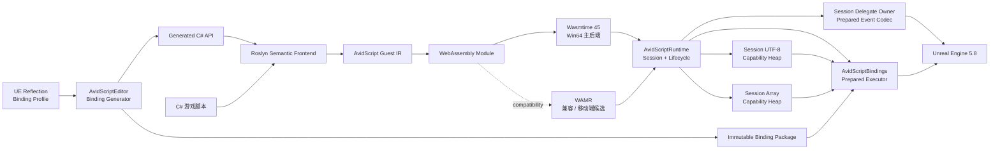
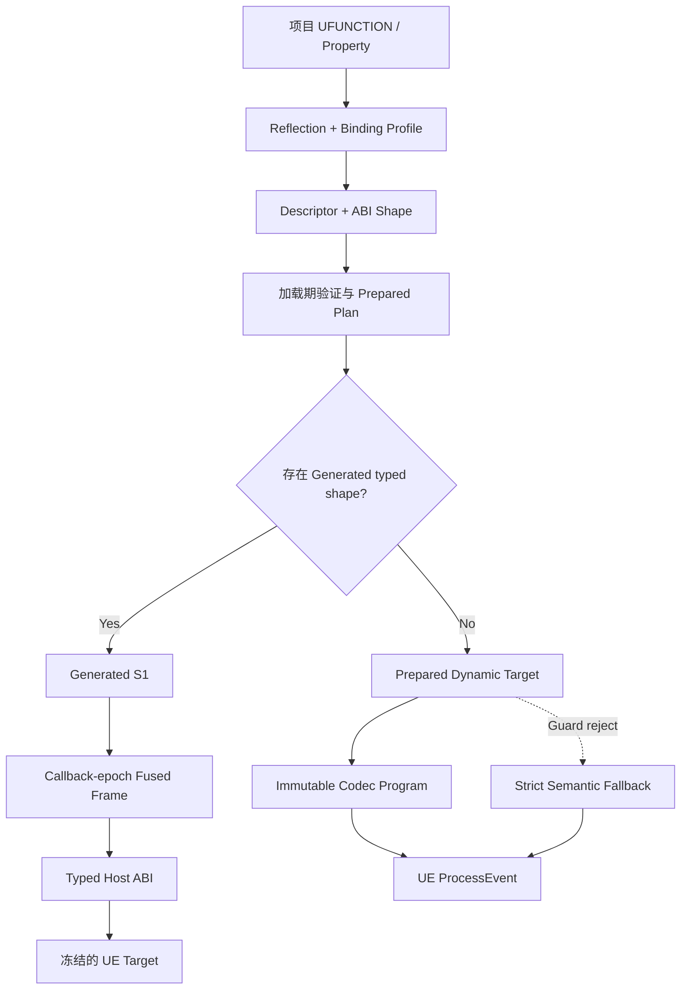

<div align="center">

# AvidScript

**面向 Unreal Engine 的现代 C# + WebAssembly 游戏脚本框架**

<p>
  
  
  
  
  
  
  
  <a href="LICENSE"></a>
</p>

将 C# 编译为轻量 WASM Guest，通过生成式 Binding 接入 `BeginPlay`、`Tick`、
Timer、受控 `async/await`、UE latent UFUNCTION、异步对象加载、Overlap、动态多播事件、
普通 `UFUNCTION` 与 `UPROPERTY`，在 UE 中编写真实游戏逻辑。

</div>

> [!IMPORTANT]
> 当前版本为 **0.1.0 开发者预览**。主线验证环境是 **UE5.8 源码版 +
> Windows 64 位 Development Editor + Wasmtime 45**。Cook、Shipping、Android
> 与 iOS 尚未完成正式支持。

## 为什么是 AvidScript

- **生成，而不是手写 API 清单**：从 UE Reflection 与 Binding Profile 生成 C#
  类型、函数、属性和不可变 dispatch plan，不为每个项目 API 增加 VM switch。
- **C# 游戏逻辑，WASM 运行边界**：Roslyn 语义前端生成 AvidScript Guest IR，
  再输出 WebAssembly；PC 主后端使用 Wasmtime Cranelift。
- **接入 UE 生命周期与事件**：脚本可以响应 `BeginPlay`、`Tick`、`EndPlay`、Timer、受控 `async/await`、异步对象加载、
  Gameplay Event、Overlap，并订阅 Session 授权的任意兼容 UObject 动态多播事件；同时使用 Actor、Component、递归固定宽度 `USTRUCT`、
  `FName`、`FString`、一维 `TArray<T>` 和常用 UE 值类型。
- **性能结论可复核**：同机、同 workload 对比 Puerts V8；候选 commit、profile、
  进程样本、P50/P95 和未达门禁均进入机器可读 evidence。

项目当前优先服务 **C# + WASM** 游戏开发。.avid 与 D 前端保留为实验性验证，
不会阻碍 C# 工具链和 UE Binding 的成熟。

## 一段脚本就是一个游戏对象

下面是 Generated Binding 暴露的 typed C# API。类型与方法来自项目 Reflection
结果，不是为样例手写的 VM 指令。

```csharp
using System.Runtime.InteropServices;

namespace AvidScript;

public static class GameScript
{
    private static AActor Projectile;

    [UnmanagedCallersOnly(EntryPoint = "avid_on_begin_play")]
    public static void BeginPlay()
    {
        AAvidScriptTypedTestActor self = UE.Self;
        self.ApplyGameplayValue(4.0f);

        AAvidScriptTypedTestProjectile typedProjectile = UE.SpawnActor(
            ProjectClasses.Projectile,
            FTransform.Identity);
        AAvidScriptTypedTestActor typedActor = typedProjectile;
        Projectile = typedActor;
    }

    [UnmanagedCallersOnly(EntryPoint = "avid_on_tick")]
    public static void Tick(float deltaSeconds)
    {
        if (!Projectile.HasHandle)
        {
            return;
        }

        Projectile.SetActorScale3D(new FVector(1.0f, 1.0f, 1.0f));
    }

    [UnmanagedCallersOnly(EntryPoint = "avid_on_end_play")]
    public static void EndPlay()
    {
        if (Projectile.HasHandle)
        {
            UE.DestroyActor(Projectile);
            Projectile = default;
        }
    }
}
```

完整可运行版本见
[TypedProjectApi](Samples/CSharp/TypedProjectApi/TypedProjectApiScript.cs)。

### FName、FString 与自定义 UFUNCTION

`FName` 和 `FString` 在生成的 C# facade 中统一呈现为 `string`。value、const-ref、
ref、out、return 与属性读写共用同一个通用 codec，不需要为项目函数手写 wrapper：

```csharp
[UnmanagedCallersOnly(EntryPoint = "avid_on_tick")]
public static void Tick(float deltaSeconds)
{
    AMyGameplayActor self = UE.Self;

    string displayName = self.DisplayName;
    self.NormalizeName(ref displayName);
    self.BuildStatusText(out string status);

    self.DisplayName = displayName;
    self.StatusText = status;
    self.LastSocketName = self.GetAttachParentSocketName();
}
```

这里的 `AMyGameplayActor` 代表项目 Reflection 生成的 facade。仓库内双后端真实闭环见
[NameStringRoundtrip fixture](Source/AvidScriptRuntime/Private/Tests/Fixtures/P57_11B2_NameStringRoundtrip.cs)。

### TArray、普通索引循环与显式值释放

满足元素安全合同的一维 `TArray<T>` 会生成 C# `T[]`。函数 value/ref/out/return、属性读写、
`Length` 和索引访问使用同一套 schema v10 类型图：

```csharp
int[] input = new int[] { 1, 2 };
int[] inOut = new int[] { 10 };
int[] result = self.IntArrayRoundTrip(input, ref inOut, out int[] output);

int sum = 0;
for (int index = 0; index < result.Length; ++index)
{
    sum += result[index];
}
result[0] += 1;

if (sum == 13)
{
    self.ReadableIntArray = result;
}
AvidScriptValue.Release(inOut);
AvidScriptValue.Release(output);
AvidScriptValue.Release(result);
```

这条路径已用同一个 C# Guest 在 WAMR 与 Wasmtime 执行，UE property 最终得到
`[11, 1, 2]`，显式释放后 live array capability 为 0。编译器会自动把 capability 上的普通
索引循环 materialize 为有界 Guest region，并在 dirty barrier 写回；`Snapshot`/`Flush` 保留
为兼容与显式控制 API。完整 fixture 见
[ArrayRoundtrip](Source/AvidScriptRuntime/Private/Tests/Fixtures/P57_11B3_ArrayRoundtrip.cs)。

### UE 动态多播事件

Profile 通过 `include_events` 显式授权动态多播委托。生成的 facade 提供稳定的 `AvidEvents`
常量、强类型 `AvidSubscriptions` 入口和不透明订阅 token：

```csharp
public static class PickupScript
{
    [AvidTransient]
    private static AvidSubscription _subscription;

    public static void BeginPlay()
    {
        _subscription = AvidSubscriptions.OnPickedUp(UE.Self);
    }

    [AvidEvent(AvidEvents.OnPickedUp)]
    public static void OnPickedUp(AActor instigator, int itemId, float value)
    {
        UE.Self.ApplyPickup(itemId, value);
    }

    public static void StopListening()
    {
        _subscription.Cancel();
        _subscription = default;
    }
}
```

Roslyn 前端会校验事件身份、返回类型与参数签名，并生成确定性的
`avid_on_delegate_<stable-id>` WASM export。订阅源可以是当前 Runtime Session 已持有或借用的任意
兼容 UObject handle；Runtime 统一校验 registry、capability、world 与 owner class。脚本可显式取消，
加载失败、热重载替换、宿主切换与 `EndPlay` 仍由 Session 事务式管理并最终自动解绑。

### UE 延迟 Continuation

`AvidContinuations.Delay` 与 `NextTick` 使用真实 UE `FTimerManager` 作为 producer。Session 在安全
Tick 边界按注册顺序恢复最多一个回调；脚本不需要手写 WASM export：

```csharp
private const int ResumeSpawn = 1;

[AvidTransient]
private static AvidContinuation PendingSpawn;

public static void BeginPlay()
{
    PendingSpawn = AvidContinuations.Delay(0.25f, ResumeSpawn);
}

[AvidContinuation(ResumeSpawn)]
public static void ResumeSpawnHandler()
{
    UE.Self.SetActorScale3D(new FVector(1.05f, 1.0f, 1.0f));
}
```

token 支持显式 `Cancel()`，并随 active/prepared Session transaction、热重载回滚、HostContext
切换与 `EndPlay` 自动失效和清理。`Delay` / `NextTick` handler 保持零参数 `public static void`。

### 受控 C# async/await

C3 将 `Delay`、`NextTick` 与真实 `FStreamableManager::RequestAsyncLoad` 投影为受控 C# awaitable。
编译器把 async 导出切成零 Guest 堆分配的 CPS segment，在 Session 安全 Tick 边界恢复后继续执行
UE 游戏逻辑：

```csharp
[UnmanagedCallersOnly(EntryPoint = "avid_on_begin_play")]
public static async void BeginPlay()
{
    UE.Self.SetActorLocation(new FVector(100.0f, 200.0f, 300.0f));
    await AvidContinuations.NextTickAsync();

    AvidLoadedObject loadedObject = await AvidAssets.LoadObjectAsync(
        "/Engine/EngineMeshes/Cube.Cube");
    UObject loaded = UObject.TryCast(loadedObject);
    UE.Self.AddActorWorldOffset(new FVector(0.0f, 0.0f, 10.0f));
}
```

P57.12C5 进一步从 UE Reflection 识别满足 completion-only 合同的 latent `UFUNCTION`，生成
`FooAsync` facade。下面的 `DelayAsync` 来自 `UKismetSystemLibrary.Delay`，不需要手写 VM wrapper：

```csharp
[UnmanagedCallersOnly(EntryPoint = "avid_on_begin_play")]
public static async void BeginPlay()
{
    UE.Self.SetActorScale3D(new FVector(1.0f, 1.0f, 1.0f));
    await UKismetSystemLibrary.DelayAsync(0.25f);
    UE.Self.SetActorScale3D(new FVector(1.25f, 1.25f, 1.25f));
}
```

P57.12C6A 已把这一生成链扩展到 public/storage ABI 不同的 `bool` 参数。项目自己的
`UFUNCTION(meta=(Latent, ...)) WaitForFlag(bool)` 会生成 `WaitForFlagAsync(bool)`，Guest 在调用
WASM import 前显式执行 `bool -> i32` 适配；Reflection、descriptor、C#、Semantic、Guest 与 Runtime
全程没有按 API 名称分支。

P57.12C6B 同样支持 enum value 参数与 enum 默认值。C# 保留强类型 enum，Semantic 根据 enum
TypeShape 授权 underlying storage，Guest 发出零额外 WASM 指令的同存储转换；缺少或不匹配的 TypeShape
会在生成物进入 Runtime 前失败。

P57.12C6C 进一步支持 UObject capability、FVector/FRotator/FTransform 和已授权固定 USTRUCT value
参数。共享 storage planner 根据 type graph 选择递归字段展开或 `in` address，validator 与 lowerer
使用同一份计划；深度、cell 数与叶子类型均有上限，string/array 仍保持 fail closed。

脚本显式取消与 completion payload 的架构合同已在 P57.12C6D 冻结，但尚未暴露为可用 API。当前
`await FooAsync()` 仍只支持宿主生命周期取消与 completion-only 恢复；后续实现会使用独立 Session
cancellation source 和显式 provider result slot，不会从 latent `ref/out` 或函数名称猜测结果。

当前支持零参数、非泛型、block-bodied 的 `public static async void` 导出，以及多个顶层直接
`DelayAsync(float)`、`NextTickAsync()`、`LoadObjectAsync(const string)` 和受支持的生成式 latent
`FooAsync(...)`。普通 local 不能跨越下一 await；跨暂停状态需显式放入静态字段。旧 callback API、schema 10/11 Guest 与
`avid_on_continuation_v2` 继续兼容。

取消、候选回滚、`EndPlay` 与 Session teardown 会抑制尚未分发的恢复并取消异步 handle。Continuation
还会在调度、生产者完成、候选提交和 Guest 分发前检查 owner generation 与 World teardown；失效 activation
会整 lane 关闭，并抑制已经迟到的回调。成功对象结果沿用 Session 强引用与 generational capability；callback
trap 会回滚本次借出的对象 capability。

## 当前能力

| 领域 | 已实现 |
| --- | --- |
| C# 生命周期 | `BeginPlay`、`Tick`、`EndPlay`、Timer、Gameplay Event、Overlap 路由、受控 `async void` 导出 |
| 确定性 Continuation | `Delay` / `NextTick`、`FStreamableManager` 异步对象加载、completion-only UE latent producer、状态与对象结果、生成式 callback 与 async CPS dispatcher、不透明 token/cancel、Session active/prepared 事务、owner generation/World liveness 围栏与 teardown |
| 受控 async/await | 多个顺序 await、Reflection 生成 `FooAsync`、零 Guest 堆 CPS segment、稳定 resume debug map、调度拒绝 trap；不依赖 CLR `Task` Runtime |
| UE 事件订阅 | Profile 显式授权的动态多播委托；任意 Session capability UObject 源、生成式 `[AvidEvent]` / `AvidSubscriptions`、显式 token/cancel、事务式热重载与自动解绑 |
| 生成式 Binding | Profile 授权的普通 `UFUNCTION`/`UPROPERTY`、Generated S1、prepared dynamic executor、严格 fallback |
| UE 值类型 | `FVector`、`FRotator`、`FTransform`、enum、`FName`、`FString` |
| 自定义 USTRUCT | 递归固定宽度字段图；value/const-ref/ref/out/return 与 property get/set；对象叶 capability |
| 变长字符串 | Session-owned UTF-8 capability heap；跨调用 intern；reload/跨 Runtime 失效；多输出原子发布 |
| 通用数组 | schema v10 一维 `TArray<T>` -> C# `T[]`；函数全方向、属性读写、编译器托管 region、兼容 Snapshot/Flush 与显式 Release |
| UObject / Actor | typed `UE.Self`、generational handle、异步加载结果 `TryCast`、`SpawnActor`、`DestroyActor`、`IsA`、checked cast |
| Component | descriptor 驱动工厂、typed `FindComponent`、Attach/Detach、显式 `Release` |
| 对象安全 | Session 所有权、World 隔离、失效句柄检测、UObject GC 强引用、Component 回收 |
| 热重载 | C# 候选加载、显式状态迁移、失败回滚、调试映射 |
| 调用完整性 | Binding package、WASM import、immutable codec program、prepared target 与 Runtime Session 多层 provenance |
| 性能热路径 | callback-epoch fused host cell、prepared export、`TickHot` / Event hot result |
| VM 后端 | Win64 Wasmtime 45 主后端；WAMR 兼容后端；同一 C# Guest 双后端验证 |

当前 UE5.8 EngineGameplay profile 生成 `371` 个 reflection binding，加上 object/owner 与
六个 value capability，manifest 授权 `379` 个 import；这代表默认 gameplay surface，不等于完整 UE API 总量。项目 profile
可以加入自己的 UCLASS/UFUNCTION，只要类型可由现有 descriptor/codec 表达，就会自动生成。

生成 API 的覆盖范围由项目 profile、UE Reflection 结果和当前 ABI 类型能力共同决定。
普通反射路径不会因为 fast path 缺失而静默调用错误入口。

## 性能

性能数据按测试层次分开报告。**UE 交互、完整游戏 workload 与纯 Wasm 执行不是同一
benchmark，不能互相替代。** 所有正式对比均使用 UE5.8 Win64 Development、冻结 workload
和同机 Puerts V8；比率小于 `1.0x` 表示 AvidScript 更快。

### Phase 57：通用 UE 交互

Phase 57 将原本昂贵的 Semantic reflection 路径重构为加载期冻结的 prepared reflection
invocation cell 与不可变 codec program。正式协议为 **5 个独立进程**、每进程 **5 次
warmup + 30 次 timed sample**，共 `9000/9000` 个有效 timed sample。


| UE 交互场景 | AvidScript P50 | Puerts Reflection P50 | 比率 | AvidScript 领先 |
| --- | ---: | ---: | ---: | ---: |
| Scalar UFUNCTION | `54.57 ns` | `106.15 ns` | **`0.514x`** | **48.59%** |
| Property get/set | `68.14 ns` | `103.01 ns` | **`0.661x`** | **33.86%** |
| FVector value | `66.49 ns` | `1193.10 ns` | **`0.056x`** | **94.43%** |
| UObject roundtrip | `69.60 ns` | `130.90 ns` | **`0.532x`** | **46.83%** |

四个已冻结 prepared shape 均领先 Puerts Reflection，目标样本产生 `96,000,000` 次 native
hit，fallback 与 guard reject 都为 0。该表仍只代表对应 prepared shape，不外推到字符串或
container；数组使用下面独立的 P57.11C 协议。

### Phase 57.11D：编译器托管数组区域

P57.11D 使用 5 个独立进程、每进程 8 次 warmup + 21 次 timed sample，共 `2520` 个
样本。Puerts lane 使用真实 `UE.NewArray(UE.BuiltinInt)` 和 UE `TArray<int32>` Reflection
往返；AvidScript headline lane 来自真实 C# -> Semantic -> Guest IR -> Wasm 流水线，并把
同一次 export 内的普通数组循环自动聚合为一次 read、Guest 变换与一次 dirty write。


| 元素数 | AvidScript compiler region P50 | Puerts TArray P50 | 比率 | AvidScript 加速 |
| ---: | ---: | ---: | ---: | ---: |
| 1 | `10.034 ns` | `914.172 ns` | **`0.01098x`** | **91.11x** |
| 4 | `20.068 ns` | `1119.629 ns` | **`0.01792x`** | **55.79x** |
| 16 | `61.864 ns` | `1833.887 ns` | **`0.03373x`** | **29.64x** |
| 64 | `245.120 ns` | `4913.280 ns` | **`0.04989x`** | **20.04x** |
| 256 | `946.078 ns` | `16532.023 ns` | **`0.05723x`** | **17.47x** |
| 1024 | `3718.771 ns` | `65368.717 ns` | **`0.05689x`** | **17.58x** |

完整输出 hash 与 `N>=64` 的 compiler-region/element `<=0.80x` 门禁均通过。这里比较的是
一次 export 内的编译器托管数据驻留路径，不是所有 UFUNCTION 的通用加速倍数：AvidScript
capability 在计时前建立，Puerts 每个逻辑调用包含 TArray 参数/返回值分配和 wrapper 访问。
完整口径见 [P57.11D 中文报告](Docs/Phase57/P57.11D_Compiler_Managed_Array_Region.md)。

### Phase 56：完整游戏 workload

Phase 56 的 Generated S1、Data-Oriented 与生命周期热路径仍是可复核的历史正式基线：


| 场景 | AvidScript P50 | Puerts 最快对应路径 P50 | 比率 | AvidScript 领先 |
| --- | ---: | ---: | ---: | ---: |
| Small gameplay | `65.72 ns/op` | `139.996 ns/op` | **`0.469x`** | **53.1%** |
| Dense gameplay | `121.88 ns/op` | `237.638 ns/op` | **`0.513x`** | **48.7%** |
| Lifecycle callback | `67.88 ns` | `173.66 ns` | **`0.391x`** | **60.9%** |

### Wasmtime 与 V8 纯执行层

冻结的 12-kernel controlled suite 当前为：P50 几何均值 `0.9798x`、P95 几何均值
`1.0267x`，P50/P95 kernel win rate 为 `66.7% / 41.7%`。这表示 Wasmtime P50 整体接近
V8，但 P95 尾延迟尚未达到 `0.95x` 领先门槛；`P57-D06-ControlledLeadership` 仍保持
`Fixing`。AvidScript 当前领先主要来自更低成本的生成式 UE 边界，而不是宣称 Wasmtime
对 V8 的所有纯计算都绝对领先。

正式证据与详细口径：

- [P57.11B3 通用数组与完整验收证据](Docs/Phase57/P57.11B3_Generic_Array_Capability_Evidence.json)
- [P57.11C 数组批量传输与正式性能证据](Docs/Phase57/P57.11C_Array_Bulk_Transfer_Evidence.json)
- [P57.11D 编译器托管数组区域与正式性能证据](Docs/Phase57/P57.11D_Compiler_Managed_Array_Region_Evidence.json)
- [P57.11B2 FName/FString 与完整验收证据](Docs/Phase57/P57.11B2_Variable_Utf8_Value_Heap_Evidence.json)
- [P57.11B1 Prepared Reflection 正式性能证据](Docs/Phase57/P57.11B1_Recursive_Fixed_Struct_Codec_Evidence.json)
- [P57.9 Wasmtime/V8 controlled toolchain](Docs/Phase57/P57.9_Controlled_Wasmtime_Toolchain.md)
- [Phase 56 游戏 workload 报告](Docs/Phase56/P56.5_Fused_Call_Frame_Implementation_Report.md)

正式性能候选：
[`4c10239`](https://github.com/Avidel-zzz/AvidScript/commit/4c1023989596bba112de345b5533546655559df7)；
当前功能候选：
[`54a573c`](https://github.com/Avidel-zzz/AvidScript/commit/54a573cb028543b01df73665757cad9833c5f00d)。

## 架构



| 模块 | 职责 |
| --- | --- |
| `AvidScriptCore` | 后端无关 ABI、错误、诊断与基础合同 |
| `AvidScriptBindings` | UE typed binding、descriptor、不可变 codec、prepared executor 与 value heap |
| `AvidScriptVM` | Wasmtime/WAMR 后端、WASM 校验、Guest Memory 与 Host crossing |
| `AvidScriptRuntime` | Session、生命周期、对象 registry、事件、Continuation、事务与热重载 |
| `AvidScriptEditor` | Reflection/profile、代码生成、C# 构建和 Editor 集成 |
| `Tools/` | Roslyn 前端、Guest IR、WASM backend 与构建工具 |

### 一般 UFUNCTION 如何进入脚本



Generated 与 prepared path 都由 descriptor、真实反射 identity 和 ABI shape 生成，
不要求为每个 `UFUNCTION` 手写 C++ wrapper。输出范围、对象 capability 与变长值容量会在
`ProcessEvent` 前预检；尚未支持的类型在生成或加载阶段失败关闭，而不是进入未经验证的调用。

## 环境要求

- Unreal Engine 5.8 源码版；
- Windows 10/11 x64；
- Visual Studio 2022 与 UE 对应的 MSVC/Windows SDK；
- .NET SDK `8.0.416`；
- PowerShell 7；
- Git。

## 快速开始

### 1. 放置插件

将仓库放到项目的 `Plugins/AvidScript`：

```text
YourProject/
  Plugins/
    AvidScript/
  YourProject.uproject
```

### 2. 安装锁定的 Wasmtime 依赖

在插件目录执行：

```powershell
pwsh -NoProfile -File Build/InstallWasmtimeDependency.ps1 -Mode Install
```

脚本按 lock file 下载并校验 Wasmtime 45 Win64 C API，不依赖未固定版本的系统包。

### 3. 构建 UE Editor Target

```powershell
$env:UE_ROOT = "C:\UnrealEngine"

& "$env:UE_ROOT\Engine\Build\BatchFiles\Build.bat" `
  YourProjectEditor Win64 Development `
  "-Project=C:\Path\To\YourProject.uproject" `
  -WaitMutex -NoHotReloadFromIDE
```

不要为普通增量问题清理完整 Editor Target。

### 4. 构建第一个 C# Guest

先使用仓库内的生命周期样例验证工具链：

```powershell
pwsh -NoProfile -File Build/BuildCSharpActorLifecycle.ps1
```

项目自定义 API 需要先由 Editor Reflection 与 Binding Profile 生成 binding
package 和 C# facade，再构建对应 Guest。当前流程仍是开发者预览，建议先在同仓库
测试项目中验证，再迁移到独立游戏项目。

### WAMR 兼容后端

WAMR 保留用于兼容性和后续移动端 AOT 工作，不是当前 Win64 默认性能后端：

```powershell
cmd /c Build\BuildWAMRWin64.cmd
```

## 样例

| 样例 | 展示内容 |
| --- | --- |
| [TypedProjectApi](Samples/CSharp/TypedProjectApi/README.md) | typed Self、自定义 `UFUNCTION`、Spawn、cast 与销毁 |
| [DynamicProjectile](Samples/CSharp/DynamicProjectile/README.md) | Blueprint class reference、Timer、Spawn/Destroy 与热重载回滚 |
| [PlayablePickup](Samples/CSharp/PlayablePickup/README.md) | Overlap、Gameplay Event、持久状态与热重载 |
| [ComponentGameplay](Samples/CSharp/ComponentGameplay/ComponentGameplay.cs) | 创建/查询组件、Attach、Tick 调用与 EndPlay 释放 |
| [BidirectionalProperties](Samples/CSharp/BidirectionalProperties/README.md) | C# 与 UE 属性双向读写 |
| [ActorLifecycle](Samples/CSharp/ActorLifecycle/ActorLifecycleScript.cs) | async `BeginPlay`、`Tick` / `EndPlay`、NextTick、UE TimerManager Continuation 与异步对象加载 |
| [LatentGameplay](Samples/CSharp/LatentGameplay/README.md) | Reflection 生成 `UKismetSystemLibrary.DelayAsync`，在 `BeginPlay` 中等待后恢复 UE 游戏逻辑 |
| [D Guest](Samples/D/ActorSetLocation/README.md) | D 到 WASM 的早期验证链路 |
| [.avid Guest](Samples/AvidScript/ActorSetLocation/README.md) | 自研语言前端的早期原型 |

## 当前边界

- 还不是完整 UE API 类型系统，只覆盖 descriptor 可表达且 ABI 已实现的类型；
- 固定宽度递归 `USTRUCT` 已支持，但其字段中暂不接受 `FName`、`FString` 与容器；
- 一维 `TArray<T>` 已支持首批固定元素类型；nested array、字符串元素、`TSet`、`TMap` 尚未支持；
- 动态多播事件支持当前 Session 授权的任意兼容 UObject 源，但仍要求 Profile 显式授权；单播委托、C# `event +=`、lambda/closure 尚未支持；
- 受控 `async/await` 已支持顶层顺序等待、紧邻对象结果与宿主 activation 失效抑制；尚未支持 local spill、`Task` / `ValueTask`、异常传播、`try/finally`、任意 awaiter、async helper 调用链、批量加载和进度/优先级；后续 bounded spill 必须同时提供 Guest frame reset 握手；
- soft object path 尚不会自动加入 Cook 依赖，打包项目必须显式纳入脚本所引用的资产；异步结果当前在 Session teardown 统一释放，尚无细粒度 lease/release；
- completion-only、静态 Blueprint Function Library latent 已支持首批单 cell value 参数；instance
  latent、复杂类型、completion payload、取消句柄映射、RPC、interface dispatch 和 Blueprint 图中新声明函数尚未完整支持；
- `FText` 的本地化 identity/history 语义尚未支持；
- C# 由 Roslyn semantic/CFG lowering 编译，不提供完整 .NET Runtime；
- 高频 `Tick` 内应优先使用已有 Generated S1 或经过 benchmark 的 prepared shape；
- 数组 capability 已提供显式 `Release`；UTF-8 heap 仍以 Session/reset 为主要回收边界；
- Cook、Shipping、崩溃隔离、Android 与 iOS 尚未完成正式验收；
- 正式竞品矩阵目前覆盖 Puerts V8，尚未同口径覆盖 UnLua 与 AngelScript。

## 路线图

1. 扩展生成式 latent facade 的对象/结构体等类型覆盖与取消/payload 合同，并为受控 async 增加带 reset 握手的 bounded spill frame 和显式重入策略；
2. 用 C# 完成真实小型游戏 Demo，固化生命周期、对象创建、事件和热重载工作流；
3. 扩展 string element、nested array、`TSet`/`TMap`，继续压缩 Wasmtime P95 尾延迟；
4. 完成 Cook、Shipping、包体、故障隔离以及 Android/iOS AOT 适配。

路线图只表示后续工程顺序，不代表对应平台已经可用。

## 验证与开发约定

项目采用集中阶段验收：

- 固定 .NET 8.0.416 的前端、语义、Guest IR 与 WASM backend 合同测试；
- PowerShell schema、构建合同、候选身份和架构门禁；
- UE5.8 no-clean Editor build 与 `Automation RunTests AvidScript`；
- 同机、候选绑定的 Puerts/Wasmtime 正式性能矩阵。

当前最近一次完整 AvidScript Automation 基线为 Phase 57.12C6E 的 **361/361 通过**，固定 .NET
完整基线为 `232/232`。UE5.8 no-clean `AvidTPSTemplateEditor` 增量构建成功，clean candidate
`7aa9f66/4223436d` 架构门禁通过。C6 已完成 bool、enum、UObject capability、FVector/FRotator/FTransform
与固定 USTRUCT latent value 参数链；显式取消与 completion payload 仍停留在已冻结设计，尚未暴露 API。
本阶段没有新增性能 benchmark，性能表继续引用已冻结的
P57.11D/P57.11B1/P56 正式证据。最新阶段报告见
[P57.12C6 中文合同与进度](Docs/Phase57/P57.12C6_Latent_Type_And_Cancellation_Contract.md)。

工程规则：

- 面向使用者的文档使用中文；
- Runtime、Bindings、VM、Editor 保持模块边界；
- 新 UE API 通过 descriptor/profile 生成，不添加项目专用 VM wrapper；
- 热路径不按名称或 class path 反复查找对象；
- 非阻塞问题在阶段末集中构建与验收，避免碎片化等待；
- 阶段状态、源码版 UE5.8 路径和错误复盘见 [AGENTS.md](AGENTS.md)。

## 许可证

AvidScript 原创代码使用 [MIT License](LICENSE)。

Wasmtime 使用 Apache-2.0 WITH LLVM-exception；`Source/ThirdParty/WAMR/upstream`
保留上游 Apache License 2.0 及目录内其他第三方许可。Unreal Engine 不包含在
本仓库中，并受 Epic Games 的许可条款约束。
