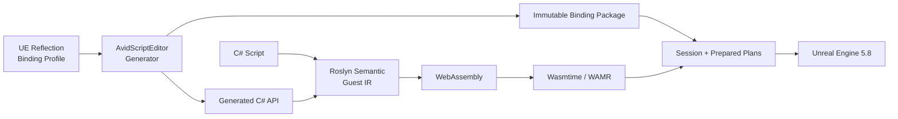

<div align="center">

# AvidScript

**面向 Unreal Engine 的现代 C# + WebAssembly 游戏脚本框架**

<p>
  
  
  
  
  
  
  
  
  <a href="LICENSE"></a>
</p>

AvidScript 将 C# 编译为 WASM，通过自动生成的 Binding 接入 UE 生命周期、项目 API、网络与异步流程。
Win64 主后端使用 Wasmtime 45，保留 WAMR 兼容后端；UE Runtime 不托管 CLR。

</div>

> [!IMPORTANT]
> 当前版本为 **0.1.0 开发者预览**，主线验证环境是 **UE5.8 源码版 + Win64
> Development/Shipping + Wasmtime 45**。两种 Win64 配置的 BuildCookRun 均已通过；Android arm64
> 交叉 AOT 发布已验证，Android UBT/真机与 iOS 仍待正式验收。

## 已实现

可以用 C# 编写并打包 Win64 游戏逻辑，调用项目自定义 UE API；目前仍是开发者预览，不是完整 UE/.NET 替代层。

| 领域 | 已验证能力 |
| --- | --- |
| 生命周期与启动 | `BeginPlay/Tick/EndPlay`、Timer、Overlap、Gameplay Event；Startup Scenario 自动挂载、原子回滚与 teardown |
| C# 游戏样例 | `PickupRush` 计时、收集、复活和胜负逻辑；同源 Editor、Win64 Development/Shipping 包内行为验证通过 |
| 生成式 UE API | Reflection/Profile 生成 `UFUNCTION`、`UPROPERTY`、Interface 与项目自定义 API；typed Self、Spawn、cast、销毁，无需逐个手写 VM wrapper |
| 类型与容器 | UObject、向量/变换、固定 `USTRUCT`、名称/字符串、`FText`；字符串数组、递归容器、`TSet/TMap`；soft/weak object 身份往返，详见下方边界 |
| C# 定义 UE 类型 | Actor、Component、World/GameInstance Subsystem，含继承、override、属性、函数与默认参数 |
| 异步与委托 | 受控 `async/await`、Delay/NextTick、异步加载、Latent、AsyncAction；单播/多播、受支持签名的 `return/ref/out` 与主动调用；独立 UObject 订阅与回调来源查询 |
| Blueprint 与网络 | callable/event 双向交互；Server/Client/NetMulticast RPC、属性复制与 RepNotify，dedicated/listen 多进程验证 |
| 热重载与安全 | 方法体事务式替换与回滚；ObjectHandle、Session 隔离、执行预算、后台恢复、低内存回收及 teardown 自动取消 |
| Cook 与发布 | 内容寻址模块、多平台 catalog、无头 Release、Generated Type 预编译；Win64 Development/Shipping BuildCookRun 与回执校验 |
| VM 后端 | Wasmtime 45 Win64 JIT/AOT；Android arm64 脚本及 Generated Type 交叉 AOT；WAMR 兼容后端 |
| 构建与 IDE | 增量缓存、persistent Worker、`.slnx`/WASI 工作区、离线源码索引与 Visual Studio/Rider/VS Code 启动 |
| 调试与 Profiler | 源码映射、跨层调用栈、PIE 目标、受控同步断点/步进、只读变量；UE Trace、热点与 JSON 导出 |

**最近交付（2026-09-04）：** [PickupRush](Samples/CSharp/PickupRush/README.md) 已通过 Editor 与
Win64 Development/Shipping 包内玩法探针；[委托来源查询](Docs/Phase64/P64.D_Delegate_Source_Context.md)
让 Actor 脚本显式订阅独立 UObject 事件并识别来源。UI、跨进程存档与长稳仍在联调，未计入已验收能力。

类型支持与限制可追溯至 [P58 验收](Docs/Phase58/P58.4_Centralized_Gate_Report.md)，
当前玩法及打包结果见 [P64 记录](Docs/Phase64/P64_Closeout.md)。

## C# 游戏脚本

下面的 typed API 来自项目 Reflection，不是为单个 API 手写的 VM wrapper：

```csharp
using System.Runtime.InteropServices;

namespace AvidScript;

public static class GameScript
{
    private static AActor Projectile;

    [UnmanagedCallersOnly(EntryPoint = "avid_on_begin_play")]
    public static async void BeginPlay()
    {
        AAvidScriptTypedTestActor self = UE.Self;
        self.ApplyGameplayValue(4.0f);

        Projectile = UE.SpawnActor(
            ProjectClasses.Projectile,
            FTransform.Identity);

        await AvidContinuations.NextTickAsync();
        Projectile.SetActorScale3D(new FVector(1.05f, 1.0f, 1.0f));
    }

    [UnmanagedCallersOnly(EntryPoint = "avid_on_tick")]
    public static void Tick(float deltaSeconds)
    {
        if (Projectile.HasHandle)
        {
            Projectile.AddActorWorldOffset(
                new FVector(100.0f * deltaSeconds, 0.0f, 0.0f));
        }
    }

    [UnmanagedCallersOnly(EntryPoint = "avid_on_end_play")]
    public static void EndPlay()
    {
        if (Projectile.HasHandle)
        {
            UE.DestroyActor(Projectile);
            Projectile = default;
        }
    }
}
```

完整样例见 [PickupRush](Samples/CSharp/PickupRush/README.md)、
[TypedProjectApi](Samples/CSharp/TypedProjectApi/README.md) 与
[ActorLifecycle](Samples/CSharp/ActorLifecycle/ActorLifecycleScript.cs)。
Editor Tools 可生成 C# 工作区、刷新 typed facade，并启动 Visual Studio、Rider 或 VS Code；默认保留用户文件。

## 架构



| 模块 | 职责 |
| --- | --- |
| `AvidScriptCore` | 后端无关 ABI、错误与基础合同 |
| `AvidScriptBindings` | descriptor、codec、prepared executor 与 value heap |
| `AvidScriptVM` | Wasmtime/WAMR、WASM 校验、Guest Memory 与 Host crossing |
| `AvidScriptRuntime` | Session、生命周期、对象 registry、事件、异步与热重载 |
| `AvidScriptEditor` | Reflection/profile、代码生成、C# 构建和 Editor 集成 |
| `Tools/` | Roslyn 前端、Guest IR 与 WASM backend |

对象始终通过 generational `ObjectHandle` 访问；不向 Guest 暴露原始 `UObject*`。不支持的类型或
失配的反射身份会在生成或加载阶段失败关闭。

## 性能摘要

以下为 P56/P57/P60 已归档基准，不是本次文档更新重新测得的成绩。环境为 UE5.8 Win64
Development、同机冻结 workload；竞品表中比率为 AvidScript / Puerts，小于 `1.0x` 表示更快。
结论只适用于对应 workload，不外推到所有脚本代码。


| UE 交互场景 | AvidScript P50 | Puerts Reflection P50 | 比率 |
| --- | ---: | ---: | ---: |
| Scalar UFUNCTION | `54.57 ns` | `106.15 ns` | **`0.514x`** |
| Property get/set | `68.14 ns` | `103.01 ns` | **`0.661x`** |
| FVector value | `66.49 ns` | `1193.10 ns` | **`0.056x`** |
| UObject roundtrip | `69.60 ns` | `130.90 ns` | **`0.532x`** |

Phase 56 完整游戏 workload 中，Small gameplay、Dense gameplay 与 Lifecycle callback 的
P50 比率分别为 **`0.469x`、`0.513x`、`0.391x`**。编译器托管数组区域在 `N>=64`
的冻结 workload 中领先 Puerts TArray **17.47x-20.04x**。

增量构建的无修改热路径为零编译调用，5 轮中位数 `806 ms`。

P60 的新增 UE 交互路径均在 warm path 禁止名称反射查找，并使用固定 20 组样本：

| P60 路径 | UE/原生 P50 | AvidScript P50 | 比率或预算 |
| --- | ---: | ---: | ---: |
| Interface | `0.151 us` | `0.387 us` | `2.56x` |
| Delegate 主动调用 | `0.553 us` | `0.726 us` | `1.31x` |
| Blueprint callable | `0.641 us` | `0.779 us` | `1.22x` |
| AsyncAction Session 生命周期 | 不适用 | `4.308 us` | `< 250 us` |

这些数字用于同一 UE 构建内的回归门禁，不等同于完整 WASM crossing 或竞品对比。

纯执行层仍未宣布绝对领先：12-kernel Wasmtime/V8 suite 的 P50/P95 几何均值为
`0.9800x / 1.0006x`，P95 领导力门禁仍未关闭。

完整口径与机器可读证据：

- [Prepared Reflection 证据](Docs/Phase57/P57.11B1_Recursive_Fixed_Struct_Codec_Evidence.json)
- [编译器托管数组区域报告](Docs/Phase57/P57.11D_Compiler_Managed_Array_Region.md)
- [Phase 56 游戏 workload 报告](Docs/Phase56/P56.5_Fused_Call_Frame_Implementation_Report.md)
- [Wasmtime Cranelift Speed 报告](Docs/Phase57/P57.13_Cranelift_Speed_Profile.md)
- [Phase 60 性能矩阵与 Gate](Docs/Phase60/P60.D_Performance_And_Gate.md)
- [Phase 61 集中 Gate](Docs/Phase61/P61.E_Integration_Gate.md)

## 快速开始

要求：UE5.8 源码版、Windows 10/11 x64、Visual Studio 2022、.NET SDK `8.0.416`、
PowerShell 7 与 Git。

1. 将仓库放入项目的 `Plugins/AvidScript`。
2. 在插件目录安装锁定的 Wasmtime 依赖：

```powershell
pwsh -NoProfile -File Build/InstallWasmtimeDependency.ps1 -Mode Install
```

3. 使用源码版 UE5.8 增量构建 Editor Target：

```powershell
$env:UE_ROOT = "C:\UnrealEngine"

& "$env:UE_ROOT\Engine\Build\BatchFiles\Build.bat" `
  YourProjectEditor Win64 Development `
  "-Project=C:\Path\To\YourProject.uproject" `
  -WaitMutex -NoHotReloadFromIDE
```

4. 构建仓库内第一个 C# 生命周期 Guest：

```powershell
pwsh -NoProfile -File Build/BuildCSharpActorLifecycle.ps1
```

项目自定义 API 需要先通过 Editor Reflection 与 Binding Profile 生成 binding package 和 C# facade。

## 样例

| 样例 | 展示内容 |
| --- | --- |
| [TypedProjectApi](Samples/CSharp/TypedProjectApi/README.md) | typed Self、自定义 UFUNCTION、Spawn、cast 与销毁 |
| [ActorLifecycle](Samples/CSharp/ActorLifecycle/ActorLifecycleScript.cs) | 生命周期、Timer、异步加载与受控 async/await |
| [PickupRush](Samples/CSharp/PickupRush/README.md) | Startup Scenario、真实地图自动挂载、计时收集与胜负闭环 |
| [PlayablePickup](Samples/CSharp/PlayablePickup/README.md) | Overlap、Gameplay Event、持久状态与热重载 |
| [NetworkRpc](Samples/CSharp/NetworkRpc/README.md) | C# 调用项目 Server、Client 与 NetMulticast RPC |
| [ReplicatedProperty](Samples/CSharp/ReplicatedProperty/README.md) | replicated property、authority setter 与 Push Model |
| [NetworkTopology](Samples/CSharp/NetworkTopology/README.md) | dedicated/listen 多进程网络闭环 |

## 当前边界

- **UE 类型**：由 Profile 与 ABI/codec 决定生成范围，并非所有 UE API 自动可用。复合容器内强 UObject 引用仍拒绝，平面 `TArray<UObject*>` 可用；Set/Map key 受确定性编码限制，soft/weak 的脚本侧解析易用接口待补齐。
- **C# 子集**：无完整 .NET Runtime、任意 awaiter 或异常系统；暂不支持 `event +=`、lambda/closure，使用显式 bind/subscribe 与 `ExecuteX/BroadcastX`。
- **重载与隔离**：方法体可热重载；反射结构变更需增量 UBT 并重启 Editor。WASM 故障隔离不等于原生 C++/DLL 进程沙箱。
- **玩法与平台**：UI、跨进程存档、热重载压力、长稳及人工游玩仍待验收；Android 仅完成交叉 AOT 和集成合同，UBT/APK/真机及 iOS 尚未验收。
- **性能结论**：已有 Puerts V8 对比，但纯执行 P95 领先门禁未关闭，也未完成同口径 UnLua/AngelScript 矩阵。

## 路线图

1. **P62/P63 已收尾**：Win64 Cook/Shipping、多平台 catalog、Android 交叉 AOT 与移动 Runtime 生命周期；
2. **P64 进行中**：PickupRush 与跨平台运行工具已落地；继续补齐 UI、存档、长稳与移动构建/设备验收；
3. **后续发布工程**：安装/升级、兼容与诊断，逐项补齐类型、移动端、真实游戏及性能验收缺口。

路线图只表示工程顺序，不代表对应能力已经可用。

## 验证

最近完整技术回归绑定候选 **`9e08cdc`**，不代表后续未完成改动已通过；**P64 尚未关闭**。

| 验证范围 | 结果 |
| --- | --- |
| 完整 AvidScript Automation / .NET | **439/439 / 284/284** |
| PowerShell、架构与构建 | 10 组合同、干净候选架构检查、no-clean Editor UBT 通过 |
| PickupRush Editor / Win64 Development / Shipping | 均为 5/5 事件、胜利状态、零丢弃回调 |
| Development / Shipping 包回执 | 21/21 / 19/19，实际运行包身份与发布结果一致 |

新增[委托来源小节](Docs/Phase64/P64.D_Delegate_Source_Context.md)另通过 UE Automation **10/10**、
C# 专项 **8/8** 与增量 Editor 构建；这些专项结果不扩充上表的历史全量基线。

这些是自动化与包内探针证据，不替代真实输入、视觉、设备和长稳验收。
详见 [P64 记录](Docs/Phase64/P64_Closeout.md)、[Android 边界](Docs/Phase64/P64.D_Android_Readiness.md)
及已关闭阶段的 [P63 Gate](Docs/Phase63/P63_Gate_Summary.json)。

阶段状态与实现证据见 [Docs](Docs/)，开发规则见 [AGENTS.md](AGENTS.md)。

## 许可证

AvidScript 原创代码使用 [MIT License](LICENSE)。Wasmtime 使用 Apache-2.0 WITH
LLVM-exception；`Source/ThirdParty/WAMR/upstream` 保留上游许可。Unreal Engine 不包含在本仓库中。
