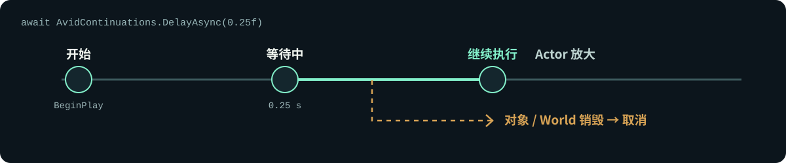

# AvidScript

  [](LICENSE)

UE 5.8 的 C# 脚本插件。仓库包含 C# 编译工具、WebAssembly Runtime、UE 绑定生成器和可运行样例。目前以 Win64 为主要开发与验证平台。


## 运行第一个样例

需要 UE 5.8 **源码版**、Visual Studio 2022（UE C++ 工作负载）、PowerShell 7，以及 [global.json](global.json) 指定的 .NET SDK。下面的命令从 `Plugins/AvidScript` 执行；示例工程位于 `../../AvidTPSTemplate.uproject`。

```powershell
pwsh -NoProfile -File Build/InstallWasmtimeDependency.ps1 -Mode Install

$env:UE_ROOT = 'C:\UnrealEngine' # 改成自己的 UE 源码目录
$project = (Resolve-Path ../../AvidTPSTemplate.uproject).Path
& (Join-Path $env:UE_ROOT 'Engine\Build\BatchFiles\Build.bat') `
  AvidTPSTemplateEditor Win64 Development "-Project=$project" `
  -WaitMutex -NoHotReloadFromIDE
```

打开工程，在关卡中放置并选中一个 **Movable** Cube。执行 **Tools → AvidScript → Build And Bind C# ActorLifecycle Script**，然后点击 **Play**。脚本会移动、旋转并缩放这个 Actor。

只编译样例脚本，不启动 Editor：

```powershell
pwsh -NoProfile -File Build/BuildCSharpActorLifecycle.ps1
```

## 代码示例

[ActorLifecycleScript.cs](Samples/CSharp/ActorLifecycle/ActorLifecycleScript.cs) 的 `Tick` 每秒把 Actor 沿 X 轴移动 120 UE 单位（以下是移动部分）：

```csharp
[UnmanagedCallersOnly(EntryPoint = "avid_on_tick")]
public static void Tick(float deltaSeconds)
{
    FVector currentLocation = UE.Self.GetActorLocation();
    UE.Self.SetActorLocation(currentLocation + new FVector(120.0f * deltaSeconds, 0.0f, 0.0f));
}
```

[LatentGameplayScript.cs](Samples/CSharp/LatentGameplay/LatentGameplayScript.cs) 演示等待 UE 的 `Delay`，并在 `EndPlay` 取消等待：

```csharp
[UnmanagedCallersOnly(EntryPoint = "avid_on_begin_play")]
public static async void BeginPlay()
{
    LifetimeCancellation = AvidCancellationSource.Create();
    await UKismetSystemLibrary.DelayAsync(0.25f)
        .WithCancellation(LifetimeCancellation.Token);
    UE.Self.SetActorScale3D(new FVector(1.25f, 1.25f, 1.25f));
}

[UnmanagedCallersOnly(EntryPoint = "avid_on_end_play")]
public static void EndPlay()
{
    LifetimeCancellation.Cancel();
    LifetimeCancellation.Release();
}
```

Actor 在等待期间销毁时，`EndPlay` 取消后续代码。完整运行步骤见 [LatentGameplay 样例](Samples/CSharp/LatentGameplay/README.md)。



## 更多样例

| 想看什么 | 代码与运行说明 |
| --- | --- |
| Actor 生命周期、输入、碰撞 | [ActorLifecycle](Samples/CSharp/ActorLifecycle/ActorLifecycleScript.cs) |
| Timer、异步加载、Latent、取消 | [LatentGameplay](Samples/CSharp/LatentGameplay/README.md) |
| RPC、属性复制、RepNotify | [NetworkRpc](Samples/CSharp/NetworkRpc/README.md) · [ReplicatedProperty](Samples/CSharp/ReplicatedProperty/README.md) |
| UI、存档 | [UiSaveDemo](Samples/CSharp/UiSaveDemo/README.md) |
| 调用项目 C++ API | [TypedProjectApi](Samples/CSharp/TypedProjectApi/README.md) |
| 从 C# 声明 Actor、Component、Subsystem | [ScriptDefinedTypes](Samples/CSharp/ScriptDefinedTypes/README.md) |

## 当前限制

| 范围 | 现状 |
| --- | --- |
| 平台 | 主要在 UE 5.8 / Win64 开发；Android、iOS 尚未验收。 |
| C# | 支持编译器识别的 C# 与生成的 UE API 子集；不能直接运行任意 .NET 项目或 NuGet 包。 |
| 异步 | `Task<int>` 支持受限的同源静态方法调用和 `await`；跨 Session 等待等情况尚未支持。见 [Task 结果合同](Docs/Phase66/P66.C4_Task_Result_Contract.md)。 |
| 异常 | 支持 `try/finally` 和以 `-LanguageErrors bounded` 显式启用的同步 `catch/throw`；`finally` 内不能 `await`，异步任务错误还不能进入 C# `catch`。生成类型中的该模式目前限 Win64 Development。见 [语言错误合同](Docs/Phase66/P66.C3_Language_Error_Channel_Contract.md)。 |
| 脚本定义的 UE 类型 | 修改 `UClass`、`UProperty` 或 `UFunction` 后，需要重新构建并重启 Editor。 |
| 游戏验收 | 真实游戏流程与真实多人联机仍待验收；样例和自动化测试不等同于这两项验收。 |

## 开发与测试

```powershell
dotnet run --project Tools/AvidScript.CSharpGuest.Tests/AvidScript.CSharpGuest.Tests.csproj -c Release
```

[Source/](Source/) 是 UE 插件，[Tools/](Tools/) 是 C# 工具链，[Build/](Build/) 是构建入口。设计和验证记录放在 [Docs/](Docs/)；仓库开发约束见 [AGENTS.md](AGENTS.md)。

## License

原创代码采用 [MIT License](LICENSE)。Wasmtime 使用 Apache-2.0 WITH LLVM-exception；WAMR 保留上游许可。Unreal Engine 不包含在本仓库中。
