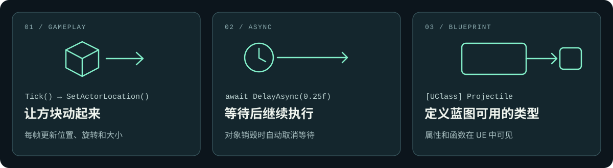

# AvidScript

<p align="center">
  
</p>

<p align="center">
  
  
  
  <a href="LICENSE"></a>
</p>

Unreal Engine 的 C# 脚本插件。C# 经编译生成 WASM，通过生成的绑定调用 UE API；UE 进程不加载 CLR。运行时可使用 Wasmtime 或 WAMR。

目前面向 **UE 5.8 源码版、Win64 Editor / Development**。Shipping、Android 和 iOS 尚未验收。

[快速开始](#快速开始) · [脚本示例](#脚本示例) · [更多示例](#更多示例) · [支持范围](#支持范围) · [开发](#开发)

## 快速开始

需要 UE 5.8 源码版 C++ 工程、Visual Studio 2022 UE C++ 工具链、PowerShell 7 和 [.NET SDK 8.0.416](global.json)。

在 **UE 工程根目录**安装插件：

```powershell
git clone https://github.com/Avidel-zzz/AvidScript.git Plugins/AvidScript
cd Plugins/AvidScript
pwsh -NoProfile -File Build/InstallWasmtimeDependency.ps1 -Mode Install
```

编译 Editor target。将 `MyGame` 和引擎路径换成自己的：

```powershell
$ueRoot = 'C:\UnrealEngine'
$project = (Resolve-Path '../../MyGame.uproject').Path

& (Join-Path $ueRoot 'Engine\Build\BatchFiles\Build.bat') `
  MyGameEditor Win64 Development "-Project=$project" `
  -WaitMutex -NoHotReloadFromIDE
```

打开 Editor，选中关卡中的 **Movable** Cube，执行 **Tools → AvidScript → Build And Bind C# ActorLifecycle Script**，再点击 **Play**。Cube 会移动、旋转和缩放。修改脚本后，停止 Play 并重新执行 **Build And Bind**。

## 脚本示例

[ActorLifecycleScript.cs](Samples/CSharp/ActorLifecycle/ActorLifecycleScript.cs) 的 `Tick` 每帧沿 X 轴移动 Actor，速度为 120 cm/s：

```csharp
[UnmanagedCallersOnly(EntryPoint = "avid_on_tick")]
public static void Tick(float deltaSeconds)
{
    FVector position = UE.Self.GetActorLocation();
    UE.Self.SetActorLocation(
        position + new FVector(120.0f * deltaSeconds, 0.0f, 0.0f));
}
```

`UE.Self` 是当前绑定脚本的 Actor。完整示例还包含 `BeginPlay`、输入、碰撞和异步加载。

## 更多示例



| 需求 | 示例 |
| --- | --- |
| Actor 生命周期、输入、碰撞 | [ActorLifecycle](Samples/CSharp/ActorLifecycle/ActorLifecycleScript.cs) |
| Timer / latent `await`，Actor 销毁时取消 | [LatentGameplay](Samples/CSharp/LatentGameplay/README.md) |
| C# 定义 Actor、属性和 Blueprint 函数 | [ScriptDefinedTypes](Samples/CSharp/ScriptDefinedTypes/README.md) |
| 客户端调用 Server RPC | [NetworkRpc](Samples/CSharp/NetworkRpc/README.md) |
| 属性复制与 `RepNotify` | [ReplicatedProperty](Samples/CSharp/ReplicatedProperty/README.md) |
| UI 和存档 | [UiSaveDemo](Samples/CSharp/UiSaveDemo/README.md) |
| 调用项目自己的 C++ API | [TypedProjectApi](Samples/CSharp/TypedProjectApi/README.md) |

等待 UE latent 函数并绑定 Actor 生命周期（[完整代码](Samples/CSharp/LatentGameplay/LatentGameplayScript.cs)）：

```csharp
await UKismetSystemLibrary.DelayAsync(0.25f)
    .WithCancellation(LifetimeCancellation.Token);
```

定义可在 Blueprint 中使用的属性（[完整代码](Samples/CSharp/ScriptDefinedTypes/ScriptDefinedTypes.cs)）：

```csharp
[UClass(Blueprintable = true, BlueprintType = true)]
public partial class Projectile : AvidActor
{
    [UProperty(BlueprintReadWrite = true, Category = "Projectile")]
    public float LaunchSpeed { get; set; } = 1200.0f;
}
```

## 支持范围

| 项目 | 当前情况 |
| --- | --- |
| C# | 支持项目已实现的语法和部分 .NET API；不能直接使用任意 NuGet 包。详见 [语言实现计划](Docs/Phase66/P66.C_Language_Execution_Plan.md)。 |
| 异步 | 支持示例中的 Timer / latent `await` 和销毁取消。`Task<T>` 目前只支持 `Task<int>`，`catch` / `finally` 内不能 `await`。 |
| UE 类型 | 方法体变化可热重载；反射类型或签名变化需要重新编译并重启 Editor。 |
| 网络 | RPC、复制属性和 `RepNotify` 有样例及自动化验证；真实多人玩法仍需项目内测试。 |
| 发布平台 | 当前主要验证 Win64 Editor / Development；Shipping、Android、iOS 尚未验收。 |

标准 `CancellationToken` 属性已有双 VM 专项验证，尚未进入默认构建入口；见 [取消语义合同](Docs/Phase66/P66.C10_Cancellation_Token_Identity_Contract.md)。

前端可生成“静态字段 + `CancellationToken`”的 Semantic 54 能力清单；Guest IR 35 的同步组合已通过独立 IR 夹具验证。C# Guest lowering、WASM 输出和 UE 加载尚未接通；见 [能力组合合同](Docs/Architecture/AvidScript_Composable_Capability_Contract.md)。

## 开发

在插件根目录运行：

```powershell
pwsh -NoProfile -File Build/BuildCSharpActorLifecycle.ps1
dotnet run --project Tools/AvidScript.CSharpGuest.Tests/AvidScript.CSharpGuest.Tests.csproj -c Release
```


`Source/` 包含 UE 模块，`Tools/` 包含编译器和生成工具，`Build/` 包含构建脚本，`Samples/` 包含可运行示例。参见[模块架构](Docs/Architecture/AvidScript_Module_Architecture.md)和[迭代路线图](Docs/Architecture/AvidScript_Iteration_Roadmap.md)。

## License

[MIT](LICENSE)。第三方许可证：[Wasmtime](Source/ThirdParty/Wasmtime/README.md)、[WAMR](Source/ThirdParty/WAMR/README.md)。Unreal Engine 不包含在本仓库中。
