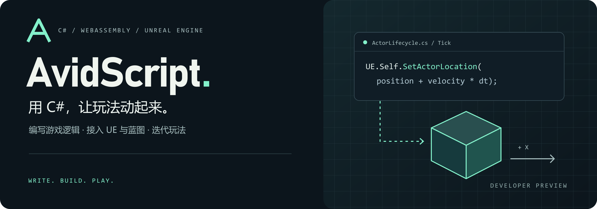

# AvidScript




[](LICENSE)

在 Unreal Engine 项目中写 C# 游戏逻辑，构建为 WebAssembly，再由插件在 UE 进程中运行。脚本通过生成的 C# API 调用 Actor 和其他 UE 对象；游戏运行时不加载 CLR。

**当前状态：开发预览版。** 主要验证环境是 UE 5.8 源码版、Win64 Editor。Shipping、Android、iOS 和真实多人游戏尚未完成验收。

## 快速开始

准备一个 **UE 5.8 源码版 C++ 项目**，并安装 Visual Studio 2022 的 UE C++ 工具链、PowerShell 7 和 [.NET SDK 8.0.416](global.json)。在 UE 项目根目录运行：

```powershell
git clone https://github.com/Avidel-zzz/AvidScript.git Plugins/AvidScript
cd Plugins/AvidScript
pwsh -NoProfile -File Build/InstallWasmtimeDependency.ps1 -Mode Install
```

编译项目的 Editor target。替换项目名和 UE 源码路径：

```powershell
$projectName = 'YourGame'
$ueRoot = 'C:\UnrealEngine'
$project = (Resolve-Path "../../$projectName.uproject").Path

& (Join-Path $ueRoot 'Engine\Build\BatchFiles\Build.bat') `
  "${projectName}Editor" Win64 Development "-Project=$project" `
  -WaitMutex -NoHotReloadFromIDE
```

打开项目，在 Editor 中：

1. 选择 **Tools → AvidScript → Create Project C# Gameplay Workspace**。脚本会生成在 `<项目>/Scripts/AvidScript/GameplayScript.cs`。
2. 在关卡中选中一个 RootComponent 可移动的 Actor。
3. 选择 **Tools → AvidScript → Build And Bind Project C# Gameplay Script**，然后进入 Play。

生成的脚本会在 `BeginPlay` 设置缩放，在 `Tick` 旋转 Actor。可以把其中的 `Tick` 方法改成下面这样；停止 Play，重新执行 Build And Bind 后，Actor 的 yaw 将以每秒 90 度变化：

```csharp
[UnmanagedCallersOnly(EntryPoint = "avid_on_tick")]
public static void Tick(float deltaSeconds)
{
    FRotator rotation = UE.Self.GetActorRotation();
    UE.Self.SetActorRotation(new FRotator(
        rotation.Pitch,
        rotation.Yaw + 90.0f * deltaSeconds,
        rotation.Roll), false);
}
```

`UE.Self` 指向当前绑定的 Actor。生成的 workspace 已包含所需的 `using`、`FRotator` 和 UE API 绑定；再次创建 workspace 不会覆盖你改过的脚本。详细步骤见[项目 C# workspace 说明](Docs/Phase44/P44.3_Project_CSharp_Gameplay_Workspace.md)。

## 更多示例

| 想做什么 | 从哪里开始 |
| --- | --- |
| Actor 生命周期、输入和碰撞 | [ActorLifecycle](Samples/CSharp/ActorLifecycle/ActorLifecycleScript.cs) |
| Timer、异步加载和取消 | [LatentGameplay](Samples/CSharp/LatentGameplay/README.md) |
| C# 定义 Actor / Component | [ScriptDefinedTypes](Samples/CSharp/ScriptDefinedTypes/README.md) |
| RPC、属性复制和 RepNotify | [NetworkRpc](Samples/CSharp/NetworkRpc/README.md) · [ReplicatedProperty](Samples/CSharp/ReplicatedProperty/README.md) |
| UI 和存档 | [UiSaveDemo](Samples/CSharp/UiSaveDemo/README.md) |
| 项目 C++ API 的 C# 绑定 | [TypedProjectApi](Samples/CSharp/TypedProjectApi/README.md) |

## 构建链


C# 前端和 WASM 模块生成器只在构建时运行。运行时插件加载 `.wasm`；脚本持有的是经过 Runtime 校验的对象句柄，不是 `UObject*`。模块划分见[架构文档](Docs/Architecture/AvidScript_Module_Architecture.md)。

## 开发与测试

在 `Plugins/AvidScript` 目录运行示例构建和 C# Guest 自执行测试：

```powershell
pwsh -NoProfile -File Build/BuildCSharpActorLifecycle.ps1
$dotnet = Join-Path $env:USERPROFILE '.dotnet/dotnet.exe'
$env:DOTNET_ADD_GLOBAL_TOOLS_TO_PATH = '0'
$env:DOTNET_SKIP_WORKLOAD_INTEGRITY_CHECK = '1'
$env:DOTNET_GENERATE_ASPNET_CERTIFICATE = '0'
& $dotnet build Tools/AvidScript.CSharpGuest.Tests -c Release --disable-build-servers `
  -m:1 -nodeReuse:false -p:UseSharedCompilation=false
& $dotnet run --project Tools/AvidScript.CSharpGuest.Tests -c Release --no-build --no-restore
```

构建入口使用已安装的 SDK，不向用户 PATH 追加临时工具目录；C# 编译使用单个 MSBuild 节点并关闭后台编译服务。[环境安全检查](Build/Contracts/TestDotNetEnvironmentSafety.ps1)覆盖 SDK 首次运行与临时目录回收。

主要目录：[`Source/`](Source/) 是 UE Runtime 和 Editor 模块；[`Tools/`](Tools/) 是 C# 编译器与生成工具；[`Build/`](Build/) 是构建入口；[`Samples/`](Samples/) 是可运行示例。开发进度见[迭代路线图](Docs/Architecture/AvidScript_Iteration_Roadmap.md)。

## 当前限制

- 支持的是已实现的 C# / .NET 子集，不能直接运行任意 NuGet 包。`Task<T>` 目前只覆盖 `Task<int>`，`catch` 和 `finally` 中不能 `await`。
- 方法体热重载已有自动化覆盖；脚本定义类型的反射签名变化仍需重新编译并重启 Editor。[新建工作区](Docs/Phase66/P66.C19_Editor_Gameplay_Profile_Contract.md)默认启用 `gameplay-v1`，支持标准 `CancellationToken` 的组合用法；已有配置沿用原合同。
- 对象加载的[取消恢复](Docs/Phase66/P66.C18_Object_Load_Cancellation_Contract.md)支持静态状态、标准 token 和 `catch/finally` 组合；使用生成的绑定声明构建后，Wasmtime / WAMR 的 48 项运行测试已通过，覆盖取消重抛、GC 和执行域退出。命令行使用 `-LanguageProfile gameplay-v1`；新建 Editor 工作区已默认选择该配置。
- `async void` 异常报告、Session 候选回滚和[静态 / token 组合](Docs/Phase66/P66.C12_Async_Void_Composition_Contract.md)已有 Win64 双 VM 测试；[普通 Task 的静态状态 / catch / token 组合](Docs/Phase66/P66.C14_Static_Catch_Composition_Contract.md)也已覆盖。[Gameplay 配置](Docs/Phase66/P66.C16_Gameplay_Profile_Build_Contract.md)支持缓存与 prepared 重用；新生成的绑定包支持[标准 CancellationToken](Docs/Phase66/P66.C17_Generated_Cancellation_Token_Contract.md)。Editor 的构建、绑定、异步重载与编译失败保留旧实例已有自动化验证；共享类型域的语言错误回滚和真实 Editor Play 仍待完成。
- 网络路径有自动化测试，真实多人游戏尚未验收；Shipping、Android 和 iOS 也尚未验收。

语言边界见 [P66.C 执行计划](Docs/Phase66/P66.C_Language_Execution_Plan.md)和[异步能力合同](Docs/Architecture/AvidScript_Composable_Capability_Contract.md)。

## 许可证

[MIT](LICENSE)。第三方许可证：[Wasmtime](Source/ThirdParty/Wasmtime/README.md)、[WAMR](Source/ThirdParty/WAMR/README.md)。Unreal Engine 不包含在本仓库中。
