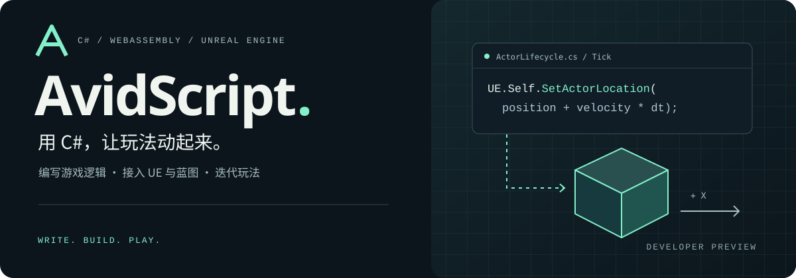
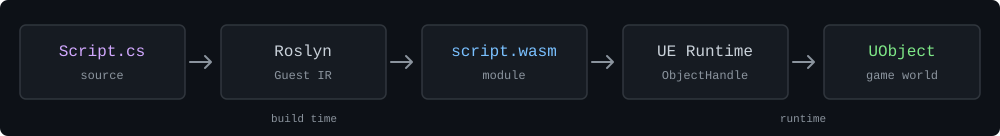

# AvidScript

<p align="center">
  
</p>

<p align="center">
  
  
  
  <a href="LICENSE"></a>
</p>

AvidScript 是 Unreal Engine 的 C# 脚本插件。构建工具使用 Roslyn 将脚本编译为 WASM；UE 通过生成的绑定调用脚本，运行时不加载 CLR。当前测试环境为 **UE 5.8 源码版 + Win64 Editor / Development**。

## 代码示例

[ActorLifecycleScript.cs](Samples/CSharp/ActorLifecycle/ActorLifecycleScript.cs) 的 `Tick` 通过 `UE.Self` 访问绑定的 Actor，每秒沿 X 轴移动 120 cm。以下节选省略了同一方法中的旋转和缩放：

```csharp
[UnmanagedCallersOnly(EntryPoint = "avid_on_tick")]
public static void Tick(float deltaSeconds)
{
    FVector currentLocation = UE.Self.GetActorLocation();
    UE.Self.SetActorLocation(currentLocation + new FVector(120.0f * deltaSeconds, 0.0f, 0.0f));
}
```

## 快速开始

需要 UE 5.8 源码版 C++ 工程、Visual Studio 2022 UE C++ 工具链、PowerShell 7 和 [.NET SDK 8.0.416](global.json)。在**工程根目录**安装插件：

```powershell
git clone https://github.com/Avidel-zzz/AvidScript.git Plugins/AvidScript
cd Plugins/AvidScript
pwsh -NoProfile -File Build/InstallWasmtimeDependency.ps1 -Mode Install
```

编译工程的 Editor target。将 `MyGame` 和引擎路径替换为自己的工程名和路径：

```powershell
$ueRoot = 'C:\UnrealEngine'
$project = (Resolve-Path '../../MyGame.uproject').Path

& (Join-Path $ueRoot 'Engine\Build\BatchFiles\Build.bat') `
  MyGameEditor Win64 Development "-Project=$project" `
  -WaitMutex -NoHotReloadFromIDE
```

打开 Editor，在关卡中放置并选中一个 **Movable** Cube，运行 **Tools → AvidScript → Build And Bind C# ActorLifecycle Script**，再点击 **Play**。Cube 会移动、旋转和缩放。修改[脚本](Samples/CSharp/ActorLifecycle/ActorLifecycleScript.cs)后，停止 Play 并重新运行该菜单项。

## 示例目录

| 功能 | 代码 |
| --- | --- |
| Actor 生命周期、输入、碰撞 | [ActorLifecycle](Samples/CSharp/ActorLifecycle/ActorLifecycleScript.cs) |
| Timer / latent `await`、EndPlay 取消 | [LatentGameplay](Samples/CSharp/LatentGameplay/LatentGameplayScript.cs) |
| C# 声明 Actor、属性、Blueprint 函数 | [ScriptDefinedTypes](Samples/CSharp/ScriptDefinedTypes/ScriptDefinedTypes.cs) |
| Server RPC | [NetworkRpc](Samples/CSharp/NetworkRpc/README.md) |
| 复制属性、`RepNotify` | [ReplicatedProperty](Samples/CSharp/ReplicatedProperty/README.md) |
| UI、存档 | [UiSaveDemo](Samples/CSharp/UiSaveDemo/README.md) |
| 项目 C++ API 绑定 | [TypedProjectApi](Samples/CSharp/TypedProjectApi/README.md) |

## 当前支持与限制

| 项目 | 状态 |
| --- | --- |
| C# | 支持已实现的语法及部分 .NET API；不能直接使用任意 NuGet 包。[语言实现计划](Docs/Phase66/P66.C_Language_Execution_Plan.md) |
| 异步 | Timer / latent `await` 和 Actor 销毁取消已有示例；`Task<T>` 目前仅支持 `Task<int>`，`catch` / `finally` 内不能 `await`。 |
| UE 类型 | 方法体改动可热重载；反射类型或签名变化需要重新编译并重启 Editor。 |
| 网络 | RPC、复制属性和 `RepNotify` 有示例及自动化验证；真实多人玩法仍需项目内测试。 |
| 平台 | 主要验证 Win64 Editor / Development；Shipping、Android、iOS 尚未验收。 |

标准 `CancellationToken` 尚未接入上述默认构建流程。静态字段与 token 值的同步组合已有 Win64 双 VM 验证。IR 35 的异步 token reader 已通过局部验证；五能力模块尚未通过完整验证，详见[能力组合合同](Docs/Architecture/AvidScript_Composable_Capability_Contract.md)。

## 开发

在插件根目录构建默认示例并运行 C# Guest 测试：

```powershell
pwsh -NoProfile -File Build/BuildCSharpActorLifecycle.ps1
dotnet run --project Tools/AvidScript.CSharpGuest.Tests/AvidScript.CSharpGuest.Tests.csproj -c Release
```



源码位置：`Source/`（UE 模块）、`Tools/`（编译器）、`Build/`（构建脚本）、`Samples/`（示例）。设计和后续工作见[模块架构](Docs/Architecture/AvidScript_Module_Architecture.md)与[迭代路线图](Docs/Architecture/AvidScript_Iteration_Roadmap.md)。

## License

[MIT](LICENSE)。第三方许可证：[Wasmtime](Source/ThirdParty/Wasmtime/README.md)、[WAMR](Source/ThirdParty/WAMR/README.md)。Unreal Engine 不包含在本仓库中。
